# codexD 详细设计与实施计划

> 状态：Review Draft
> 日期：2026-08-05
> 当前阶段：仅设计，不包含产品代码
> 目标平台：macOS、Windows
> 首发入口：Discord
> Codex 集成：官方 Python Codex SDK

---

## 0. 文档目的

本文定义 `codexD` 的产品边界、系统架构、状态机、持久化、Discord
交互、表格渲染、进程保活、安全模型、测试策略和实施顺序。

`codexD` 的产品目标与
[claudeD](https://github.com/HXYerror/claudeD) 相近：用户可以在 Discord
中持续使用本机编程 Agent；但是实现必须以 Codex 的真实能力为基础。
本文不会把 Claude Code、Copilot CLI 或 Codex TUI 的命令机械改名后照搬。

本文采用四种能力标签：

| 标签 | 含义 |
|---|---|
| **Codex-native** | 官方 Python Codex SDK 在当前受支持版本范围中稳定暴露的能力 |
| **codexD extension** | codexD 为 Discord、持久化或运维自行实现的能力 |
| **Gated** | Codex 中存在相近能力，但 Python SDK 未稳定暴露或仍为实验性 |
| **Excluded** | Claude/Copilot/TUI 专属，或不符合 v1 产品边界 |

所有后续实现都必须能追溯到本文中的一种标签。若无法归类，默认不进入
v1。

---

## 1. 执行摘要

### 1.1 最重要的结论

1. **Codex 有官方 Python SDK。**
   PyPI 包名为 `openai-codex`，导入名为 `openai_codex`。它管理本地
   `codex app-server`，不是通用 `openai` Python SDK，也不是
   Responses API 的薄封装。
2. **Codex thread 可恢复，但进行中的本地 turn 不是 durable job。**
   rollout 和 thread metadata 可以在进程结束后恢复；被杀掉的 turn、
   shell 进程或后台 terminal 不能被宣传为原地续跑。
3. **Discord 断线不能影响 Codex 运行。**
   Discord adapter、Codex runtime 和事件持久化必须解耦。只要 codexD
   daemon 与 SDK runtime 仍然存活，Discord gateway 重连期间的 turn
   应继续执行。
4. **daemon 或机器重启后只恢复 conversation，不恢复正在执行的 Turn。**
   provider-started Turn 和 Discord queued Turn 标记为 `interrupted`，下一条
   用户消息通过 `thread_resume` 继续上下文；唯一例外是从未进入 provider、带
   immutable snapshot 的 queued Schedule Turn。
5. **不提供伪造的 `/workflow`。**
   codexD 直接使用 Codex `Turn`，通过 `/turn` 查看或中断同一对象；不增加
   第二层 execution wrapper。
6. **提供 `/schedule`，但它是 codexD extension。**
   Schedule 持久化本地时间规则，到点后在既有 Conversation 中创建普通
   Codex Turn；它不是 provider workflow。
7. **表格是渲染层对象，不是 Codex 原生事件。**
   普通回答中的 Markdown 表格由 block assembler 解析成 `TableBlock`；
   Discord 输出 PNG，并附 Markdown 原文和复制按钮，失败时回退代码块。
8. **Discord 输入附件使用统一的 v1 管线。**
   每个附件只下载一次并由隔离 MediaWorker 按内容分类；图片规范化后映射为 SDK
   image input，普通文件作为受控 opaque file 映射为 `MentionInput`。文本、图片和
   文件可混合，image-only/file-only 都合法，CDN URL、本地路径和文件内容不进入
   prompt 或公开状态。
9. **v1 只走官方 Python SDK。**
   不把 `codex exec --json`、TypeScript SDK、私有 app-server RPC 或
   Codex TUI slash command 当作隐藏 fallback。

### 1.2 推荐架构

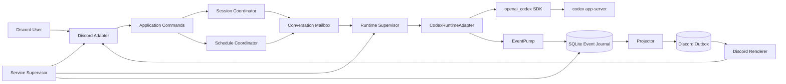

核心约束：

- 一个 active Turn 只有一个 EventPump。
- 一个 conversation 只有一个 CommandMailbox 写入 turn。
- provider event 先持久化，再投影、再发送 Discord。
- Discord 发送失败只重放 outbox，绝不重跑 Codex turn。
- SDK runtime 可以重建，Codex thread identity 不随 runtime 消失。

---

## 2. 调研结论

### 2.1 官方 Python Codex SDK

截至 2026-08-05，官方 SDK 的事实边界如下：

| 项目 | 结论 |
|---|---|
| PyPI 包 | `openai-codex` |
| Python import | `openai_codex` |
| 最低 Python | 官方包要求 Python 3.10+；codexD 设计基线为 Python 3.12+ |
| 执行模型 | SDK 启动并控制匹配版本的本地 Codex CLI/app-server runtime |
| 会话模型 | `thread / turn / item` |
| 主要接口 | thread start/list/read/resume/fork/archive/unarchive/name/compact，Turn stream/steer/interrupt，text/image/skill/mention input，model/reasoning/personality/service tier、output schema、Sandbox/ApprovalMode、account/login；0.144.4 的 public low-level `CodexClient` 还提供 server-request handler，配套 experimental schema 支持 `thread/start.dynamicTools` 与 `item/tool/call` |
| 持久化 | Codex 本地 rollout JSONL 与 SQLite metadata，通常位于 `$CODEX_HOME` |
| 版本关系 | SDK 与配套 CLI binary 强绑定，不能假设任意系统 Codex CLI 都兼容 |
| 成熟度 | 官方 Learn 页面与仓库对 beta/stable 的表述不完全一致，必须维护兼容范围、测试矩阵和契约测试 |

本轮源码审查固定在 Codex commit
`ed2f985a26eee9a59cde0fdefd20f69b45bc25f5`。该快照的 SDK package metadata
内部依赖 `openai-codex-cli-bin==0.144.4`；这只是可复核的上游配套关系，不是
codexD 对 `openai-codex` 精确锁 patch 的产品策略。

官方依据：

- [Codex SDK 文档](https://learn.chatgpt.com/docs/codex-sdk)
- [Python SDK README](https://github.com/openai/codex/blob/main/sdk/python/README.md)
- [Python SDK API reference](https://github.com/openai/codex/blob/main/sdk/python/docs/api-reference.md)
- [PyPI: openai-codex](https://pypi.org/project/openai-codex/)
- [Python SDK pyproject.toml](https://github.com/openai/codex/blob/main/sdk/python/pyproject.toml)

### 2.2 四种常被混淆的集成面

| 集成面 | 实际能力 | 是否用于 codexD v1 |
|---|---|---|
| `openai-codex` Python SDK | 控制本地 app-server；完整 thread/turn 生命周期的 Python 接口 | **是，唯一 provider 接口** |
| `@openai/codex-sdk` TypeScript SDK | 以子进程方式包装 `codex exec` JSONL | 否 |
| 通用 `openai` Python SDK | 调用 Responses、Conversations 等云 API | 否，不冒充 Codex SDK |
| OpenAI Agents SDK | 通用 agent loop、handoff、guardrail、tracing | 否，未来多 Agent 编排再评估 |

因此，v1 不提供以下“看似更稳”的混合路径：

- SDK 失败后偷偷调用 `codex exec`；
- Python SDK 缺少能力时直接发送 TUI slash command；
- 为了 Discord 交互直接暴露 app-server WebSocket；

### 2.3 Codex 的原生持久化语义

Codex 的核心对象是：

- **Thread**：一段可恢复、可 fork、可 archive 的对话；
- **Turn**：一次用户请求及其 Agent 工作；
- **Item**：消息、命令执行、文件修改、MCP 调用、计划等增量单元。

本地 thread 的 canonical history 是 rollout JSONL，可查询 metadata
存于 Codex 自己的 SQLite state database：

- [app-server core primitives](https://learn.chatgpt.com/docs/app-server#core-primitives)
- [Codex thread store](https://github.com/openai/codex/tree/main/codex-rs/thread-store)

`thread_resume` 表示重新加载已持久化 thread。它不意味着：

- 原 app-server 进程仍在；
- 原 turn 仍在执行；
- 原 shell PID 仍然存在；
- 原 event stream 可以从任意 offset 续订；
- 原审批 request 仍然有效；
- Codex 已提供跨机器任务队列。

codexD 必须把“恢复上下文”和“恢复执行”写成两个完全不同的产品状态。

### 2.4 会话存活与后台任务的真实边界

本设计采用以下承诺：

| 故障或断线 | Conversation | 当前 Turn | 用户可见结果 |
|---|---|---|---|
| Discord gateway 短暂断线 | 保持 | 继续 | 重连后 outbox 补发 |
| Discord REST 发送失败 | 保持 | 继续 | 重试发送，不重跑 Codex |
| Discord renderer 崩溃 | 保持 | 继续 | 从 event journal 重建消息 |
| SDK runtime 进程崩溃 | 保持 | `interrupted` | runtime 重启；下一 turn resume thread |
| codexD daemon 重启 | 保持 | `interrupted` | 启动恢复后显示中断原因 |
| OS 重启 | 保持 | `interrupted` | service 启动后可继续 conversation |
| Codex rollout 丢失/损坏 | `blocked` | `interrupted` | 明确 incident，不静默新建 thread |

“后台任务尽力而为”在本设计中的精确定义：

- Discord 用户发出请求后不必保持在线；
- codexD daemon 持续消费 `TurnHandle.stream()`；
- 只要 daemon 和 SDK runtime 存活，长 turn 持续运行；
- active Turn 内正式 `collabAgentToolCall` / `subAgentActivity` 仍由同一
  EventPump 追踪并显示折叠卡片；
- 用户可以用 `/turn` 查看、取消和诊断；
- provider `turn/completed` 后 codexD 不再声称拥有 detached shell/background
  terminal；Python 高层 SDK 没有其稳定管理或重连控制面；
- daemon/runtime 被杀后，不承诺 turn 或其子进程继续；
- 不通过创建一个新 turn 来伪造“恢复原任务”。

### 2.5 Codex 命令调研

Codex 当前官方 CLI 包含大量顶层命令，例如：

`apply`、`review`、`resume`、`fork`、`archive`、`unarchive`、`delete`、
`doctor`、`features`、`exec`、`execpolicy`、`mcp`、`plugin`、
`mcp-server`、`sandbox`、`app-server`、`remote-control`。

Codex TUI 还包含 `/new`、`/resume`、`/fork`、`/archive`、`/compact`、
`/review`、`/plan`、`/model`、`/permissions`、`/status`、`/usage`、
`/diff`、`/ps`、`/stop`、`/skills`、`/mcp` 等 slash command。

来源：

- [Codex developer commands](https://learn.chatgpt.com/docs/developer-commands.md?surface=cli)
- [TUI slash command implementation](https://github.com/openai/codex/blob/main/codex-rs/tui/src/slash_command.rs)

这些命令不能直接成为 codexD Discord 命令，原因有三：

1. TUI 命令属于 TUI 状态机，不等于 Python SDK API；
2. 一些命令依赖实验 feature、平台或 debug build；
3. Discord 产品动作需要自己的权限、幂等和错误语义。

codexD 只选择 Python SDK 能稳定映射的 Codex 原生动作。CLI 有但 SDK
未暴露的能力进入 Gated 清单，不通过 shell 调 CLI 补齐。

### 2.6 Codex 原生且值得突出的能力

本节基于 2026-08-05 的官方 Python SDK public exports 与源码，而不是从 TUI
命令名反推 API。官方 Learn 页面仍称 Python SDK 为 beta，而 PyPI/classifier
称 stable；设计按 compatibility-sensitive API 管理。

| 能力 | 官方 Python 表面 | codexD 设计 |
|---|---|---|
| 持久 Thread 生命周期 | start/list/read/resume/fork/archive/unarchive/set_name/compact | start/resume/read Core；archive/unarchive/fork/rename/compact Native Optional |
| Thread lineage | `Thread.session_id`、`forked_from_id`、`parent_thread_id` 与可选 agent metadata | 只做 identity/fork/subagent correlation；不新增产品级 Session，也不暴露完整 provider ID |
| active Turn 控制 | `TurnHandle.stream/steer/interrupt` | stream、steer、cancel 都是 Core |
| 图片输入 | `ImageInput`、`LocalImageInput` 与 `TextInput` 列表 | Discord 图片自动进入同一 Turn，Core |
| 模型可发现性 | `Codex.models()` 返回 model、reasoning efforts、modalities、personality support、service tiers 与 upgrade metadata | `/model`、`/reasoning` Core；不硬编码 model ID/tier |
| Turn 参数 | model、effort、personality、summary、output_schema、service_tier | personality/output schema/service tier Native Optional |
| 结构化 Item 流 | commandExecution、fileChange、plan、MCP、dynamic tool、webSearch、image generation、subagent 等 | 按正式类型自动渲染或安全降级，不要求用户先执行命令 |
| Web search | Codex config + `webSearch` Item | Native Optional，显式 mode 与风险提示 |
| Skills | public `SkillInput(name, path)` | 仅预登记 path 或 Codex 自发现；不造 `/skills` 管理器 |
| 普通文件输入 | public `MentionInput(name, path)` | 仅把已持久化并复验的受控文件交给同一 Turn；能力缺失时 `file_input_unsupported` |
| 多 Agent 可观察性 | 正式 `collabAgentToolCall` 与 `subAgentActivity` Item | 只做当前主会话内折叠卡片；控制面 Gated |
| 本机账号 | `account()`、API key/browser/device-code login、`logout()` | `/status` 只读 auth 状态；`codexd auth codex ...` 只允许本机运维，不进入 Discord |
| Typed error/retry helper | public `CodexError` hierarchy、`is_retryable_error()`、同步 `retry_on_overload()` | 只给幂等 read/local CLI 做 bounded retry；不包裹 Turn/lifecycle mutation，也不在 async event loop 调同步 helper |

当前 SDK 的 `ThreadItem` 是公开 tagged union。adapter 必须逐项分类，不能只实现
claudeD 曾经出现过的 task/tool 类型：

| SDK `ThreadItem.type` | v1 处理 |
|---|---|
| `userMessage` | 输入审计关联，不重复回显 |
| `hookPrompt` | 只记 type/fragment count/hash；不把 hook 文本发到 Discord |
| `agentMessage` | 按 `phase=commentary/final_answer` 组装进度、visible transcript 与 canonical final answer |
| `plan` | `PlanBlock`；不等同于 plan mode |
| `reasoning` | 只允许 `summary`；`content` 在 normalization 前丢弃 |
| `commandExecution` | `ToolBlock` |
| `fileChange` | `FileChangeBlock` |
| `mcpToolCall`、`dynamicToolCall` | 通用 tool card；结果做边界与 secret redaction |
| `collabAgentToolCall`、`subAgentActivity` | 默认折叠 `TaskCardBlock` |
| `webSearch` | search card |
| `imageView` | 只显示安全 metadata，不自动上传任意本地路径 |
| `sleep` | 合并为进度状态，不单独刷屏 |
| `imageGeneration` | Native Optional；验证结果/本地路径后作为图片附件，否则 metadata fallback |
| `enteredReviewMode`、`exitedReviewMode` | 被动 mode notice；不表示 codexD 能调用 `review/start` |
| `contextCompaction` | compaction activity |

一个类型出现在 union 中，只证明 SDK 能解析该 Item，不证明当前 Turn 一定产生它，
也不自动赋予 codexD 对应的控制 API。

关键限制：

- `thread_fork()` 没有公开的 `lastTurnId`，不能宣传“从任意历史 Turn 分叉”；
- `Thread.compact()` 返回 start response，但没有可可靠绑定的公开
  `TurnHandle`，UI 只能确认请求已启动；
- `Codex.models()` 的 response 有 `next_cursor`，但当前高层方法没有 cursor 参数；
  若返回非空 cursor，model picker 必须标记 catalog incomplete 并禁用 set/tier
  mutation，不能假装只存在第一页；
- plan Item/notification 可消费，不代表 Python SDK 提供 plan mode；
- `review/start`、agent roster/control、background terminals、process/shell 和
  plugin/MCP 管理没有 Python 高层 API；
- `Thread.run()`/`TurnHandle.run()` 是收集式 convenience API，failed Turn 会抛
  `RuntimeError`；daemon 必须使用 `Thread.turn()` + `TurnHandle.stream()` 保留
  完整生命周期与 terminal status；
- public `CodexConfig.experimental_api` 当前默认 `True`；codexD v1 必须显式设为
  `False`，不能因 SDK 默认值意外 opt in experimental app-server surface；
- remote image URL 已 deprecated；codexD 必须先下载并使用 data URL 或
  local image public input；
- hidden reasoning 不属于可展示产品数据，只允许官方 reasoning summary；
- 高层 `Codex`/`AsyncCodex` 不接受自定义 approval handler；登录 API 虽公开，
  也不能把 API key、browser callback 或 logout 暴露成 Discord 命令。

官方依据：

- [Python public API](https://github.com/openai/codex/blob/ed2f985a26eee9a59cde0fdefd20f69b45bc25f5/sdk/python/src/openai_codex/api.py)
- [Python input types](https://github.com/openai/codex/blob/ed2f985a26eee9a59cde0fdefd20f69b45bc25f5/sdk/python/src/openai_codex/_inputs.py)
- [Python Sandbox presets](https://github.com/openai/codex/blob/ed2f985a26eee9a59cde0fdefd20f69b45bc25f5/sdk/python/src/openai_codex/_sandbox.py)
- [Python ApprovalMode mapping](https://github.com/openai/codex/blob/ed2f985a26eee9a59cde0fdefd20f69b45bc25f5/sdk/python/src/openai_codex/_approval_mode.py)
- [Python runtime client](https://github.com/openai/codex/blob/ed2f985a26eee9a59cde0fdefd20f69b45bc25f5/sdk/python/src/openai_codex/client.py)
- [Python notification models](https://github.com/openai/codex/blob/ed2f985a26eee9a59cde0fdefd20f69b45bc25f5/sdk/python/src/openai_codex/models.py)
- [Generated v2 public types](https://github.com/openai/codex/blob/ed2f985a26eee9a59cde0fdefd20f69b45bc25f5/sdk/python/src/openai_codex/generated/v2_all.py)
- [App-server Items](https://learn.chatgpt.com/docs/app-server#items)
- [Codex web search](https://learn.chatgpt.com/docs/web-search)
- [Codex Skills](https://learn.chatgpt.com/docs/build-skills)
- [Codex subagents](https://learn.chatgpt.com/docs/agent-configuration/subagents)

这些是 codexD 的差异化重点，但文案只称“Codex-native”，不宣称其他产品绝对
没有相近能力。

### 2.7 与 claudeD 的关系

可以借鉴的不是 Claude 命令，而是事故驱动形成的工程约束：

- Discord transport 与 Agent runtime 分层；
- 一个 stream 只有一个 reader；
- session ID 尽早持久化；
- resume ID 不匹配必须显式提示；
- renderer 与 provider event 解耦；
- 表格在完整 block 后再渲染；
- service、gateway 和 background reader 不能互相误杀；
- 原子持久化、审计、诊断和故障注入测试。

必须重做：

- Claude SDK message type 和 hooks；
- Claude workflow/subagent 任务模型；
- Claude permission mode、model alias、skills/plugins/agents；
- 依赖内存 task registry 推断后台状态；
- 用 Claude session ID 表示执行中任务；
- 通过 CLI command string 改 session 配置。

明确不做：

- 不创建 `/workflow` 的同名空壳；
- 不映射 Claude `/security-review`、`/fallback-model`；`/session compact` 仅因
  Codex public `Thread.compact()` 独立设计；
- 不读取 `.claude/agents`、Claude plugins 或 Claude settings；
- 不把 Claude task notification 解析器移植到 Codex item event。

### 2.8 claudeD Issues 避雷矩阵

| Issue/PR | 已验证问题 | codexD 设计约束 |
|---|---|---|
| [#301](https://github.com/HXYerror/claudeD/issues/301) | 只在最终 Result 保存 session ID，mid-turn kill 后无法 resume | 一收到 Codex thread ID 就事务写入 |
| [#277](https://github.com/HXYerror/claudeD/issues/277) | 设置变更 recreate session 时未 resume，历史丢失 | 配置变化不得隐式创建新 thread |
| [#285](https://github.com/HXYerror/claudeD/issues/285) | 内存 `is_active` 与真实 CLI 存活脱节 | runtime process health 与 Turn state 分离 |
| [#323](https://github.com/HXYerror/claudeD/issues/323) | background stream 未刷新 activity，被 idle reaper 杀死 | active Turn 时禁止 runtime idle eviction |
| [#324](https://github.com/HXYerror/claudeD/issues/324) | 首个 Result 后的 task notification/continuation 未转发 | EventPump 以 SDK turn terminal event 为结束依据 |
| [PR #339](https://github.com/HXYerror/claudeD/pull/339) | gateway watchdog 把后台任务视为 idle 并重启 bot | transport watchdog 不得重启 runtime/daemon |
| [PR #350](https://github.com/HXYerror/claudeD/pull/350) | 每个后台 tool event 都发 Discord，形成刷屏 | tool progress 原位更新并节流 |
| [PR #352](https://github.com/HXYerror/claudeD/pull/352) | quiet gap 让 reader 提前退出，丢 continuation tail | 不用静默间隔判定 Turn 完成 |
| [PR #353](https://github.com/HXYerror/claudeD/pull/353) | 固定 3600 秒 reader cap 杀死 81 分钟任务 | 默认不设置基于 reader 的硬超时 |
| [#321](https://github.com/HXYerror/claudeD/issues/321) | 只接受特定 task type，真实事件被静默丢弃 | 未知 item 保留、告警、降级，不静默过滤 |
| [#322](https://github.com/HXYerror/claudeD/issues/322) | orchestrator usage 被误报为全部 subagent usage | usage 必须标注统计范围 |
| [#205](https://github.com/HXYerror/claudeD/issues/205) | 同一表格同时走 PNG 与 code fence | 每个 block 只能有一个逻辑 canonical render path |
| [#219](https://github.com/HXYerror/claudeD/issues/219) | 字体可加载但 CJK glyph 是 tofu | 用 glyph probe，不用“加载成功”判断覆盖 |
| [#274](https://github.com/HXYerror/claudeD/issues/274) | smart split 切断 code fence/quote/table | 先解析 block，再按 transport 限制拆分 |
| [#308](https://github.com/HXYerror/claudeD/issues/308) | typewriter 先切 buffer，finalize 无法恢复完整 table | streaming assembler 持有未闭合 block |
| [#232](https://github.com/HXYerror/claudeD/issues/232) | LaunchAgent `ProcessType=Background` 被系统回收 | macOS 配置禁止该进程类型 |
| [#320](https://github.com/HXYerror/claudeD/issues/320) | Windows 缺失时区数据库导致 scheduler 失败 | `/schedule` 显式打包 `tzdata` 并使用 IANA timezone |

### 2.9 与 copilotD 参考设计的关系

本文保留以下通用模式：

- 单读者 EventPump；
- 单写者 CommandMailbox；
- event journal + projector + outbox；
- runtime generation；
- capability probe；
- incident diagnostics；
- block-aware renderer；
- macOS/Windows service adapter。

本文删除或重新设计：

- Copilot `/fleet`、`/tasks`、`/chronicle`、AI Credits；
- Copilot CLI 的 agent mode、autopilot 和 generated RPC；
- Copilot SDK event type；
- Copilot 的权限 profile；codexD 按产品合同固定使用 `full_access + auto_review`；
- worktree/remote 等非 Codex Python SDK 核心能力；
- schedule 仅借鉴持久化模式，重新设计为本地规则 -> 普通 Codex Turn。

---

## 3. 产品决策

### 3.1 已固定决策

| 决策 | 选择 | 原因 |
|---|---|---|
| 用户模型 | 单用户、私有部署 | 与本机 coding agent 的权限边界一致 |
| Transport | Discord 首发，core 解耦 | 保留未来本地 Web/TUI adapter 可能性 |
| Provider | Codex only | 不提前设计多 provider 最小公分母 |
| SDK | 官方 Python Codex SDK | 与 Python Discord 服务自然集成 |
| SDK 策略 | 兼容版本范围 + 能力协商 | 利于分发；SDK 自己配对 runtime，codexD 按 API/capability 判断兼容性 |
| 平台 | macOS、Windows | 用户明确要求 |
| 持久化 | SQLite WAL | 需要事务、并发、迁移和查询 |
| session 恢复 | 必须 | thread identity 与 Discord thread 持久映射 |
| active Turn 恢复 | 不承诺 | Codex 本地 turn 不是 durable job |
| background | daemon 存活期间尽力而为 | 不虚构任务恢复 |
| 子 Agent/task 展示 | 当前 Discord thread 内默认折叠卡片 | 不为 task 新建 Discord thread |
| 图片输入 | v1 Core，Discord 图片映射到 SDK 原生 image input | 不做 OCR、不把图片 URL 塞进文本 prompt |
| 普通文件输入 | 受控 opaque file 映射为 `MentionInput` | 不解析、不复制到 project；能力缺失时 `file_input_unsupported` |
| 表格 | PNG + Markdown copy source + code fallback | 兼顾可读、可复制和故障降级；不生成 CSV |
| 执行权限 | 固定 `full_access` | 单用户私有部署的明确产品选择；不是可变 profile，每次新会话醒目标示 |
| 审批 | `ApprovalMode.auto_review`；不做 Discord 人工审批 | v1 只用 Python SDK public mode |
| 未绑定频道 | `$HOME` Project | authorized mention 可直接工作；`/project bind` 只是未来 Conversation 的 cwd override |
| workflow | 不提供 | Codex Python SDK 没有等价稳定对象 |
| schedule | v1 codexD extension | 提供本地持久定时触发，但不伪装成 provider workflow |

### 3.2 产品范围

v1 包括：

- 未绑定频道中的 authorized mention 默认在 operator canonical `$HOME` Project
  创建 Conversation；`/project bind` 可为当前频道设置本地目录 override；
- 一个 Discord 主会话 thread 对应一个 Conversation；任一时刻只有一个 active
  Codex Thread Revision，但历史 revision 保留；
- 创建、恢复、fork、archive Codex Thread Revision；
- 异步执行 Codex turn；
- streaming 状态、文本、工具、文件变更和错误渲染；
- Turn 列表、详情、取消和 steer；
- `/schedule` 的本地持久定时规则与普通 Turn 触发；
- 文本、图片、普通文件及其组合输入，包括 image-only/file-only；
- model/reasoning/personality/web-search 的稳定 SDK 配置面；
- Markdown、代码块、引用、列表和表格渲染；
- SQLite event journal、projection 和 Discord outbox；
- macOS LaunchAgent 与 Windows Task Scheduler；
- health、diagnostics、structured logs、incident；
- SDK capability/version gate。

### 3.3 非目标

v1 不包括：

- 多用户、多租户、组织权限；
- Web 管理后台；
- 跨机器 worker；
- general-purpose durable job/workflow engine；
- daemon/OS 重启后续跑 active turn；
- 每个子 Agent/task 单独创建 Discord thread；
- 直接 app-server JSON-RPC；
- app-server WebSocket 暴露；
- MCP/plugin/skills 的 Discord 管理；
- Codex TUI theme、vim、pets、statusline 等 UI 功能；
- Claude/Copilot provider；
- 自动 git commit/push/PR；
- 任意 Discord 用户触发宿主 shell；
- daemon 当前工作目录 fallback；默认执行目录只能是 canonical `$HOME` 或显式 binding。

### 3.4 信任模型

codexD 是单用户本机服务，但不能把“单用户”理解为“无边界”：

- 只有 `allowed_user_ids` 中的 Discord 用户可以触发 Agent；
- `owner_user_id` 必须显式配置且同时属于 `allowed_user_ids`；禁止按 ID
  排序或 allowlist 顺序隐式推导 owner；
- owner-only Discord 命令统一指配置的全局 `owner_user_id`；Conversation 的
  `owner_user_id` 仅记录创建者和归属，不额外限制全局 owner 管理该会话；
- 部署只连接一个配置的 guild；每个支持 thread 的频道都可直接使用 canonical
  `$HOME` Project，`/project bind <path>` 仅为执行命令的当前 channel 设置 override；
- 不存在独立的 guild bind 或 thread bind；allowed user 在 configured-guild text
  channel mention bot 时自动创建主会话 thread 和 Conversation；
- 显式 binding 可指向 service user 能读取的任意现存目录；相对路径稳定地以
  operator canonical `$HOME` 为基准，不依赖 daemon working directory；
- 所有 Conversation 固定使用 `full_access`；Discord 账号被盗等价于获得
  service user 的完整 Codex 执行能力；
- 不注册 `/permissions`，也不允许通过 Discord/config 改成另一 Sandbox profile；
- 所有 project binding 变化和 session 变化写审计事件；
- app-server 仅由 SDK 通过本地进程通信，不监听公网端口。

---

## 4. 术语

| 术语 | 定义 |
|---|---|
| Project | 一个由 canonical root 唯一确定、创建后 root 不可变的执行身份 |
| ChannelBinding | 可选的 `(guild, channel) -> Project` 路由 override；不存在时路由到 `$HOME` Project |
| Conversation | 一个 Discord thread 对应的持久业务会话 |
| Codex Thread | 官方 SDK 管理的 provider thread ID |
| Provider Session ID | SDK `Thread.session_id`，用于关联同一 fork tree；不是 codexD 产品实体或 Discord command group |
| Thread Revision | Conversation 使用过的某一个 Codex thread，可由 new/fork/resume 产生 |
| Turn | Codex 原生的一次用户请求；codexD 为同一对象分配本地 ID 并持久化状态，SDK 接受后补充 provider turn ID |
| Schedule | codexD 持久化的本地时间规则；到点只负责创建普通 Turn |
| Schedule Fire | Schedule 某一次 UTC occurrence 的幂等记录，可关联零或一个 Turn |
| Runtime Slot | 一个受 Supervisor 管理的 SDK/app-server 实例；优先 project-scoped，contract 不通过时可 shared |
| Runtime Lease | Runtime Slot 某一代进程的持久记录 |
| Runtime Generation | runtime 每次重启递增的代数，用于拒绝旧事件 |
| EventPump | 一个 active Turn 唯一的 SDK stream consumer |
| CommandMailbox | 一个 Conversation 唯一的串行命令队列 |
| Projector | 将 append-only events 投影成可查询状态 |
| Outbox | 等待发送到 Discord 的持久操作 |
| ContentBlock | transport-neutral 的渲染 AST 节点 |
| TableBlock | 完整表格及原始 Markdown/结构化 rows |
| Capability | 当前已安装 SDK 在受支持范围内公开且通过启动检查的一项功能 |
| Incident | 需要用户感知或诊断的可靠性/一致性异常 |

---

## 5. 能力分级与设计门禁

### 5.1 Core：v1 必需的 Codex-native 能力

这里只放“没有它就无法安全承载普通文字/图片 Turn”的协议原语。缺一项时进程
启动失败，不以降级模式继续；某类 tool/usage/subagent event 没有在 probe 中
出现，不属于启动失败条件。

| Capability ID | 预期 SDK 映射 | 用途 |
|---|---|---|
| `thread.start` | `thread_start` | 新 conversation |
| `thread.resume` | `thread_resume` | daemon/runtime 重建后继续上下文 |
| `thread.read` | `Thread.read(include_turns=False)` | identity/recovery verification |
| `turn.stream` | `Thread.turn()` + `TurnHandle.stream()` | 唯一事件源 |
| `turn.interrupt` | `TurnHandle.interrupt()` | `/turn cancel` |
| `turn.steer` | `TurnHandle.steer()` | active Turn 中途追加指导 |
| `turn.image_input` | SDK public image input API | Discord 图片附件进入同一 Turn |
| `turn.model_override` | Turn `model=` | `/model` |
| `turn.reasoning_effort` | Turn `effort=` + model catalog | `/reasoning` |
| `model.catalog` | `Codex.models()` | 不硬编码 model/effort/modalities |
| `event.turn_lifecycle` | typed turn/item/agent notifications + `UnknownNotification` | 可靠 terminal 与 forward-compatible fallback |
| `thread.identity` | public Thread ID/session/lineage fields | 持久映射、fork relation 和 mismatch 检查 |
| `sandbox.configure` | SDK public sandbox API | 显式执行 profile；默认 full_access |
| `approval.configure` | SDK public approval policy | 保证 headless Turn 不悬挂 |
| `runtime.close` | SDK client close | 优雅关闭 |

### 5.2 Native Optional：稳定则启用

| Capability ID | 产品功能 | 不可用时 |
|---|---|---|
| `thread.archive` / `thread.unarchive` | `/session archive` 与 archived resume | direct-handle/config-preservation contract 不通过时不注册 archive；已有 archived revision 标 blocked |
| `thread.fork` | `/session fork` | 不注册该 subcommand |
| `thread.side_query` | `/btw` 与 `/side` 一次性临时问答 | 不注册命令；不得降级为 steer、ordinary Turn 或持久 fork |
| `thread.set_name` | `/session rename` | 不注册；已有 Discord thread title 不变 |
| `thread.compact` | `/session compact` | 不注册该 subcommand |
| `turn.output_schema` | 结构化内部任务 | 仅解析 Markdown |
| `turn.personality` | `/personality` | 使用 provider/model 默认 |
| `turn.reasoning_summary` | `/reasoning summary` | 不注册 summary 子命令；沿用 provider default |
| `turn.service_tier` | `/model tier` | 使用 catalog/provider default |
| `usage.notification` | `/usage` provider counters | 显示 not reported，不影响 Turn |
| `item.command_file_diff_plan` | rich tool/file/diff/plan cards | 已知类型走安全 generic card |
| `web_search.config` | `/websearch` + `webSearch` Item | 不注册命令；沿用 provider default，并标 `uncontrolled` |
| `skill.input` | 预登记 SkillInput | 作为普通文本输入并提示未注入 |
| `mention.input` | 受控 ordinary file 的 `MentionInput` | 文件 Turn 在 provider start 前以 `file_input_unsupported` 失败；文字/图片 Turn 不受影响 |
| `mcp.item` | 已配置 MCP 的自动工具卡 | 不影响无 MCP 的 Turn |
| `dynamic_tool.item` | dynamic tool card | safe generic metadata |
| `dynamic_tool.call` | 注册并响应 client-executed dynamic tool | 仅保留 `/schedule`；不向 Agent 描述不可调用工具 |
| `codexd.schedule_create_tool` | 自然语言请求生成 Schedule 草稿与 Discord 确认卡 | 提示 owner 使用 `/schedule create` |
| `codexd.publish_image_tool` | 显式登记 current-Turn raster image，并在 final Discord 回复附加 | 只输出文字；不得声称图片已发布 |
| `collab.item` | `collabAgentToolCall` / `subAgentActivity` TaskCardBlock | 不展示 agent card，不猜测 |
| `image_generation.item` | 生成图片附件 | safe metadata fallback |
| `account.read` | `/status` auth 摘要 | 显示 unknown，要求本机 doctor |
| `account.auth` | 本机 `codexd auth codex login-api-key/login-chatgpt/login-device-code/logout` | 本机命令返回 unsupported；不影响已认证 runtime |

`thread.set_name` 的产品 capability 只控制用户可见的 `/session rename`。如果当前
SDK 的 non-ephemeral `thread_start` 在首个 Turn 前不会自行持久化，adapter 可以把一次
固定内部名称写入作为 empty-Thread persistence handshake；该 fallback 必须由真实
close/reopen/resume contract 证明，失败按 `thread.start` outcome unknown 处理，且不能
单凭内部 handshake 绕过 capability gate 暴露 `/session rename`。

Optional event capability 表示 adapter 对该公开类型有经过 fixture 验证的 parser，
不是“启动时必须观察到一次该事件”。`not_observed` 与 `unsupported` 必须是两个
不同状态。

### 5.3 codexD extension

这些能力由 codexD 实现，不冒充 Codex 原生命令：

- `/project bind|info|unbind`
- `/turn list|show|cancel`
- `/schedule create|list|show|update|pause|resume|delete|run-now`
- `/status`
- `/diagnostics`
- `/capabilities`
- Discord progress message、outbox 和 retry
- table/image/attachment rendering
- service install/start/stop/status/logs
- incident、audit、health snapshot

### 5.4 Gated

以下能力存在于 Codex 生态，但因产品语义或接口边界不进入 v1：

| 能力 | 原因 |
|---|---|
| `review` | app-server 有 `review/start`，Python SDK 高层 API 没有 |
| `plan`/collaboration mode | Python SDK 可消费 plan Item，但无公开 mode 控制参数 |
| fork at selected turn | app-server 有更细粒度语义，但 Python SDK `thread_fork()` 只支持整条 thread |
| subagent roster/control | 可消费正式 `collabAgentToolCall` / `subAgentActivity` Item，但无 list/spawn/switch/close 高层 API |
| thread goal/time budget | generated/low-level protocol 有 goal 类型，`AsyncThread` 高层对象无 goal 方法 |
| multi-agent mode | generated config 有 mode 类型，高层 API 无 typed control；不通过任意 config 猜 key |
| realtime/remote control | generated types/notifications 存在，高层 API 无对应稳定控制面或全局 stream |
| named permission profiles | 产品合同固定 full_access；Python SDK preset 不构成可变产品 profile |
| command process network policy | 高层 API 没有可验证的 typed network sandbox 配置；与 web search mode 不是同一边界 |
| realtime account rate limits | generated notification 存在，高层 API 无全局 stream |
| background terminals management | app-server API 含实验性部分 |
| plugin/MCP/skills 管理 | 高层 API 无 list/reload/OAuth/install 控制面 |

Gated 能力进入稳定版必须同时满足：

1. 官方 Python SDK 有公开、文档化接口；
2. 最低支持版、推荐版和受支持范围内最新版 contract test 通过；
3. 有完整错误、权限、恢复和审计设计；
4. Discord 命令不依赖发送 CLI slash string；
5. 不破坏已有 Conversation/Turn 状态机。

### 5.5 Excluded

- Claude workflow、AskUserQuestion、Claude hooks；
- Copilot fleet、tasks、chronicle、AI Credits；
- provider 自动 fallback；
- debug-only Codex command；
- TUI 纯界面命令；
- explicit process/thread shell API；
- worktree/handoff；
- shell snapshot；
- raw reasoning；
- 用 prompt 模拟一个“原生命令”并用原生命令名展示。

---

## 6. 总体架构

### 6.1 进程拓扑

下图是 Phase 0 contract 通过时的 preferred project-scoped topology；shared
fallback 在图后定义。

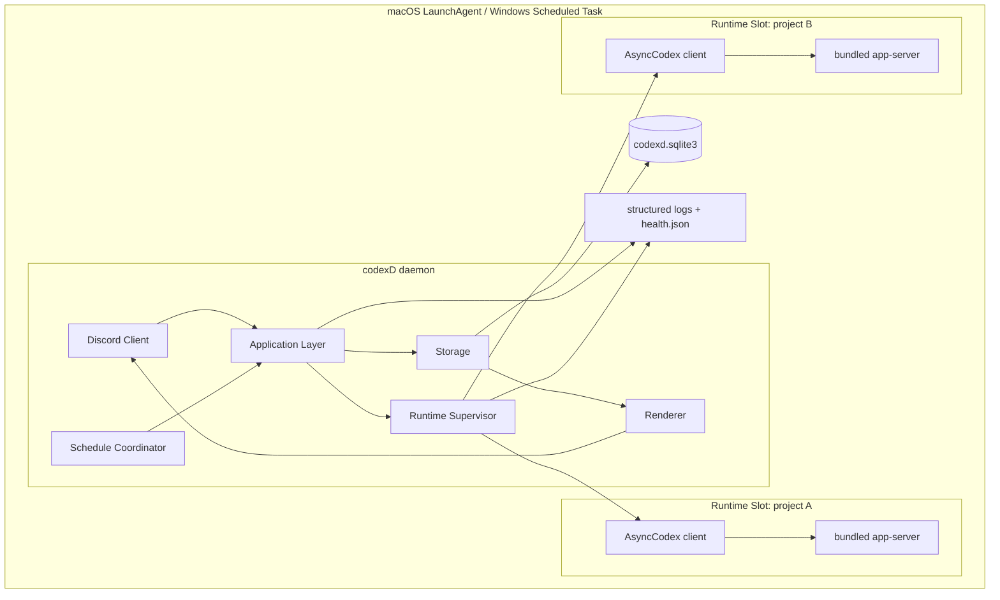

Phase 0 contract 通过时，v1 首选每个 project 一个 Runtime Slot：

- 首次使用时 lazy start；
- Discord ready/account preflight 只检查已经加载的 slot，绝不遍历 enabled Project
  调用 `ensure()`；未加载时 auth projection 为 `unknown`，由首次真实操作解析；
- 启动后默认保留到 daemon 关闭；
- 同一 project 的多个 Conversation 复用 SDK client；
- project-scoped Runtime Slot 崩溃只中断该 project 的 active Turn；shared
  fallback 的 blast radius 见下；
- 不设置固定 Runtime Slot 上限，也不因预设配额拒绝新 project；
- 若宿主机确实无法创建 runtime，返回真实启动错误并记录 incident；
- v1 不做基于 inactivity 的自动回收，避免重演后台任务被 idle reaper
  误杀。

该拓扑假设多个官方 SDK/app-server client 可安全共享同一 service-user
`$CODEX_HOME`、同时操作不同 Thread。Phase 0 必须用两个 project/cwd 的真实并行
contract test 验证 state DB、rollout 和 notification routing；若不成立，实施前
改为一个共享 Runtime，而不是用文件锁把长 Turn 假并行或继续交付已知不安全的
one-slot-per-project 设计。

shared fallback 不是临时拼接：Supervisor 把所有 Project 映射到
`scope_kind=shared` 的同一个 slot，`CodexConfig.cwd` 使用 service-owned neutral
runtime directory，而每次 thread start/resume/fork 与 Turn 仍显式传入 canonical
Project cwd。共享 client 继续依赖 SDK 的 turn-ID routing 承载并行 Conversation；
slot crash 会中断所有 Project 的 active Turn，因此 `/status` 必须显示更大的 blast
radius。不能用共享 slot 的 neutral cwd 作为 Project fallback，也不能因此取消
allowed-root 校验。

### 6.2 组件职责

| 组件 | 职责 | 禁止事项 |
|---|---|---|
| `DiscordAdapter` | 收消息、校验来源、发送/编辑消息、处理 attachment | 不持有 SDK handle |
| `ApplicationCommands` | 解析产品动作、权限检查、事务边界 | 不直接访问 Discord API 或 SDK |
| `SessionCoordinator` | Conversation/thread mapping、mailbox、new/resume/fork/archive | 不渲染消息 |
| `ScheduleCoordinator` | 持久规则、next due、misfire、Schedule Fire 幂等物化 | 不直接调用 SDK；不实现 workflow graph |
| `RuntimeSupervisor` | Runtime Slot lifecycle、generation、health、restart backoff | 不推断业务完成 |
| `CodexRuntimeAdapter` | 唯一 SDK adapter、event normalization、capability manifest | 不返回 SDK 类型到 core |
| `EventPump` | 单消费者读取一个 Turn 的 stream | 不直接发 Discord |
| `EventJournal` | 每 Turn 一个无正文 activity anchor，加 terminal/error/policy metadata 白名单 | 不保存正文、普通成功事件或做 UI 逻辑 |
| `Projector` | 更新 Turn、tool/task 状态与 usage metadata | 不调用 provider，不持久化 transcript |
| `DiscordOutbox` | 持久化 send/edit/delete 操作和 retry | 不重跑 Agent |
| `ContentAssembler` | stream delta -> 进程内 ContentBlock AST | 不知道 Discord message ID，不写磁盘 |
| `DiscordRenderer` | AST -> Discord messages/files/embeds | 不读取 SDK event |
| `MediaWorker` | 隔离执行 untrusted image decode 与 table PNG render | 无 SDK/Discord secret、不接收 project path |
| `ServiceSupervisor` | 安装、启动、停止、status、heartbeat | 不把 transport 断线当 daemon 死亡 |
| `Diagnostics` | incident、版本、health、日志摘要 | 默认不导出 prompt/secret |

### 6.3 依赖方向

```text
transport.discord
    -> application
        -> domain
        -> runtime.port
        -> storage.port
        -> rendering.port

runtime.codex_sdk -> runtime.port + domain
storage.sqlite    -> storage.port + domain
rendering.discord -> rendering.port + domain
service.*         -> application health interfaces
```

硬规则：

- `domain` 不 import `discord`、`openai_codex`、SQLite driver；
- `application` 不保存 provider raw object；
- `runtime.codex_sdk` 不 import Discord；
- `rendering` 只接收 `ContentBlock` 和 projection；
- service installer 不读取 Discord token；
- 未知 SDK event 先 normalization，再进入 storage。

### 6.4 建议目录

```text
codexD/
├── docs/
│   └── codexD-detailed-design.md
├── src/codexd/
│   ├── __main__.py
│   ├── config.py
│   ├── domain/
│   │   ├── capabilities.py
│   │   ├── conversations.py
│   │   ├── turns.py
│   │   ├── events.py
│   │   ├── content_blocks.py
│   │   └── incidents.py
│   ├── application/
│   │   ├── commands.py
│   │   ├── session_coordinator.py
│   │   ├── schedule_coordinator.py
│   │   ├── turn_coordinator.py
│   │   └── recovery.py
│   ├── runtime/
│   │   ├── port.py
│   │   ├── codex_sdk.py
│   │   ├── supervisor.py
│   │   ├── mailbox.py
│   │   └── event_pump.py
│   ├── storage/
│   │   ├── port.py
│   │   ├── sqlite.py
│   │   ├── migrations/
│   │   ├── projectors.py
│   │   └── outbox.py
│   ├── rendering/
│   │   ├── assembler.py
│   │   ├── markdown.py
│   │   ├── tables.py
│   │   └── discord.py
│   ├── transport/discord/
│   │   ├── bot.py
│   │   ├── routing.py
│   │   ├── commands/
│   │   └── attachments.py
│   ├── service/
│   │   ├── supervisor.py
│   │   ├── macos.py
│   │   └── windows.py
│   └── observability/
│       ├── health.py
│       ├── logging.py
│       └── diagnostics.py
└── tests/
    ├── contract/
    ├── integration/
    ├── rendering/
    ├── recovery/
    └── platform/
```

目录只是后续实现建议；当前阶段不会创建这些源码文件。

### 6.5 并发模型

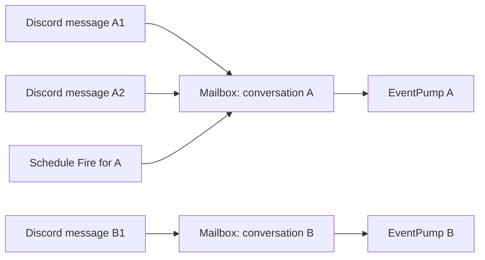

这里不设置产品级并发配额：

- 不同 Conversation 的 Turn 默认可并行；
- Turn queue metadata/order 与 queued immutable input 持久化到 SQLite，不设全局
  或单 Conversation 数量上限；只有 Schedule snapshot 具备可重启执行资格，
  Discord queued Turn 即使 snapshot 完整，重启后仍按 §10.7 中断而非 replay；
- 唯一必须保留的协议不变量是每个 Conversation 最多一个 active Turn，
  由 mailbox 串行保证；
- 每个 active Turn 恰好一个 EventPump，否则记录 internal incident；
- Discord outbox 只要求同一 destination key 保序，不固定全局 worker 数量。

相同 Conversation 的第二条普通消息默认排队，不自动成为 steer。只有显式
`/steer` 才调用 SDK steer，避免用户不知道消息被注入正在运行的 turn。

mailbox 把 queued Turn 转为 `starting` 前，还要用幂等
`Thread.read(include_turns=False)` 检查 current provider Thread：

- `idle` 才可调用 `Thread.turn()`；
- `active` 且本地没有 active Turn 时，设置 durable provider barrier、保留 queued
  Turn 并按 runtime backoff 继续只读轮询；这覆盖 `/session compact` 启动的内部
  activity 和另一个本地 Codex client 造成的 external activity；
- `notLoaded` 先以同 ID 和 effective config resume，再重新 read；
- `systemError` 或 identity mismatch 进入 blocked/incident；
- barrier 没有 quiet/hard timeout，不以“过了几十秒”猜 provider 已空闲；
- Runtime Coordinator 即使没有 queued Turn 也按 bounded backoff reconcile durable
  barrier，idle 后清除并更新 `/status` projection；
- read-idle 到 turn-start 之间仍可能被外部进程抢占；provider rejection 按
  unknown/failed 处理且不自动重试副作用。

---

## 7. Python Codex SDK Adapter

### 7.1 Adapter 原则

`CodexRuntimeAdapter` 是 codexD 唯一接触 `openai_codex` 的模块。它负责：

- 普通能力以 `AsyncCodex(CodexConfig(experimental_api=False, ...))` 创建和关闭
  SDK client；只有版本矩阵验证通过并启用 codexD product tools 时，改用围绕
  public low-level `CodexClient(config, approval_handler=...)` 的 async compatibility
  facade，并显式设置 `experimental_api=True`；
- 将 domain request 转换为 SDK 参数；
- 将 SDK thread/turn/item 转换为 normalized event；
- 将受信任的 `TurnFile` 映射为 public `MentionInput`，不读取文件内容或生成替代 prompt；
- 捕获 thread ID、turn ID 和 runtime version；
- 实现 interrupt、steer、fork、archive/unarchive 等 capability；
- 统一 SDK exception；
- 丢弃或脱敏不应进入业务层的 provider detail；
- 生成 capability manifest。

daemon 不调用 `AsyncThread.run()` 或 `AsyncTurnHandle.run()`；它只调用
`AsyncThread.turn()`，立即保存返回的 Turn ID，再由唯一 EventPump 消费
`AsyncTurnHandle.stream()`。同一 SDK client 可以依靠 SDK 的 turn-ID routing
承载多个 Conversation 的并行 Turn，但每个 Turn 仍只能有一个 consumer。
mailbox 在 await 前先提交 `starting`；handle 返回后以同一 transaction 保存
provider Turn ID/runtime generation 并转 `running`，然后启动 EventPump。SDK
可能已缓存早到的 `turn/started` notification，因此该 notification 只幂等确认
ID/state；若其中 ID 与 handle 不同则进入 incident，不能创建第二个 Turn。

当前 SDK 在 `turn_start()` 返回 handle 前已为 provider Turn 注册 notification
queue，`stream()` 的再次注册是幂等的；因此 adapter 可以先提交 provider Turn ID
再开始迭代，而早到事件由 SDK queue 暂存。这个行为必须用“立即完成的最短 Turn”
做每档 contract test；若版本漂移导致早到 terminal 丢失，该 SDK 组合不受支持，
codexD 不下沉到私有 router 修补。

它不负责：

- Discord 消息；
- SQLite transaction；
- Turn 状态投影；
- 自动重试用户 turn；
- CLI fallback；
- 任意或未经过 schema/version gate 的 app-server JSON-RPC；
- 解释 TUI slash command。

### 7.2 Domain Port

后续实现应提供类似以下的 provider-neutral port。名称为设计接口，不要求与
SDK 类名一致：

```python
class CodexRuntime(Protocol):
    async def capabilities(self) -> CapabilityManifest: ...
    async def list_models(self) -> ModelCatalogSnapshot: ...
    async def account_status(self) -> AccountStatus: ...

    async def start_thread(
        self,
        *,
        cwd: Path,
        config: ThreadConfig,
    ) -> ThreadIdentity: ...

    async def resume_thread(
        self,
        *,
        thread_id: str,
        cwd: Path,
        config: ThreadConfig,
    ) -> ThreadIdentity: ...

    async def fork_thread(
        self,
        *,
        thread_id: str,
        cwd: Path,
        config: ThreadConfig,
    ) -> ThreadIdentity: ...

    async def read_thread(self, thread_id: str) -> ThreadSnapshot: ...
    async def set_thread_name(self, thread_id: str, name: str) -> None: ...
    async def compact_thread(self, thread_id: str) -> CompactStartResult: ...

    async def start_turn(
        self,
        *,
        thread: ThreadIdentity,
        input: TurnInput,
        config: TurnConfig,
    ) -> TurnStream: ...

    async def steer(self, turn: TurnIdentity, text: str) -> None: ...
    async def interrupt(self, turn: TurnIdentity) -> None: ...
    async def archive_thread(self, thread_id: str) -> None: ...
    async def unarchive_thread(self, thread_id: str) -> ThreadIdentity: ...
    async def close(self) -> None: ...
```

`ThreadSnapshot` 至少保留 actual thread ID 与 public
`Thread.status` 的 `idle|active|notLoaded|systemError` discriminant；adapter
不得把 unknown/new status 默认折叠成 idle。active flags 只以 typed、安全摘要
进入 diagnostics，不据此实现 Python SDK 没有的 approval/user-input command。

`TurnStream` 只允许迭代一次。实现必须在第二个 consumer 出现时立即抛出
internal invariant error，而不是让两个 task 竞争 SDK stream。

`TurnInput` 是 codexD 自己的不可变类型，不暴露 Discord 或 SDK 对象：

```text
TurnInput
  text?
  images[]
  files[]
  skill_inputs[]

TurnImage
  attachment_id
  ordinal
  canonical_path
  media_type
  sha256
  width
  height

TurnFile
  attachment_id
  ordinal
  canonical_path
  display_name
  reported_media_type?
  sha256
  size_bytes
  retention_until

TurnSkill
  name
  canonical_path
  content_hash

ThreadConfig
  model?
  personality?             # start/resume；fork 后由下一 Turn 应用
  sandbox
  approval_mode
  service_tier?
  web_search_mode?          # capability 缺失时 provider_default_uncontrolled

TurnConfig
  cwd
  sandbox
  approval_mode
  model?
  reasoning_effort?
  personality?
  service_tier?
  reasoning_summary?
  output_schema?

ModelDescriptor
  id
  model
  is_default
  input_modalities[]
  supported_reasoning_efforts[]
  default_reasoning_effort
  supports_personality
  service_tiers[]          # id/name/description
  default_service_tier?
  upgrade?

ModelCatalogSnapshot
  models[]
  complete
  next_cursor?

AccountStatus
  auth_required
  account_type?            # apiKey/chatgpt/amazonBedrock
  plan_type?               # only when provider reports it
  observed_at
```

高层 lifecycle 参数并不对称，adapter 使用显式 allowlist：

| SDK operation | codexD 传入 |
|---|---|
| `thread_start` | cwd、effective model/personality/sandbox/approval/service tier；capability 可用时仅传 `web_search` config；`ephemeral=False` |
| `thread_resume` | 同上；显式 approval，不依赖其默认 `None` |
| `thread_fork` | cwd、model/sandbox/approval/service tier；capability 可用时仅传 `web_search` config；`ephemeral=False`；高层方法没有 personality |
| `thread_unarchive` | 只传 thread ID；使用 returned handle/actual ID，不再自动叠加 resume |
| `Thread.turn` | cwd、model/effort/personality/sandbox/approval/service tier、reasoning summary、optional output schema |

v1 将 `base_instructions`、`developer_instructions`、`model_provider`、
`service_name`、`session_start_source`、`thread_source` 保持 `None`，不注入隐藏
prompt 或 analytics 值。高层 fork API 不报告也不能覆盖新 Thread 的 initial
personality，codexD 不能宣称它一定继承；desired override 在 fork 后第一个
`Thread.turn(personality=...)` 重新显式应用。若未来
要使用上述字段，必须独立设计版本化语义与 contract test。

`text`、`images` 与 `files` 至少一项存在。adapter 不做 OCR，不生成替代 prompt，
也不把 Discord CDN URL 传给 Codex。图片文件至少保留到 SDK 接受输入并收到
`turn.started`，之后仍按输入附件 retention policy 保存，以便审计和故障诊断。
wire list 的 deterministic 顺序为可选 `TextInput`、按 prompt 首次出现顺序去重的
预登记 `SkillInput`、再把 image/file 按共享的 Discord ordinal 合并：`TurnImage`
映射为 `LocalImageInput(canonical_path)`，`TurnFile` 映射为
`MentionInput(display_name, canonical_path)`。adapter 不读取或内嵌 ordinary file
bytes，不把 URL/path 拼入 `TextInput`；同一 immutable snapshot/retry-free provider
call 始终产生一个相同顺序的 wire input，file-only Turn 也不补隐式文字。

`TurnFile.canonical_path` 只来自 storage load 时完成 path/symlink/type/mode/size/hash
复验的 snapshot；runtime 不接受 Discord 文本、URL 或调用者另传的路径 channel。
`mention.input` 不为 `true` 时，coordinator 与 SDK adapter 都必须在调用
`Thread.turn()` 前返回稳定的 `file_input_unsupported`，错误和日志不包含 display
name 或绝对路径。ordinary file 不参与 image modality 检查。

model、reasoning effort、service tier、image modality 与 personality support
必须来自 `Codex.models()` 的当前 catalog。配置或 Schedule 触发时若选择值已不
再被 catalog 支持，Turn 在 provider 调用前明确拒绝，不能静默换模型、tier 或
丢弃图片。

### 7.3 类型隔离

Domain 层只接收以下稳定类型：

```text
ThreadIdentity
  thread_id
  requested_thread_id?
  provider_session_id        # Thread.session_id；不是 codexD 产品实体
  forked_from_thread_id?
  parent_thread_id?           # provider subagent relation；main revision 通常为空
  provider_version

TurnIdentity
  turn_id                # codexD local ID for the same Turn
  provider_turn_id?
  runtime_generation

NormalizedEvent
  local_sequence
  provider_event_id?
  kind
  occurred_at
  payload
  raw_type
  schema_version
```

任何 `openai_codex.*` 实例不得：

- 写入 SQLite pickle；
- 出现在 Discord handler signature；
- 进入 event payload；
- 被 application 层保存以供稍后调用；
- 跨 runtime generation 复用。

SDK public type 虽名为 `RunInput`，它只是
`str | InputItem | list[InputItem]`，其中 `InputItem` 为
`TextInput | ImageInput | LocalImageInput | SkillInput | MentionInput`；adapter
可使用该 SDK 名，domain/storage/Discord 不因此创建
`Run` 产品实体。

### 7.4 SDK 与 CLI 版本兼容

codexD 的发布依赖声明使用受测试的兼容范围，而不是固定单一版本：

```text
openai-codex >= MIN_SUPPORTED, < NEXT_BREAKING
```

`MIN_SUPPORTED` 和 `NEXT_BREAKING` 由 compatibility matrix 决定。若 SDK
仍采用快速演进的预发布版本号，可以收窄到相邻 minor 范围，但不能把产品
设计成只能安装一个 patch 版本。

SDK 对其配套 `openai-codex-cli-bin` 的依赖关系由官方 SDK 包管理：

- codexD 不单独要求 SDK version 与 runtime version 字符串相等；
- 包管理器安装 SDK 声明的兼容 runtime；
- codexD 通过 SDK handshake、required API 和 capability manifest 判断是否
  可用；
- 记录实际解析到的 SDK/runtime 版本用于诊断；
- 使用 PATH 中任意 `codex` 覆盖 SDK runtime 默认不支持；
- SDK 与 runtime 不能绕过官方依赖关系各自手工升级；
- 运行时发现不兼容后不能静默降级到 `codex exec`；
- 不依赖 SDK 私有模块路径。

分发策略：

| 场景 | 策略 |
|---|---|
| PyPI/安装包依赖 | 声明兼容范围 |
| CI | 测试 minimum、recommended、latest-supported 三个组合 |
| 独立应用产物 | 记录构建时解析版本，但不把该版本变成全局产品要求 |
| 用户已有较新 SDK | 在受支持范围内先做 compatibility/capability check |
| 超出声明范围 | 拒绝启动并给出升级 codexD 或调整 SDK 的明确提示 |

补丁版本在声明范围内默认可安装；若启动检查发现 required capability 缺失，
仍然 fail closed。Optional capability 按实际 manifest 注册，不按版本号猜测。
`mention.input` 当前只在 public export、`MentionInput(name, path)` constructor、
`{"type":"mention","name":...,"path":...}` wire serialization 与平台 secure-lease
contract 均通过的 SDK `0.144.4`/POSIX 组合上报告 `true`；范围内其他 patch 或缺少
安全 lease 的平台保持文字/图片兼容，但文件 Turn fail closed，直到对应组合加入
compatibility matrix。

启动时记录：

- codexD version；
- Python version；
- OS/version/architecture；
- `openai_codex` package version；
- bundled Codex runtime version；
- `$CODEX_HOME` 的 canonical path hash 与 redacted display；
- capability manifest hash；
- database schema version。

initialize handshake 只证明 SDK 与 runtime 能通信并返回 server/platform
metadata；它不返回一份完整 feature list。required API 由 adapter import/signature
contract 与 compatibility matrix 验证，model/modalities/tier 再由只读 catalog
发现；不能把“某事件本次没有发生”当 capability probe。

若 SDK 超出受支持范围，或 required capability 不满足，daemon 进入
`startup_failed`，Discord client 不登录。这样既允许范围内升级，又避免用户
在半可用状态下创建无法恢复的 session。

Codex authentication missing/expired 不等于 capability 缺失：它进入
`authentication_required` operational state，Discord client 仍登录，`/status`
在 `account.auth=true` 时提示本机 stop -> `codexd auth codex login-*` -> start；
否则提示升级到受支持 SDK 或由 operator 独立完成官方 Codex 登录，codexD 自己
不 shell-out。所有新 Turn fail closed。网络暂时不可达也
进入 degraded/runtime unavailable，不把受支持 SDK 错判为 schema incompatible。

### 7.5 Capability Manifest

Manifest 是 adapter 的显式输出，不通过 `hasattr` 散落判断：

```json
{
  "adapter": "openai_codex",
  "sdk_version": "X.Y.Z",
  "runtime_version": "A.B.C",
  "compatibility": {
    "declared_range": ">=MIN_SUPPORTED,<NEXT_BREAKING",
    "matrix_tier": "minimum|recommended|latest_supported|range_only",
    "handshake": "passed"
  },
  "image_input_modes": ["local_path", "data_url"],
  "required": {
    "thread.start": true,
    "thread.resume": true,
    "thread.read": true,
    "turn.stream": true,
    "turn.interrupt": true,
    "turn.steer": true,
    "turn.image_input": true,
    "turn.model_override": true,
    "turn.reasoning_effort": true,
    "model.catalog": true,
    "event.turn_lifecycle": true,
    "thread.identity": true,
    "sandbox.configure": true,
    "approval.configure": true,
    "runtime.close": true
  },
  "optional": {
    "thread.archive": true,
    "thread.unarchive": true,
    "thread.fork": true,
    "thread.set_name": true,
    "thread.compact": true,
    "thread.side_query": true,
    "turn.output_schema": true,
    "turn.personality": true,
    "turn.reasoning_summary": true,
    "turn.service_tier": true,
    "usage.notification": "supported_not_observed",
    "item.command_file_diff_plan": "supported",
    "web_search.config": true,
    "skill.input": true,
    "mention.input": true,
    "mcp.item": "supported_not_observed",
    "dynamic_tool.item": "supported_not_observed",
    "dynamic_tool.call": true,
    "codexd.schedule_create_tool": true,
    "codexd.publish_image_tool": true,
    "collab.item": "supported_not_observed",
    "image_generation.item": "supported_not_observed",
    "account.read": true,
    "account.auth": true
  }
}
```

Manifest 由 adapter、受支持版本矩阵和 contract tests 共同定义。不能以一次
真实、计费的 Agent turn 作为 daemon 每次启动的 capability probe。布尔型
callable capability 与 `supported|unsupported|supported_not_observed` 事件
capability 分开表示。

`dynamic_tool.call` 与 `codexd.schedule_create_tool` / `codexd.publish_image_tool`
是不同门禁：前者只证明当前
SDK/runtime pair 的 public `CodexClient` handler、experimental opt-in、request
routing 和 response schema 通过 contract；后者还要求 actor persistence、owner
gate、Schedule draft/outbox transaction 与 Discord card contract 全部接线完成。
当前只对 SDK/runtime `0.144.4/0.144.4` 报告为 true，范围内未验证 patch 保持
false。自定义 handler 对 command/file approval 继续返回既有 `auto_review`
decision；未知 server request 返回空结果，绝不按 Schedule 调用处理。

`thread.compact=true` 不是单纯 `hasattr(Thread, "compact")`：它还要求 §12.4
定义的 provider busy/idle serialization contract 通过。只确认 start callable
但无法防止下一 Turn 与内部 compaction 重叠时，该值必须为 false。

`turn.image_input=true` 要求兼容矩阵中至少一个 public wire mode 通过真实
runtime contract；`image_input_modes` 只列实际验证过的 mode。认证成功后，
catalog 还必须至少有一个可见 model 声明 image input modality，否则服务进入
fail-closed operational state，不能把“能解析 Python 类型”冒充图片可用。若
`next_cursor` 非空且当前页尚未找到 image-capable model，错误是
`model_catalog_incomplete`，不能误报为 provider 明确不支持；只有 complete
catalog 才可报 `required_capability_unavailable`。

`mention.input` 是稳定的 optional capability ID，不是对任意本机路径开放的入口。
它只表示当前 SDK version 的 public constructor/wire contract 已验证；具体文件在
每次 provider start 前仍须通过 storage snapshot 复验。capability 为 false/missing
时不得删除 `MentionInput`、改成 `TextInput(path)` 或只发送同 Turn 的其余输入。

### 7.6 Runtime 配置

每个 Runtime Slot 接收不可变启动配置：

| 字段 | 说明 |
|---|---|
| `scope_kind` | project/shared；由 Phase 0 contract 固定整个部署的 topology |
| `project_id` | project-scoped 时为 codexD Project UUID；shared 时为空 |
| `cwd` | project-scoped 为 canonical project root；shared 为 service-owned neutral runtime dir |
| `codex_home` | service user 的 Codex state 目录 |
| `environment_hash` | scrub 后 non-secret child environment 的 hash |
| `topology_contract` | project-scoped/shared 的 Phase 0 gate 结果 |

model、effort、personality、service tier、web search、sandbox 和 approval 不是
`CodexConfig` process-start 字段，也不能固化在 shared slot。它们按 §7.2 从
Project/Conversation 计算 effective Thread/Turn config，并在每次 lifecycle/Turn
调用时显式传入；Turn 一旦 queued 就保存 immutable config snapshot。

v1 构造 `CodexConfig` 时按 slot scope 传 canonical project cwd 或 neutral runtime
cwd，并显式
`experimental_api=False`。`codex_bin=None` 让 SDK 解析自己声明的 bundled
runtime；`launch_args_override=None`、`config_overrides=()`，client metadata
使用 SDK 默认。当前 SDK 的 `CodexConfig.env` 是叠加到 `os.environ.copy()`，不是
replacement；因此只传一份 allowlist mapping **不能** 阻断 inherited secret。
daemon bootstrap 必须先把需要的 HOME/USERPROFILE、PATH、SystemRoot、临时目录、
locale、`CODEX_HOME` 和明确配置的 proxy/certificate/profile metadata 复制到新
mapping，再从 no-echo/env/secret store 读取必要 secret 到内存，随后
`os.environ.clear()` 并只恢复该 allowlist，最后才允许创建任何 `AsyncCodex`。
这个 scrub 是 daemon 单线程 bootstrap 的首批步骤，必须先于 Discord client、
worker thread、MediaWorker 和其他可能读取环境的 library 初始化；运行中绝不再次
clear/mutate 全局 environment。
`CODEXD_DISCORD_TOKEN` 绝不恢复，projection/signing key 也永不进环境；
本机配置可额外登记经过 name/value 校验的 non-secret toolchain variable
（例如 `JAVA_HOME`/`DEVELOPER_DIR`），但 Discord 不能登记，proxy URL 也不得含
userinfo/query credential。`CodexConfig.env` 只可再次叠加同一 validated
non-secret mapping。bootstrap 后若
process environment 出现 allowlist 外 key，Runtime Slot creation fail closed。
`CODEX_SQLITE_HOME` 与 `CODEX_HOME` 同属允许的非 secret location metadata；
codexD 为 child 显式设置受配置约束的 `RUST_LOG`，默认只保留 WARN/ERROR，
并把 `codex_http_client::transport` 降到 ERROR，避免完整 HTTP/SSE
正文和依赖 TRACE 写入 Codex feedback SQLite。Discord 输入不能覆盖该 filter。
AWS/Azure/GCP/API-key credential environment variables 不在 allowlist；若某种
provider account 只能依赖这类 inherited secret，v1 明确报
`environmental_auth_unsupported`，不能为兼容而把它泄露给 agent command child。
`web_search.config=true` 时，Thread start/resume/fork 的 public `config` 只由
代码生成 `{"web_search": <validated mode>}`；capability=false 时传 `None`，
effective 状态记为 `provider_default_uncontrolled`，不能谎称 cached/disabled。
任何 Discord option 都不能直达这些字段，
也不能覆盖 client capability、transport、approval handler 或 app-server
启动参数。

Runtime 配置不接受 Discord 用户提供的：

- 任意 CLI flag；
- 任意 app-server JSON；
- 任意环境变量；
- 任意 `CODEX_HOME`；
- 任意附加可写目录；
- shell command string。

### 7.7 Approval 策略

Python SDK public API 只有 `ApprovalMode.auto_review` 与
`ApprovalMode.deny_all`，没有把 approval request 转交 Discord 的 handler。
单用户部署的所有会话固定使用 `Sandbox.full_access` 与
`ApprovalMode.auto_review`：

| Product policy | Sandbox | Approval | Discord/config 可切换 |
|---|---|---|---|
| fixed full access | `Sandbox.full_access`（provider 映射为 `dangerFullAccess`） | `ApprovalMode.auto_review` | 否 |

源码中的精确映射是：

- `auto_review` -> `approvalPolicy=on-request` +
  `approvalsReviewer=auto_review`；
- `deny_all` -> `approvalPolicy=never`；
- 高层 `Codex`/`AsyncCodex` 构造器不公开 approval handler；
- 它们使用的底层默认 handler 会对到达 client 的 command/file-change approval
  request 返回 `accept`，其他 server request 返回空 response。

SDK 的 `thread_start()` 默认 approval mode 是 `auto_review`，而
`thread_resume()` / `thread_fork()` 默认 `None`，即保留已有设置。codexD 不依赖
这组不对称默认：start/resume/fork 与每次 Turn 都显式传入固定的
`full_access + auto_review`，恢复/切换 revision 也不得从历史数据恢复较弱或未知
profile。

因此 `auto_review` 不表示 Discord 用户逐条点击批准，也不能宣传成“所有高风险
动作都无条件通过”：auto-review policy、sandbox 和其他 server-request 类型仍
可能拒绝。反过来，codexD 也不能安全实现 `waiting_approval` 或 `/approve`。
SDK 还公开 `workspace_write`/`read_only` preset，但它们不属于 codexD v1 产品
配置面。UI 必须显示固定 approval/sandbox policy；需要不可升级的 no-write 保证时
使用独立 OS identity/VM，不能把一个应用内 profile 当作该保证。

`deny_all` 也不是 codexD 自己实现的第二道 client-side deny handler；它依赖
provider 对 `approvalPolicy=never` 的执行，而高层 client 的默认 request handler
仍是 accept。v1 不暴露任何 Discord permission profile。`deny_all` mapping 只保留
在 SDK compatibility 记录中，不作为 required runtime gate。
设计意图是：

- 不让无 UI callback 的 Turn 永久等待审批；
- 新 Conversation 和新 Thread Revision 创建时在 status card 显示
  `FULL ACCESS`；
- config、migration、Conversation、Schedule 和每个 provider call 都维持
  `full_access + auto_review`；
- 不提供 `/approve`；
- public SDK 若因 approval/sandbox 拒绝操作，以 provider error/Item
  归一化，不创建本地 `waiting_approval` 状态。

### 7.8 Exception 归一化

| Domain error | 示例 | 是否自动重试 |
|---|---|---|
| `RuntimeUnavailable` | app-server 未启动/已退出 | 只重启 runtime，不重放 turn |
| `AuthenticationRequired` | Codex auth 失效 | 否，要求本机修复 |
| `UnsupportedCapability` | fork/steer 不存在 | 否 |
| `InvalidThread` | rollout 不存在或损坏 | 否，Conversation blocked |
| `ThreadIdentityMismatch` | resume 返回新 ID | 否，incident |
| `ProviderRateLimited` | provider rate limit | 不自动重跑有副作用 turn |
| `ProviderRejected` | policy/input rejection | 否 |
| `StreamEndedUnexpectedly` | 无 terminal event 关闭 | Turn interrupted |
| `InterruptFailed` | cancel 未确认 | 标记 cancelling 并继续观察 |
| `AdapterInvariantError` | 两个 stream reader | 立即失败并 incident |

Adapter error 必须保留：

- stable error code；
- provider exception class name；
- redacted message；
- retryability；
- runtime generation；
- thread/turn ID（如已知）；
- cause chain hash。

SDK public `retry_on_overload()` 使用 `time.sleep`，只允许本机同步 CLI 的幂等
read；不得在 daemon async event loop 调用。daemon 对 `models()`、
`account(refresh_token=False)`、`AsyncThread.read()` 等明确幂等 read，可基于
public `is_retryable_error()` 实现 bounded async backoff。
`thread_start/resume/fork/archive`、`Thread.turn()`、steer/interrupt/compact 与
login/logout 不做通用自动 retry；请求 outcome 不明时按 unknown/interrupted 或
incident 处理，绝不能因为 exception class 看似 transient 就重复副作用。

### 7.9 Structured output

`turn.output_schema` 使用 public Turn `output_schema=<JSON Schema>`，但 SDK 最终
仍返回 string。codexD：

- 只为内部、版本化协议使用，不给普通聊天硬加 `/schema`；
- schema 必须静态登记并限制深度/大小，不接受 Discord 用户提交任意 schema；
- terminal 后自行 `json.loads` 并再次执行 JSON Schema validation；
- parse/validation 失败时保留原始 assistant text，标记
  `structured_output_invalid`，不丢失回复；
- 结构化结果可生成 deterministic ContentBlock，但不能把模型输出当 codexD
  control command。

---

## 8. 生命周期与状态机

### 8.1 为什么必须拆成三个对象

`Conversation`、`RuntimeLease` 和 `Turn` 的生命周期不同：

| 对象 | 持久性 | 权威来源 | 可否在进程重启后恢复 |
|---|---|---|---|
| Conversation | durable | codexD DB + Codex thread store | 是 |
| RuntimeLease | process-scoped | RuntimeSupervisor + OS process | 否，只能新建 generation |
| Turn | execution-scoped | EventPump + terminal event | 仅恢复历史，active 变 interrupted |

将三者合并会导致：

- 用 `session.is_active` 判断进程健康；
- 用 thread ID 判断任务仍在运行；
- runtime 重启时静默新建 conversation；
- Discord gateway watchdog 杀死 Agent；
- active task 被 idle reaper 回收。

### 8.2 Conversation 状态机

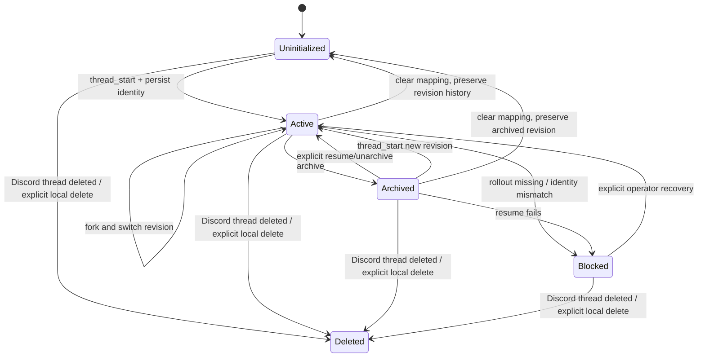

状态定义：

| 状态 | 含义 | 是否接受普通消息 |
|---|---|---|
| `uninitialized` | Discord thread 存在，但尚无 Codex thread | 是，先 start |
| `active` | 有 current thread revision | 是 |
| `archived` | 当前 revision 已 archive | 否，先 resume/new |
| `blocked` | provider identity/rollout 不一致 | 否 |
| `deleted` | codexD tombstone | 否 |

Conversation 不使用 `idle` 状态。没有 active Turn 不等于 conversation
消失；runtime 未加载也不等于 conversation 不可恢复。
`deleted` 只停止新 ingress/Schedule delivery；已在 provider 运行的 Turn 不因
Discord 删除而被 interrupt，EventPump 继续持久化，结果 delivery 进入明确
dead-letter/incident。metadata/detail 的物理清理由 retention 另行决定。

### 8.3 Thread Revision

每次 `new`、`resume` 或 `fork` 都产生或激活一个 Thread Revision：

```text
Conversation A
  revision 1: thread T1, superseded
  revision 2: thread T2, archived
  revision 3: thread T3, active, parent T2
```

约束：

- 一个 Conversation 最多一个 `active` revision；
- `fork` 创建新 provider thread ID 和 parent linkage；
- `new` 不删除旧 Codex rollout；旧 revision 若为 active 则转 `superseded`，若已
  archived 则保持 archived；
- `clear` 清除 current mapping，但保留历史 revision；
- 只有显式、二次确认的 maintenance 操作才可删除 provider/local history；
- Discord thread ID 不因 fork 变化。

### 8.4 RuntimeLease 状态机

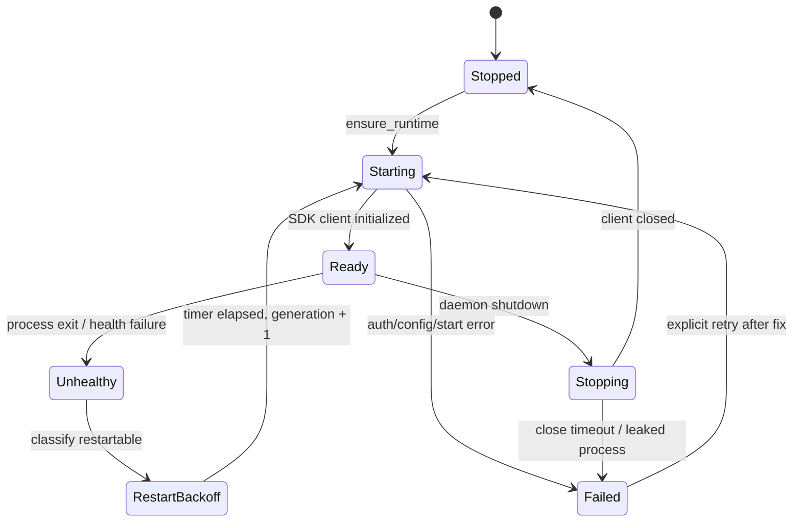

Runtime generation：

1. Runtime Slot 首次启动为 generation 1；
2. 每次新 SDK/app-server process 启动前递增；
3. Turn 创建时保存 generation；
4. EventPump 收到的事件必须匹配 Turn generation；
5. 旧 generation 的迟到 event 只写 incident，不更新 projection；
6. runtime crash 将同 generation 非终态 Turn 标为 `interrupted`。

### 8.5 Runtime restart backoff

默认退避：

```text
1s -> 2s -> 5s -> 10s -> 30s -> 60s (cap)
```

- Ready 连续 5 分钟后重置失败计数；
- auth/config/schema error 不自动循环重启；
- process crash 可自动重启；
- 每个 Runtime Slot 独立退避；
- Discord transport 始终存活并可显示 project unavailable；
- restart 不自动提交旧 Turn；
- 10 分钟内超过 5 次 crash 创建 high-severity incident。

### 8.6 Turn 状态机

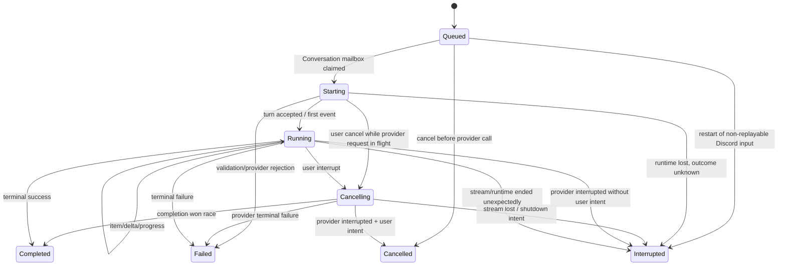

满足 §10.7 全部 replay-safe 条件的 Schedule queued Turn 在启动恢复时保持
`queued` 并重新唤醒 mailbox；它不走图中的 Discord-input restart transition。

终态：

- `completed`
- `failed`
- `cancelled`
- `interrupted`

只有 provider terminal success event 可产生 `completed`。以下都不能当成功：

- assistant 已输出一段文本；
- 收到某个 Result-like item；
- quiet gap；
- pending set 变空；
- Discord progress message 显示 100%；
- stream task 被本地 cancel；
- runtime process 仍然存在。

### 8.7 Turn cancel

取消流程：

1. queued Turn 在 provider call 前原子转 `cancelled`；`starting`/`running` Turn
   原子转 `cancelling`；
2. 同一 transaction 写入 `interrupt_origin=user`；
3. 已有 provider Turn ID 时 coordinator 立即调用当前 generation 的
   `interrupt()`；`starting` 尚无 handle 时记录 deferred interrupt，`turn()`
   返回后先提交 ID、启动唯一 EventPump，再立即 interrupt；
4. EventPump 继续读取直到 provider terminal event 或 stream 关闭；
5. 官方 SDK 以 completed event 的 `status=interrupted` 结束时，若
   `interrupt_origin=user`，产品状态映射为 `cancelled`；
6. 若 completion success 先到，状态为 `completed`，并显示 cancel race；
7. 若 interrupt 调用失败但 stream 仍在，保持 `cancelling` 并告警；
8. 若 runtime 消失，状态为 `interrupted`；
9. 不通过杀整个 Runtime Slot 取消单个 Turn，除非 operator 执行 emergency
   stop。

### 8.8 Steer

`/steer` 是 Codex-native Core capability：

- 只允许 conversation 当前 active Turn；
- Turn 必须已是 `running` 且当前 generation 的 handle 存在；`starting` 返回
  `turn_not_steerable_yet`，`cancelling` 拒绝；
- 必须匹配 runtime generation；
- 文本通过 Discord modal 获取；
- interaction ID 先以 unique intent 持久化；重复 delivery 返回已有结果，不再次
  调 SDK；
- 写 `turn.steer_requested` audit event 后调用 SDK；
- 成功后写 `turn.steer_accepted`；
- SDK 拒绝时不把文本排成新普通 turn；
- 没有 active Turn 时提示用户发送普通消息；
- adapter 不支持时 required-capability gate 阻止 daemon 进入 ready。

#### Headless waiting flags

高层 `Codex`/`AsyncCodex` 不允许 codexD 注入 server-request handler。当前低层
default handler 只对 command/file approval 返回 accept，其他 request 返回空对象；
因此 `Thread.status.activeFlags` 中的 `waitingOnUserInput` 或异常持续的
`waitingOnApproval` 不能被解释成 codexD 可回答：

- Runtime Coordinator 对 active Turn 做低频、幂等 `Thread.read()` health
  projection；观察到 flag 后原位显示一次 `provider_waiting_but_no_public_response_api`；
- Turn 与 EventPump 继续存活，不使用 quiet timeout，也不因 flag 自动标记失败；
- owner 可 `/turn cancel`；`/steer` 不能冒充某个 typed user-input/approval response；
- 不注册 `/approve`、`/answer` 等空壳命令；
- flag 消失时更新状态；长期不消失属于可诊断 provider wait，不创建新 Turn 绕过。

### 8.9 Schedule 状态机

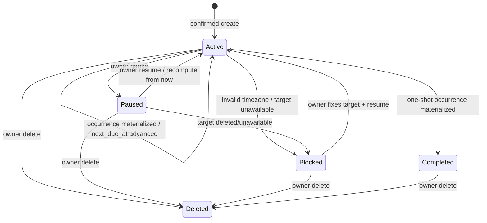

Schedule Fire 只允许：

```text
due -> materialized
due -> skipped
due -> blocked
```

`materialized` 表示已原子创建关联 queued Turn，不代表 Codex 执行成功。Turn 的
terminal state 不反写成另一套 Schedule execution state。

### 8.9.1 `codexd.schedule_create` dynamic tool

新建 provider Thread 时注册 namespace tool `codexd.schedule_create`。参数只包含
`name/kind/expression/timezone/misfire_policy/prompt`；Conversation、Discord identity、
project path、sandbox 与 approval 全部从可信 host context 推导，schema 拒绝额外字段。
升级前已存在的 rollout 不会被重建或静默丢弃上下文；该 Thread 没有工具时，用户需
执行 `/session new` 才获得能力。

每次 `item/tool/call` 重新核对 runtime generation、provider thread/turn/call、active
Revision、Discord Turn source 与该消息的 `requested_by_user_id`。只有配置的 Discord
owner 可以生成草稿；Schedule/background Turn 与 allowed non-owner 均返回安全错误且
没有 draft/outbox side effect。同一 call identity + argument hash 重放返回原结果；
同 identity 不同参数 fail closed。

合法调用在同一 SQLite transaction 中提交 invocation、pending draft 与普通 Thread
message outbox，立即向 Agent 返回 `confirmation_required`，绝不在 app-server reader
路径等待用户或调用 Discord REST。确认卡是 Conversation 中所有参与者可见的普通消息
（不同于 `/schedule create` 的 ephemeral preview），包含醒目的 `FULL ACCESS /
unattended` 提示和 10 分钟有效的 signed Confirm/Cancel。只有 owner 点击原始、已绑定
message 才能激活；Confirm/Cancel 再投递 durable terminal edit 并移除按钮。初始卡永久
投递失败会使草稿 expired 并生成 incident，不会激活 Schedule 或阻塞整个 Conversation。

### 8.9.2 `codexd.publish_image` 与 outbound artifact handoff

`publish_image(source_path, display_name, description)` 只在用户明确要求图片或 raster
visualization 时调用。`source_path` 是 runtime 内存参数：不进入 event、普通日志、
diagnostics、tool projection 或 tool result。app-server adapter 在脱敏前暂存当前
provider Turn 的 `imageView` / typed `imageGeneration.saved_path`，handler 只接受该 Turn
已观察到、位于 canonical project root 或 OS temp root、且 mtime 属于当前 Turn 的
regular single-link file；symlink/reparse、hard link、目录、设备、越界和替换竞态全部
fail closed。

handler 通过 no-follow descriptor 将 source 复制到 owner-only staging，再由隔离
MediaWorker 按 magic bytes 完整 decode，应用 orientation、pixel/byte/memory budget，
移除 EXIF/GPS/profile 并规范化为 PNG。最终文件位于
`attachments/render/<turn_id>/outbound/`；SQLite 只保存 relative path、hash、dimensions、
安全 display name/description 和 provider call identity。相同 call + argument hash 重放
原 result，不同参数冲突；文件登记与 durable result 使用同一 DB transaction，崩溃前
遗留但未登记的随机 staging 文件由 orphan retention 清理。

final outbox 在 Markdown attachments 后按 `artifact_ordinal` 合并已登记图片，并把 artifact
manifest 纳入 render-plan source hash。429/5xx 与 crash-before-ack 复用同一 immutable
PNG 和 delivery marker；Discord 永久拒绝图片时发送可见失败卡并记录
`outbound_image_delivery_failed`，不把二进制改成 base64 文本，也不改变 Turn terminal
state。普通 `imageView` 永远只是检查事件，未调用 publish tool 时不上传。

私有 `visualize…` marker 不是 provider output contract。final renderer 使用 bounded
scanner 移除 marker；有 registered image 时由附件表达，没有时替换为可见失败提示并记录
`visualization_attachment_missing`，绝不读取 marker 内 path、执行 HTML/JS 或发网络请求。
现有 typed `imageGeneration` 若没有显式 publish 仍维持
`image_generation_attachment_unavailable` incident，不能误报上传成功。

### 8.9.3 `/btw` / `/side` ephemeral Side Query

两个顶层 Discord command 共享同一个 application service。填写 `question` 时立即
ephemeral defer；省略时打开 signed `side_query` modal，intent 绑定 Conversation、guild、
thread、initiating allowed user、nonce 与 10 分钟 expiry。每次调用只执行一次问答，普通
Thread message 永远不会隐式路由到 side。

runtime 从当前 active Revision 的 provider Thread 执行 public
`thread_fork(ephemeral=True)`，不创建/激活 `ThreadRevisionRecord`。fork 与 Turn 固定
`read_only` sandbox、`deny_all` approval，并附 no-mutation developer instruction；若 Codex
config 任意 profile 含 MCP server，Side Query capability 在该 runtime fail closed。低层
approval router 也按 side provider Turn route 对 command/file escalation 返回 `decline`；
side local ID 不存在于 ordinary `turns`，因此 schedule/image dynamic tools无法取得可信
scope。

SideQuery 使用独立 handle maps，notification 仍同时校验 side thread ID、Turn ID 与
runtime generation。terminal/timeout/cancel/shutdown 时先 interrupt，再用 generated
`ThreadUnsubscribeParams/Response` 经 public `CodexClient.request` 完成 typed unsubscribe；
只有 `unsubscribed/notLoaded/notSubscribed` 为合法 cleanup 结果。主 active Turn、progress、
events、usage、diff、task cards 与 transcript 均不接收 side event。

Discord 原 ephemeral response 显示 `BTW · asking Codex…`，完成后更新为 bounded Markdown
与 `Temporary side answer · main task unchanged` footer；长回答使用 ephemeral `.md`
attachment，不回退到公共 channel。workspace 不是快照：Side Query 不写文件，但读取调用
时可见的状态，主 Turn 可能同时改变这些文件。

### 8.10 Outbox 状态机

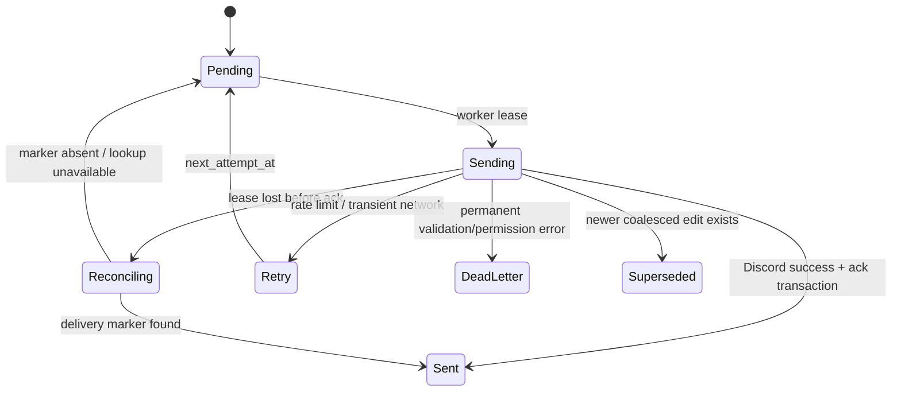

Outbox 与 Turn 独立：

- Turn completed 时 Discord 仍可能 pending；
- Discord 发送失败不修改 Turn terminal state；
- 同一 progress message 的 edit 可以合并；
- final message 不得被 progress edit 覆盖；
- terminal progress revision 必须先于 final；只有完整 visible assistant transcript
  （含 completed commentary/final/legacy message）、附件与 footer 成功并 ack `sent`
  后，才创建独立的 progress delete outbox；
- progress delete 使用 `turn:<turn_id>:progress:delete` 唯一 dedupe key，不参与
  progress coalescing；final retry/dead letter/superseded 都不能解锁 delete；
- 每个 destination key 保序；
- REST rate limit 使用 Discord 返回的 retry-after；
- dead letter 生成 incident 和 `/diagnostics` 可见记录。

### 8.11 Discord delivery 语义

Discord REST 与 SQLite 无法组成原子 transaction，所以 outbox 提供
**at-least-once delivery**，不宣称 exactly-once。

发送流程：

1. transaction claim outbox lease，并写 `sending`；
2. transaction 外调用 Discord REST；
3. message content 携带不可见的稳定 `delivery_marker`；不得向用户显示
   `codexD:turn-...` 等内部 marker，恢复时仍兼容旧版可见 marker；
4. REST 成功后另一个 transaction 写 `sent` 和 Discord message ID；
5. 若在第 3、4 步之间崩溃，恢复 worker 查询 destination 最近的 bot message，
   尝试按 marker 关联；
6. 无法可靠关联时允许重发，并记录 `delivery_duplicate_possible`；
7. 已知 message ID 的 edit/delete retry 继续使用该 ID；
8. reconciliation 可清理同 marker 的明确重复消息。

Turn progress delete 是特例：payload 只允许 `kind=turn_progress_delete` 与
`turn_id`，transport 必须从 `turn_progress_views` 读取可信的 bot message ID，禁止
payload 携带或覆盖任意 message ID。delete 不做 marker/history reconciliation；精确
`fetch_message` 后删除，`NotFound`（包括手工删除或 REST 成功但 ack 前崩溃）视为
幂等成功，429/5xx 保留 retry，403 进入永久失败 diagnostics。没有 message ID 时不
调用 Discord，直接 ack 收敛。cleanup 永远不反写 Turn terminal state，也不重发
final。

`dedupe_key` 只能保证 codexD 不生成两个不同逻辑 outbox operation，不能让
Discord upload/send 获得服务端幂等。TableBlock 的 canonical render 只保证
本地选择同一种 render plan；网络故障时同一 PNG 仍可能被重复上传。

### 8.12 启动恢复

```mermaid
sequenceDiagram
    participant OS as OS Supervisor
    participant D as codexD
    participant DB as SQLite
    participant RS as RuntimeSupervisor
    participant SC as ScheduleCoordinator
    participant DC as Discord

    OS->>D: start
    D->>DB: migrate + integrity check
    D->>DB: acquire single-instance lease
    D->>DB: interrupt unknown-outcome turns
    D->>DB: release stale outbox worker leases
    D->>RS: load project/runtime metadata
    D->>SC: restore safe queued schedule turns + evaluate misfires
    Note over RS: runtime remains lazy; no provider-started turn replay
    D->>DC: login
    D->>DB: replay pending outbox
    D->>D: write healthy heartbeat
```

启动恢复必须是幂等的。进程在任一步再次崩溃，下次启动仍可安全重做。

### 8.13 正常 Turn

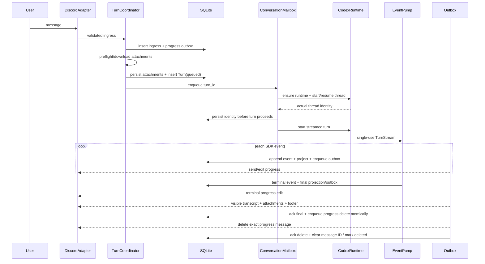

### 8.14 Discord 断线

Discord gateway disconnect：

- 不 cancel mailbox；
- 不 interrupt Turn；
- 不 close Runtime Slot；
- EventPump 继续写 event journal；
- outbox 保留 pending；
- Discord adapter 自己按 library policy 重连；
- 重连后按 destination 顺序完成 in-flight progress reconciliation、terminal edit、
  visible transcript final ack，再执行精确 progress delete；
- gateway watchdog 只能重建 Discord client，不能重启整个 daemon。

### 8.15 Runtime crash

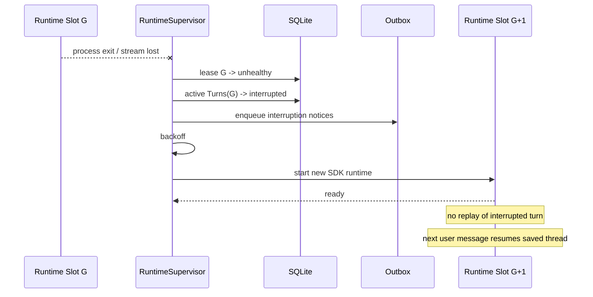

### 8.16 Resume mismatch

请求 resume thread `T1`，SDK 返回 actual thread `T2` 时：

1. 不覆盖 current revision；
2. 不把 T2 当成功恢复；
3. 创建 `ThreadIdentityMismatch` incident；
4. Conversation 进入 `blocked`；
5. 记录 requested/actual ID 的 hash 和 redacted suffix；
6. Discord 显示“Codex 未恢复原会话，已暂停该 thread”；
7. operator 可选择显式接受 T2、新建 thread 或修复 Codex rollout；
8. 所有选择都创建新 revision/audit，不能原地改历史。

---

## 9. 事件模型

### 9.1 EventPump 生命周期

EventPump 的唯一结束条件：

- SDK stream 产出 `turn/completed`，从其中读取
  `completed|failed|interrupted` status；高层 `TurnHandle.stream()` 随后立即
  结束，不存在 provider post-terminal drain；
- runtime/stream 异常，Turn 转 `interrupted`；
- internal invariant failure，Turn 转 `failed` 或 `interrupted`。

terminal event 持久化后，projector/outbox 可以继续 drain，但那是 codexD 本地
投影与发送，不是继续读取 SDK stream。

EventPump 不能因为以下条件退出：

- 8 秒或任意 quiet gap；
- 一小时固定 reader timeout；
- 当前没有 tool；
- assistant text 已结束；
- Discord message 已发送；
- transport disconnected；
- local pending counter 为零。

可配置的 operator hard ceiling 默认关闭。若用户显式设置：

- ceiling 是 Turn wall-clock 上限，不是 stream inactivity；
- 到期先 `interrupt()`；
- grace period 后仍未终止，标记 `interrupted`；
- 不杀共享 Runtime Slot，除非 operator 另行配置。

### 9.2 Normalized Event 分类

Domain event kind 使用稳定命名，不直接复用 SDK class name：

| Event kind | 关键字段 | UI 行为 |
|---|---|---|
| `thread.started` | actual thread ID | 持久化 identity |
| `thread.resumed` | requested/actual ID | mismatch check |
| `turn.started` | provider turn ID | 幂等确认 handle ID/running；mismatch incident |
| `assistant.text.delta` | item ID, text | 仅在进程内合并到文本 block |
| `assistant.text.completed` | item ID, `phase` | `final_answer` 参与 canonical final 选择；`commentary` 同时用于进度与 terminal visible transcript；若 provider 为同一流使用不同 delta/completed item ID，则只按末尾未完成同 phase 文本前缀安全合并 |
| `reasoning.summary` | safe visible summary only | 可选状态，不展示隐藏推理 |
| `command.started` | command label, cwd | tool card |
| `command.output.delta` | stream, text | 仅进程内消费，不写 event/tool projection |
| `command.completed` | exit/status | finalize tool card |
| `file_change.proposed` | paths, patch summary | file card |
| `file_change.completed` | status | finalize file card |
| `diff.updated` | aggregated unified diff | active Turn 内存态；正文不进入 event journal |
| `mcp.started/completed` | server/tool/status | generic integration card |
| `dynamic_tool.started/completed` | namespace/tool/status | generic integration card |
| `web_search.started/completed` | query/action/status | web search card |
| `plan.updated` | structured steps if public | active Turn 内存态，不持久化步骤正文 |
| `collaboration.started/progress/completed` | `collabAgentToolCall` / `subAgentActivity`、sender/receiver/status | capability-gated TaskCardBlock；连续 `wait` 仅作内部轮询，不单独刷卡 |
| `hook.started/completed` | item/turn/status only | audit/progress；不显示 prompt fragments |
| `approval_review.started/completed` | risk/status only | auto-review progress；不是 Discord approval |
| `model.rerouted/verification/safety` | old/new model 或 typed status | audit + user-visible policy notice |
| `turn.moderation` | typed safe status | warning；不展示 raw moderation metadata |
| `terminal.interaction` | command item/status | tool card metadata；不创建独立 shell |
| `context_compaction.started/completed` | `contextCompaction` Item 或 routed `thread/compacted` | compact activity notice |
| `usage.updated` | provider `last`/`total` breakdown、context window | 内存保留 latest，terminal 时只写数值 metadata |
| `turn.completed` | final success status | Turn completed |
| `turn.failed` | stable error | Turn failed |
| `turn.interrupted` | SDK completed status `interrupted` | 结合 interrupt intent 投影 |
| `provider.error` | code/message | 只持久化 code、hash、byte length；不保存 message |
| `provider.unknown` | raw type/hash | incident + safe fallback |

实际 SDK 事件名可随版本变化；只有 adapter fixture 需要知道映射。

进程内 terminal assembler 明确区分两个文本语义：

- canonical final answer 与 SDK collector 保持一致但不调用 collector：从 completed
  `agentMessage` 倒序选择最后一个 `phase=final_answer`；若没有，则兼容最后一个
  `phase=None`；`phase=commentary` 永不冒充 canonical final；
- visible assistant transcript 从 `VolatileTurnStore` 的 AST 按事件顺序保留所有非空、
  completed 的 `commentary`、`final_answer` 与 legacy `phase=None` 文本，block 间使用
  稳定空行，并把选中的 canonical final block 精确放在末尾一次。incomplete、未知
  phase、plan、reasoning、tool/raw payload 均不进入 terminal transcript。

没有 canonical final 时，completed Turn 在 commentary 后追加
`completed_without_final_response` fallback；failed/cancelled/interrupted 追加相应
terminal fallback。`turn_final` outbox 只保存 Turn ID/state/model/usage 等 metadata；
transport 在同一进程内从 `VolatileTurnStore` 读取正文并渲染，成功 ACK 后立即丢弃。
daemon 若在投递前重启，正文允许丢失，Discord 只收到“正文未持久化”的稳定说明，
绝不尝试从 SQLite 恢复。progress preview 同样只从内存读取。

当前 `TurnHandle.stream()` 可按 turn ID 路由的 typed notification family
包括：

- turn/item started/completed、agent message delta；
- command output/terminal interaction、file output/patch、MCP progress；
- plan/diff、reasoning summary/delta；
- hook、auto-approval review；
- model reroute/safety buffering/verification、moderation；
- context compact、thread goal、thread token usage 与 provider error。

generated notification registry 还包含 account、thread lifecycle、realtime、
process、skills 等 global notification parser，但高层 `AsyncCodex` 没有 global
notification iterator。codexD 不下沉到 `AsyncCodexClient` 读取它们，也不因此
宣称这些能力可观察。registry 中有 parser 不等于每个 runtime/Turn 都会发送；
adapter 只能从当前 Turn stream 的 typed notification、turn-scoped
`UnknownNotification` 与正式 Item type 归一化，不得从 assistant 自然语言猜测
plan、task 或 subagent。

兼容性规则：

- `item/fileChange/outputDelta` / `patchUpdated` 若出现则增量展示，但 canonical
  final state 来自 completed `fileChange` Item 与 `turn/diff/updated`，不能依赖
  delta 一定出现；
- compaction 同时识别 `contextCompaction` Item 与 typed
  `thread/compacted`；但 `/session compact` 没有 public `TurnHandle`/global
  stream，不能据此伪造该命令的可靠 completion ack；
- collaboration 只识别正式 `collabAgentToolCall` 与 `subAgentActivity` Item；
- `item/reasoning/textDelta` 与 completed reasoning `content` 在 event journal 前
  丢弃正文；只允许 summary family 进入可展示 projection；
- unknown notification 只有 raw `turnId` 或 `turn.id` 时才会进入当前
  `TurnHandle.stream()`；global unknown 不在 v1 高层观察面；
- 若 method 已是 `turn/completed` 但 payload 因 schema drift 成为
  `UnknownNotification`，adapter 在记录 bounded type/hash 后主动结束迭代，把 Turn
  标为 `interrupted/provider_terminal_unparseable` 并将 runtime 置为 incompatible；
  高层 generator 自己只会对 typed completion break，不能继续无限等待，也不能把
  unknown terminal 猜成 success；
- 未知 Item 记录 safe metadata 并显示 generic fallback，不自动升级为新能力。

`turn.interrupted` 的产品映射：

| `interrupt_origin` | Turn terminal state |
|---|---|
| `user` | `cancelled` |
| `shutdown` / `runtime` / empty | `interrupted` |

### 9.3 推理内容

codexD 不存储或展示隐藏 chain-of-thought：

- SDK 若只给 reasoning status，展示“正在分析”等状态；
- SDK 若给官方可见 reasoning summary，可按配置显示；
- `item/reasoning/textDelta` 与 completed Item 的 raw `content` 在 normalization
  前丢弃，只保留 method/type、size 与 hash；
- unknown event 若可能包含 reasoning，只保存 type、size、hash，不保存正文；
- diagnostics 默认不包含 reasoning；
- Discord `/raw` 不进入 v1。

### 9.4 Raw event 处置

为兼容 SDK schema 漂移，事件表保留受控 raw metadata：

```text
raw_type
raw_schema_version
raw_payload_redacted_json?
raw_payload_sha256
raw_payload_bytes
```

规则：

- 已知事件只保留 normalization 所需字段和 redacted raw；
- secret、auth、环境变量、完整绝对路径按策略脱敏；
- 单个 raw payload 上限默认 1 MiB；
- binary 不写 JSON，改存受控 attachment；
- 未知事件不静默丢弃；
- 未知事件不能直接交给 Discord renderer；
- 同一 unknown raw type 首次创建 incident，后续聚合计数；
- contract tests 必须覆盖兼容矩阵中所有 SDK public event variant。

### 9.5 Event backpressure

```text
SDK stream
  -> bounded ingress queue
  -> batched SQLite writer
  -> projector/outbox
```

默认：

- ingress queue 1000 events；
- writer 每 100 ms 或 50 events 提交一次；
- contiguous text/output delta 可在 100 ms 内合并，单块不超过 16 KiB；
- terminal、error、file-change、plan、collaboration event 永不丢弃；
- queue 满时 EventPump backpressure SDK reader，不另开无界 task；
- DB 持续阻塞超过 5 秒创建 incident；
- DB 失败不能继续仅在内存运行。

### 9.6 Provider event 与 domain event

同一 transaction 可以产生多条 domain event：

```text
SDK turn completed
  -> provider.turn_completed
  -> turn.completed
  -> message.finalize
  -> outbox.final_message
  -> audit.turn_terminal
```

这样 provider schema 变化只影响 adapter，而 Turn/projector/renderer contract
保持稳定。

---

## 10. 持久化设计

### 10.1 为什么不用 JSON 文件

codexD 同时有：

- Discord callback；
- 多 Conversation mailbox；
- 多 EventPump；
- outbox worker；
- runtime health；
- service recovery；
- schema migration。

单个或多个 JSON 文件无法提供跨对象 transaction、查询、幂等和可靠 migration。
因此使用 SQLite：

- WAL mode；
- foreign keys on；
- busy timeout；
- 同一进程单 writer queue；
- read connection pool；
- versioned migrations；
- 定期 checkpoint/backup。

### 10.2 数据目录

macOS：

```text
~/Library/Application Support/codexD/
├── codexd.sqlite3
├── attachments/
│   ├── input/             # 0700；随机 daemon-owned name，文件 0600
│   └── .quarantine/       # 0700；未提交的临时下载
├── diagnostics/
├── health.json
└── instance.lock

~/Library/Logs/codexD/
└── codexd.jsonl
```

Windows：

```text
%LOCALAPPDATA%\codexD\
├── codexd.sqlite3
├── attachments\
│   ├── input\             # service-user-only ACL
│   └── .quarantine\       # service-user-only ACL
├── diagnostics\
├── health.json
├── instance.lock
└── logs\codexd.jsonl
```

Windows ordinary-file storage 使用原生 Win32 security/handle contract：目录和文件
DACL 关闭继承，只保留当前 service-user SID 的单一 Full Control ACE；owner、DACL 和
ACE 在落盘及每次读取前复验。所有路径组件通过 `FILE_FLAG_OPEN_REPARSE_POINT` handle
拒绝 symlink、junction 与其他 reparse point，UNC/network path 默认拒绝。provider
Turn 存活期间保留只允许 `FILE_SHARE_READ` 的文件 handle，因此其他 handle 不能写入或
删除该文件；runtime 终止被确认后才释放。原生能力初始化失败时仍以
`file_input_unsupported` fail closed，不用普通 NTFS mode 冒充 DACL 保证。

数据目录与 project root 分离。任何 Discord attachment 都不能直接写入项目根。
数据库中的 attachment path 始终相对 data dir；CDN URL、文件内容和公开绝对本地
路径不进入数据库、doctor 或 diagnostics。

### 10.3 ID 与时间

- codexD entity ID：UUID4 text；
- provider thread/turn/item ID：原始 string，另存 hash 用于日志；
- event sequence：SQLite monotonic integer primary key；
- 时间：UTC epoch milliseconds；
- UI 再转换为 Discord timestamp/local timezone；
- 不用本机 locale string 做排序或幂等；
- Schedule timezone 使用 IANA name；Windows 安装包显式依赖 Python
  `tzdata`，不依赖系统 Windows timezone ID 到 IANA 的隐式映射。

### 10.4 Schema

#### `ingress_messages`

普通 Discord message 先进入 ingress，再在附件预检完成后创建 Turn：

| 字段 | 约束/说明 |
|---|---|
| `id` | PK UUID |
| `discord_message_id` | unique idempotency key |
| `accepted_content_hash` | 接收时文本 canonical hash |
| `accepted_attachment_manifest_hash` | attachment ID/size/type/order metadata hash |
| `project_id` | FK |
| `discord_guild_id`, `discord_channel_id` | required acceptance-time source；routing 变化后不重算 |
| `conversation_id` | nullable FK；首条 mention 创建 Discord thread 后回填 |
| `state` | pending_thread/pending_preflight/ready/rejected |
| `turn_id` | nullable FK，Turn 创建后回填 |
| `thread_creation_outbox_id` | nullable FK；仅 project-channel 首条 mention |
| `progress_outbox_id` | nullable FK |
| `error_code` | nullable |
| `accepted_boot_id` | required；接收该 Discord input 的 daemon boot，禁止重启后自动执行旧 prompt |
| `discovery_kind` | live/backfill；只有 backfill initial snapshot 可在新 boot 重新 REST fetch + hash 复验 |
| `created_at`, `completed_at` | UTC ms |

#### `discord_ingress_checkpoints`

每个 configured-guild parent channel 或 persisted Conversation Thread 以
`(discord_guild_id, discord_channel_id)` 唯一保存 immutable scope、完成扫描的
`last_scanned_message_id`、可恢复的 in-progress barrier/after cursor、
idle/scanning/retry/blocked、last success/error timestamps。cursor 只在整个远端 barrier
oldest-first 处理完成后推进；page progress 不是完成 cursor，crash 可从 page cursor继续或
安全重扫。Checkpoint 不保存 message content、attachment URL 或用户资料。

`discord_ingress_feature_state` 记录 migration activation time。首次 channel seed 使用
`max(activation snowflake, 同 channel 已知 ingress ID)`，并上限到当前 remote barrier，
因此升级不会无界执行历史 mention，也不会丢 migration 到首次 ready 之间的新消息。

#### `command_intents`

所有实际执行 read/mutation 的 slash command 与 modal submission 先以 Discord
interaction ID 建立幂等 intent。只负责打开 modal 的初始 slash command 不建立
mutation intent，而是创建下述 `modal_intents` pre-intent：

| 字段 | 约束/说明 |
|---|---|
| `interaction_id` | PK；Discord interaction ID |
| `command_name` | canonical command/subcommand |
| `request_hash` | 同 ID 不同 payload 时拒绝 |
| `project_id`, `conversation_id`, `turn_id` | nullable scope FK |
| `state` | accepted/effect_in_flight/reconciling/succeeded/rejected/failed/unknown |
| `result_json` | redacted `CommandResult`，供 duplicate delivery 返回 |
| `effect_kind`, `effect_correlation_id` | nullable；只放本地/已知 provider correlation |
| `accepted_boot_id` | daemon boot |
| `created_at`, `updated_at`, `completed_at` | UTC ms |

mutation 在调用 SDK/Discord 外部 side effect 前先 commit `effect_in_flight`。进程
重启将 stale intent 转 `reconciling`，不自动重发副作用；能以稳定远端
correlation read-back 的操作才完成 reconciliation，否则 intent 变 `unknown`
并创建 incident。read-only command
可以直接从 projection 重建结果，但仍不能让同一 interaction 改变 scope/payload。
只要 intent 已进入 `effect_in_flight`，随后发生的 SDK、DB 或进程内异常都必须把
结果持久化为 `unknown` 并创建 incident；不能把可能已生效的 provider mutation
错误标成可安全重试的 `failed/rejected`。

#### `modal_intents`

Schedule create/update 与 Turn steer 的 modal scope 必须跨 daemon restart 持久：

| 字段 | 约束/说明 |
|---|---|
| `id` | PK UUID；进入 signed Discord custom ID |
| `kind` | schedule_create/schedule_update/steer/side_query |
| `project_id`, `conversation_id` | required immutable scope FK |
| `turn_id` | steer required，其他 kind forbidden |
| `schedule_id`, `expected_version` | schedule_update required |
| `discord_guild_id`, `discord_channel_id` | acceptance-time immutable scope |
| `owner_user_id` | submitter 必须完全匹配 |
| `nonce_hash` | custom ID nonce 的 hash；raw nonce 不入库 |
| `state` | open/consumed/expired |
| `consumed_interaction_id` | nullable unique；一次性消费 |
| `expires_at`, `created_at`, `consumed_at` | UTC ms |

custom ID 还包含 kind、expiry、nonce 与 HMAC signature，并受 Discord 100 字符限制。
submit 时必须同时验证 signature、expiry、nonce、kind、guild/channel/user、
Conversation/Turn/Schedule scope 与 optimistic version；验证和 `open -> consumed`
在同一 transaction 完成。重复、篡改、过期或跨 scope submit 全部 fail closed。

#### `projects`

| 字段 | 约束/说明 |
|---|---|
| `id` | PK UUID |
| `name` | 用户可读名称 |
| `root_path` | canonical absolute path，unique |
| `root_path_casefold` | Windows collision check |
| `default_model` | nullable |
| `default_reasoning_effort` | nullable |
| `default_reasoning_summary` | nullable auto/concise/detailed/none |
| `default_personality` | nullable |
| `default_service_tier` | nullable catalog tier ID |
| `default_web_search_mode` | cached/indexed/live/disabled/provider_default_uncontrolled |
| `sandbox_profile` | fixed `full_access` constraint |
| `created_at`, `updated_at` | UTC ms |

Project 是 execution identity，不承载 Discord routing；`root_path` 和
`root_path_casefold` 创建后不可修改。canonical `$HOME` 只有一个 Project，多个频道
fallback/bind 到同一 root 时复用该 Project。

#### `channel_bindings`

| 字段 | 约束/说明 |
|---|---|
| `discord_guild_id`, `discord_channel_id` | composite PK |
| `project_id` | FK |
| `created_at`, `updated_at` | UTC ms |

ChannelBinding 只是未来 Conversation 的可选路由 override。删除 binding 不删除或
禁用 Project，不修改既有 Conversation/Turn/Schedule。

#### `conversations`

| 字段 | 约束/说明 |
|---|---|
| `id` | PK UUID |
| `project_id` | FK |
| `discord_thread_id` | unique |
| `discord_guild_id`, `discord_parent_channel_id` | required immutable Discord origin |
| `state` | uninitialized/active/archived/blocked/deleted |
| `active_revision_id` | nullable FK |
| `mailbox_version` | optimistic concurrency |
| `model_override` | nullable catalog model ID |
| `reasoning_effort_override` | nullable |
| `reasoning_summary_override` | nullable auto/concise/detailed/none |
| `personality_override` | nullable |
| `service_tier_override` | nullable catalog tier ID |
| `web_search_mode` | cached/indexed/live/disabled/provider_default_uncontrolled |
| `sandbox_profile` | fixed `full_access` constraint |
| `provider_barrier_kind` | nullable compact/external_active/unknown_effect |
| `provider_barrier_intent_id` | nullable FK `command_intents` |
| `provider_barrier_since` | nullable UTC ms；idle read 后清除 |
| `last_activity_at` | display only，不驱逐 runtime |
| `created_at`, `updated_at` | UTC ms |

#### `thread_revisions`

| 字段 | 约束/说明 |
|---|---|
| `id` | PK UUID |
| `conversation_id` | FK |
| `provider_thread_id` | unique |
| `provider_session_id` | provider `Thread.session_id`；同一 fork tree 可共享，不等于 codexD Conversation/Session |
| `provider_forked_from_thread_id` | nullable；fork response identity 校验 |
| `provider_parent_thread_id` | nullable；仅保存 provider 正式 subagent relation，不据此创建 Discord thread |
| `name` | nullable provider/codexD canonical name |
| `parent_revision_id` | nullable FK |
| `state` | active/archived/superseded/blocked |
| `thread_config_json` | validated non-secret ThreadConfig snapshot；切回 revision 时恢复为 Conversation active config |
| `requested_resume_id` | mismatch diagnostics |
| `provider_version` | 创建时版本 |
| `dynamic_tools_enabled` | 该 rollout 是否从新建时注册了 codexD dynamic tools；旧 Revision 默认 false，首次继续使用时只提示一次 `/session new` |
| `created_at`, `activated_at`, `archived_at` | UTC ms |

#### `runtime_leases`

| 字段 | 约束/说明 |
|---|---|
| `id` | PK UUID |
| `scope_kind` | project/shared |
| `scope_key` | project UUID 或固定 `shared`；与 generation 组成 unique |
| `project_id` | nullable FK；project scope required、shared scope forbidden |
| `generation` | monotonic per scope key |
| `state` | starting/ready/unhealthy/stopping/stopped/failed |
| `sdk_version`, `runtime_version` | 实际解析版本，仅用于诊断 |
| `capability_hash` | manifest hash |
| `failure_code` | nullable |
| `started_at`, `heartbeat_at`, `ended_at` | UTC ms |

高层 `AsyncCodex` 当前不公开 app-server child PID；RuntimeLease 不得读取
`_client._proc` 或伪造 child identity。service `health.json` 中的 PID/start token
属于 codexD daemon，另由平台 supervisor 校验。

#### `turns`

| 字段 | 约束/说明 |
|---|---|
| `id` | PK UUID |
| `conversation_id` | FK |
| `thread_revision_id` | nullable FK only for queued Turn in uninitialized Conversation；required before `starting` |
| `runtime_lease_id` | nullable until starting |
| `runtime_generation` | nullable until starting |
| `provider_turn_id` | nullable, unique where present |
| `source_kind` | discord/schedule |
| `input_message_id` | Discord source ID；仅 discord Turn 非空且 unique |
| `requested_by_user_id` | nullable actor；普通 Discord ingress/Turn 保存真实 message author，Schedule/system Turn 为 null |
| `schedule_fire_id` | 仅 schedule Turn 非空且 unique |
| `state` | queued/starting/running/cancelling/completed/failed/cancelled/interrupted |
| `interrupt_origin` | nullable user/shutdown/runtime |
| `interrupt_reason` | nullable stable code |
| `input_hash` | audit，不替代原文权限 |
| `input_summary` | 固定 `[content not retained; N bytes]`，不含 prompt 摘要 |
| `queued_input_text` | 始终 null；legacy migration 主动清空 |
| `queued_skill_inputs_json` | nullable immutable name/canonical path/content hash；provider start/terminal 后清除 |
| `effective_skill_names_json` | nullable audit；不保留 path |
| `effective_model`, `effective_reasoning_effort` | provider-start audit |
| `effective_reasoning_summary` | nullable/provider-start audit |
| `effective_personality`, `effective_service_tier` | nullable/start audit |
| `effective_web_search_mode` | start audit；可为 provider_default_uncontrolled |
| `effective_sandbox`, `effective_approval_mode` | start audit |
| `queued_at`, `started_at`, `ended_at` | UTC ms |
| `terminal_code` | nullable |
| `error_code`, `error_message_redacted` | 只保留 `error_code`；message 始终 null |
| `usage_scope` | nullable |

约束要求 `discord` source 只关联 `input_message_id`，`schedule` source 只关联
`schedule_fire_id`。两种入口最终共享同一 Turn 状态机、mailbox、EventPump 和
renderer。Discord canonical text 只在 `VolatileTurnStore` 中跨 queue/provider-start
传递，daemon 重启后明确 interrupt，不 replay。Schedule prompt 属于 durable Schedule
配置，但不会复制到 Turn row；provider-start 从关联 Schedule 读取并用 Turn
`input_hash` 校验，配置已变化时明确 interrupt，不能静默使用新 prompt。
若预登记 SkillInput 被识别，其 name/path/content-hash 也在 materialize 时进入
queued snapshot；重启后 path/hash 不再匹配时 Schedule Turn 明确失败，不能重新按
当前 registry 解释旧 prompt。
uninitialized Conversation 的首个 queued Turn 可暂时没有 revision；mailbox 必须
先提交 actual provider Thread/Revision，并在同一 transaction 回填
`thread_revision_id`，之后才允许 queued -> starting。
Discord snapshot 仍受 `accepted_boot_id` 限制，daemon 重启后清除并
interrupt，绝不 replay；Schedule snapshot 满足 §10.7 条件时才可跨重启恢复。
`provider_turn_id` 成功提交或 Turn 进入终态的同一事务必须清空 queued text/skill
path，只留下 input hash 与 effective skill name。敏感 snapshot 不进入
log、diagnostics 或 audit。

#### `schedules`

| 字段 | 约束/说明 |
|---|---|
| `id` | PK UUID |
| `conversation_id` | FK；Schedule 始终属于一个主会话 |
| `name` | Conversation 内 unique display name |
| `kind` | once/cron |
| `expression` | canonical ISO-8601 instant 或 5-field cron |
| `timezone` | IANA timezone name |
| `misfire_policy` | skip/latest/all；默认 latest |
| `prompt_text` | nullable only after delete；持久输入，不进入普通日志/diagnostics |
| `prompt_hash` | audit/dedupe，不替代正文 |
| `state` | active/paused/completed/blocked/deleted |
| `next_due_at`, `last_due_at` | nullable UTC ms |
| `version` | optimistic concurrency |
| `created_by_user_id` | owner Discord user ID |
| `created_at`, `updated_at`, `deleted_at` | UTC ms |

Schedule 绑定 Conversation，而不是某个 Thread Revision。触发时读取当前 active
Revision、model/reasoning 等偏好，并固定以 `full_access + auto_review` 执行；因此
`/session new` 后规则自然继续在新上下文执行。ChannelBinding 变化不影响 Schedule
持有的 Conversation/Project/Discord origin。

#### `schedule_drafts`

Schedule modal submit 只创建 durable preview draft，不直接 mutation：

| 字段 | 约束/说明 |
|---|---|
| `id`, `conversation_id`, `owner_user_id` | PK、Conversation FK、owner scope |
| `discord_guild_id`, `discord_channel_id` | required immutable preview-component scope |
| `action` | create/update |
| `schedule_id`, `expected_version` | update required；create forbidden |
| `payload_json`, `occurrences_json` | validated preview snapshot |
| `state` | pending/confirmed/cancelled/expired |
| `component_nonce_hash` | signed component nonce hash |
| `confirmation_message_id` | nullable；durable card ack 后绑定，防止复制 component 到其他 message |
| `confirmation_outbox_id` | nullable immutable FK；dynamic-tool draft 的初始 card outbox |
| `expires_at`, `created_at`, `updated_at` | UTC ms |

Confirm/Cancel 必须重新验证 signature、owner、guild、thread channel、nonce、expiry
和 update version；daemon restart 后从该记录恢复，重复同一 interaction 返回已持久化
结果，不重复 mutation。

#### `dynamic_tool_invocations`

记录 local Turn、runtime generation、provider thread/turn/call、namespace/tool、canonical
argument hash、安全 result JSON，以及可选 draft/outbox correlation。四元 provider
identity 唯一；成功记录必须同时关联 draft 与 outbox，失败记录两者都为空。该记录、
草稿和确认卡 outbox 使用同一 transaction，因此 response 前崩溃与 request replay 都不
会产生重复卡片或 Schedule。

#### `side_queries`

只保存 interaction ID、Conversation/project/user scope、accepted/running/terminal state、
question/answer SHA-256 与 UTF-8 size、stable terminal/error code 和 timestamps；完整问题、
回答及 provider side thread/turn ID 从不进入 DB、audit payload、main projection或
diagnostics。`(conversation_id, requested_by_user_id)` 对 accepted/running 唯一，daemon-wide
另有 bounded concurrency。restart 将旧 boot 的 accepted/running 标 interrupted 且绝不
重放；terminal row 90 天后 retention 删除。

#### `outbound_image_invocations`

每行同时表示 `publish_image` invocation 及其可选 registered artifact：local Turn、runtime
generation、provider thread/turn/call 与 canonical argument hash 唯一；失败行只保存安全
error result，成功行还必须包含 ordinal、render-root relative path、source/normalized hash、
PNG size/dimensions、display name/description 和 retention deadline。成功 artifact 按
`(turn_id, artifact_ordinal)` 唯一排序。Turn 删除级联清理记录；render plan/outbound
retention 删除文件前会保护 active Turn、pending final delivery 和仍被 plan 引用的路径。

#### `schedule_fires`

| 字段 | 约束/说明 |
|---|---|
| `id` | PK UUID |
| `schedule_id` | FK |
| `occurrence_key` | unique per schedule；timer 用 UTC instant，manual 用 interaction ID |
| `trigger_kind` | timer/manual/misfire |
| `scheduled_for` | nullable UTC ms；manual fire 可空 |
| `scheduled_local` | 带 offset 的审计字符串 |
| `state` | due/materialized/skipped/blocked |
| `turn_id` | nullable unique FK |
| `error_code` | nullable stable code |
| `created_at`, `materialized_at` | UTC ms |

```text
UNIQUE(schedule_id, occurrence_key)
UNIQUE(turn_id) WHERE turn_id IS NOT NULL
```

Schedule Fire 是时间触发幂等记录，不是 execution wrapper；一旦 materialize，
真正的执行状态只看它关联的 Codex Turn。

#### `events`

| 字段 | 约束/说明 |
|---|---|
| `sequence` | INTEGER PK autoincrement |
| `event_id` | UUID unique |
| `turn_id` | nullable FK |
| `project_id` | FK |
| `conversation_id` | nullable FK；thread creation intent 产生时尚无 Conversation |
| `runtime_generation` | nullable |
| `provider_event_id` | nullable |
| `local_event_index` | nullable；有 Turn 时 monotonic per Turn |
| `kind` | normalized kind |
| `schema_version` | domain event version |
| `payload_json` | normalized/redacted |
| `raw_type`, `raw_hash`, `raw_size` | diagnostics |
| `occurred_at`, `recorded_at` | UTC ms |

唯一约束：

```text
UNIQUE(turn_id, local_event_index)
UNIQUE(turn_id, provider_event_id) WHERE provider_event_id IS NOT NULL
```

#### `message_projections`（legacy compatibility）

| 字段 | 说明 |
|---|---|
| `id` | PK UUID |
| `turn_id` | FK |
| `content_revision` | projector revision |
| `content_ast_json` | legacy schema column；新版本不写，migration/compaction 清空所有 row |
| `plain_text` | legacy schema column；新版本不写 |
| `is_final` | bool |
| `last_event_sequence` | idempotent projection cursor |

#### `tool_projections`

| 字段 | 说明 |
|---|---|
| `id` | PK UUID |
| `turn_id` | FK |
| `provider_item_id` | nullable |
| `kind` | command/file/mcp/etc. |
| `label` | 固定 tool kind/name，不保存 command/query |
| `state` | started/completed/failed |
| `summary_json` | 仅状态、ID、hash、byte length、duration/exit code 等 metadata |
| `last_event_sequence` | cursor |

#### `task_projections`

只由正式 `collabAgentToolCall` 或 `subAgentActivity` Item 创建/更新：

| 字段 | 说明 |
|---|---|
| `id` | PK UUID |
| `turn_id` | FK |
| `source_type` | collab_agent_tool_call/subagent_activity |
| `provider_item_id` | 当前 SDK Item 必填；`UNIQUE(turn_id, source_type, provider_item_id)` |
| `provider_correlation_hash` | collab item ID 或 agent thread ID 的 domain-separated HMAC，unique |
| `parent_task_id` | nullable FK，仅在正式 parent relation 存在时填写 |
| `operation` | spawn_agent/send_input/resume_agent/wait/close_agent/activity |
| `tool_status` | in_progress/completed/failed/nullable |
| `state` | pending/running/interrupted/completed/errored/shutdown/not_found/unknown |
| `display_title` | 从 operation + 本地 agent ordinal 确定性生成；绝不取 raw prompt |
| `safe_status_summary` | nullable；只来自 bounded/redacted agent-state message |
| `sender_thread_hash` | nullable HMAC |
| `model`, `reasoning_effort` | nullable；provider typed public metadata |
| `prompt_hash`, `prompt_size` | nullable；不持久化 prompt 正文 |
| `error_code` | nullable |
| `last_event_sequence` | idempotent projection cursor |
| `created_at`, `updated_at`, `ended_at` | UTC ms |

#### `task_projection_agents`

`collabAgentToolCall.receiverThreadIds` 可以有多个，不能把一条 tool call 强行压成
单 child 字段：

| 字段 | 说明 |
|---|---|
| `task_projection_id` | FK |
| `provider_agent_thread_hash` | HMAC；与 task projection 构成 unique |
| `agent_label` | 本地稳定 ordinal（如 `agent-1`）；不取 `agentPath` 或 thread ID |
| `state` | pending/running/interrupted/completed/errored/shutdown/not_found |
| `safe_message` | nullable、bounded、redacted |
| `updated_at` | UTC ms |

#### `task_card_views`

| 字段 | 说明 |
|---|---|
| `id` | PK UUID；Discord component 只引用此本地 ID |
| `task_projection_id` | unique FK |
| `destination_key` | 主 Conversation thread |
| `discord_message_id` | nullable，首次发送后回填 |
| `display_state` | collapsed/expanded；默认 collapsed |
| `content_revision` | optimistic interaction/update version |
| `component_nonce_hash` | 防伪造与迟到 component |
| `created_at`, `updated_at` | UTC ms |

#### `turn_progress_views`

| 字段 | 说明 |
|---|---|
| `turn_id` | PK/FK；progress view 与 Turn 一一对应 |
| `destination_key` | 固定为该 Turn 的 Conversation thread |
| `discord_message_id` | nullable；只能由 progress send/edit ack 回填，delete ack 清空 |
| `content_revision` | queued/running/cancelling/terminal 的单调 revision |
| `state` | queued/running/cancelling/terminal |
| `cleanup_state` | active/legacy_ineligible/delete_pending/delete_failed/deleted；非 active 禁止新 revision |
| `deleted_at` | nullable；delete ack 或从未创建远端消息的 final ack 收敛时间 |
| `created_at`, `updated_at` | UTC ms |

final ack 只在 view 当前有远端 message 时插入一次 delete outbox；没有 message ID
时在同一 transaction 直接标记 `deleted`，不扫描历史 Turn。delete payload 不持久化
message ID；transport 以 cleanup outbox ID 关联并校验 view、destination、已 sent 的
final dependency 后才取得删除目标，避免把远端用户消息 ID 变成可注入的删除目标。

升级到 migration 0016 时，已经 terminal 的 Turn view 标记为 `legacy_ineligible`，
避免迟到的旧版 final ack 删除 rollout 前的 progress；升级时仍非 terminal 的 Turn
保持 `active`，之后正常进入 cleanup 生命周期。

#### `discord_outbox`

| 字段 | 说明 |
|---|---|
| `id` | PK UUID |
| `event_sequence` | source event |
| `destination_key` | guild/channel/thread |
| `operation` | create_thread/send/edit/delete/upload/unarchive_thread |
| `depends_on_outbox_id` | nullable FK；例如 send 等待 unarchive_thread sent |
| `payload_json` | renderer output descriptor |
| `dedupe_key` | unique idempotency |
| `coalesce_key` | progress edit grouping；terminal progress delete 必须为 null |
| `delivery_marker` | 远端 reconciliation 的稳定短标识 |
| `state` | pending/sending/reconciling/retry/sent/dead_letter/superseded |
| `attempts`, `next_attempt_at` | retry |
| `discord_message_id` | nullable |
| `lease_owner`, `lease_expires_at` | crash recovery |
| `last_error_code` | nullable |

#### `attachments`

| 字段 | 说明 |
|---|---|
| `id` | PK UUID |
| `ingress_id` | nullable FK，Turn 创建前的 attachment owner |
| `turn_id` | nullable FK |
| `kind` | input_image/input_file/table_md/table_csv/table_png/diagnostic |
| `ordinal` | nullable；同一 Turn 内 input_image/input_file 全局唯一的 Discord 顺序 |
| `relative_path` | data dir relative path |
| `source_sha256`, `normalized_sha256` | 图片的原始/规范化 integrity；opaque file 两者相同 |
| `size_bytes`, `mime_type`, `width`, `height` | validated metadata；file 的 `mime_type` 是 nullable reported media type，dimensions 为 null |
| `source_name_sanitized` | 图片安全 source name / 文件安全 display name；不参与本地路径生成 |
| `retention_until` | cleanup |
| `created_at` | UTC ms |

#### `incidents`

| 字段 | 说明 |
|---|---|
| `id` | PK UUID |
| `severity` | info/warning/error/critical |
| `code` | stable code |
| `project_id`, `conversation_id`, `turn_id`, `schedule_id` | nullable relations |
| `summary` | redacted |
| `details_json` | bounded diagnostics |
| `occurrence_count` | aggregation |
| `first_seen_at`, `last_seen_at`, `resolved_at` | UTC ms |

#### `audit_log`

记录：

- project bind/unbind；
- session new/resume/fork/archive/clear；
- model/reasoning/personality/web-search change；
- Turn cancel/steer；
- schedule create/update/pause/resume/delete/run-now 和 misfire；
- full access startup；
- diagnostics export；
- local history delete。

#### `schema_migrations`

包含：

- integer version；
- migration name；
- checksum；
- applied timestamp；
- codexD version。

已应用 migration checksum 变化时启动失败，不继续写库。

### 10.5 Transaction 规则

以下操作必须单 transaction：

1. 创建 ingress + initial progress outbox；
2. 预检完成后保存 attachment metadata + 创建 Turn + 回填 ingress；
3. 保存 first actual thread identity + 激活 revision；
4. append normalized event + update projection + enqueue outbox；
5. terminal event + Turn terminal state + final outbox；
6. session clear/new/fork 的 revision 切换；
7. runtime crash + affected Turn interrupted + notices；
8. claim/release outbox lease；
9. Discord REST 成功后 ack outbox + 保存 message ID；final ack 同 transaction
   幂等创建 progress delete，delete ack 清空可信 ID 并记录 deleted state/time；
10. startup 将所有非终态 Turn 标记 interrupted；
11. attachment metadata + projection reference。
12. claim due Schedule + insert Schedule Fire + advance `next_due_at`；
13. Schedule Fire + queued Turn + mailbox wake marker。
14. collab Item event + Task projection + TaskCard outbox revision。
15. expand/collapse interaction + TaskCard view revision + edit outbox。

第 8、9 项是两个 SQLite transaction，中间夹着无法纳入 transaction 的
Discord REST 调用。该 crash window 由 delivery marker 和 reconciliation
处理，不能声称远端 exactly-once。

禁止：

- 先发送 Discord 再写 event；
- 先开始 turn 后异步保存 thread ID；
- 用多个 JSON 文件分别保存 session 和 Turn；
- projector 失败时仍 ack event；
- outbox 失败时重跑 provider。

### 10.6 Thread identity 持久化

首次获得 actual thread ID 后：

1. EventPump 暂停继续投影依赖 thread 的事件；
2. transaction 插入/确认 Thread Revision；
3. 检查 requested resume ID；
4. 更新 Conversation active revision；
5. 写 `thread.identity_persisted` event；
6. commit 后继续。

若 DB commit 失败：

- Turn 不继续以“可恢复”状态运行；
- 尝试 interrupt；
- Turn 标记 `interrupted`；
- 创建 critical incident。

### 10.7 Startup recovery transaction

启动时：

```sql
-- 概念性逻辑，不是最终 migration
UPDATE turns
SET state = 'interrupted',
    terminal_code = CASE
      WHEN state = 'queued' THEN 'daemon_restarted_before_start'
      ELSE 'daemon_restarted'
    END,
    ended_at = :now,
    queued_input_text = NULL,
    queued_skill_inputs_json = NULL
WHERE state IN ('starting', 'running', 'cancelling')
   OR (state = 'queued' AND source_kind = 'discord');

UPDATE discord_outbox
SET state = 'reconciling',
    lease_owner = NULL,
    lease_expires_at = NULL
WHERE state = 'sending'
  AND lease_expires_at < :now;

UPDATE ingress_messages
SET state = 'rejected',
    error_code = 'daemon_restarted_before_preflight',
    completed_at = :now
WHERE state = 'pending_preflight'
  AND accepted_boot_id <> :current_boot_id;

UPDATE command_intents
SET state = 'reconciling',
    updated_at = :now
WHERE state = 'effect_in_flight'
  AND accepted_boot_id <> :current_boot_id;
```

Discord 创建的 `queued` Turn 默认不自动执行：

- daemon 可能在收到消息后、提交 provider 前崩溃；
- 自动执行旧 prompt 会让用户无法判断发生时间；
- 启动将旧 queued Turn 标为 `interrupted_before_start`；
- `/turn show` 提供原 Discord message link，用户重新发送时创建新 Turn；
- v1 不提供会偷偷重放原 prompt 的 retry。

`pending_thread` initial ingress 是特殊的远端 side-effect intent：重启后
`create_thread` outbox 先以 starter message reconciliation/create 得到唯一
Discord thread 并持久化 Conversation，但若 `accepted_boot_id` 已过期，随后把
ingress 标为 `rejected/daemon_restarted_before_preflight`，在新 thread 提示用户
重新发送。它只恢复 Discord mapping，不自动执行旧 prompt。已处于
`pending_preflight` 的 ingress 直接 reject 并清理 quarantine partials。

唯一例外是尚未进入 provider 的 Schedule Turn：若 `source_kind=schedule`、
`state=queued`、`provider_turn_id IS NULL`、`runtime_lease_id IS NULL` 且
`queued_input_text` 存在并与 `input_hash` 匹配，说明 provider 调用从未开始，
startup 可将 immutable snapshot 重新放回 Conversation mailbox。snapshot
缺失/不匹配、`skill.input` capability 已消失，或其中 skill path/content hash
已漂移时，Turn 进入 `interrupted`
并创建 incident，绝不读取 Schedule 当前 prompt/skill registry 代替。任何
`starting/running/cancelling` Schedule Turn 都是 unknown outcome，必须
`interrupted`，绝不自动重放。

`provider_barrier_kind` 也跨重启保留。关联 compact command intent 从
`effect_in_flight` 进入 `reconciling/unknown` 后不重发 SDK mutation；恢复同 ID
Thread 后只调用 `read(include_turns=False)`。status 为 active 时继续 barrier，
idle 时清除并发送 `thread_ready_after_provider_activity`，systemError/mismatch
则保持 blocked 并创建 incident。不能因为本地已没有 active Turn 就丢掉 barrier。

Schedule recovery 随后：

1. 校验 IANA timezone database 与所有 active rule；
2. 恢复未开始的 queued Schedule Turn；
3. 对 `next_due_at <= now` 的 rule 按 misfire policy 生成幂等
   `schedule_fires`；
4. 重新计算并持久化下一次 UTC due time；
5. Conversation、Project 或 active Revision 不可用时将 fire 与 Schedule
   标记 `blocked`，通过 outbox 通知 owner，不启动新 Thread。

### 10.8 Retention 与备份

默认建议：

| 数据 | 保留 |
|---|---|
| Conversation/thread metadata | 直到显式删除 |
| Command intent/result | 90 天；unknown/incident 引用时按 incident retention |
| Turn/event | 14 天；普通成功 lifecycle/delta 不进入 event journal |
| conversation prompt/assistant transcript | 0 天；从不进入 SQLite |
| tool output delta | 0 天；不进入 event journal/tool projection |
| table source/PNG | 30 天 |
| input image / ordinary file | 7 天 |
| Schedule definition | active definition 到显式删除；delete 立即清除 prompt，只保留 tombstone/audit metadata |
| Schedule Fire | 与关联 Turn 同期；无 Turn 的 fire 90 天 |
| codexD logs | 7 天滚动 |
| Codex feedback logs | 7 天；普通 TRACE/DEBUG 仅 24 小时，HTTP transport TRACE 不保留 |
| incidents/audit | 90 天 |

清理规则：

- 只删除 terminal Turn 的可压缩 detail；
- EventPump 可按 `stream_update_ms` 合并连续 delta，但 assistant/plan/reasoning/tool-output/
  diff/usage 的连续更新只触达内存（以及只读 generation 校验），不打开 SQLite 写事务；
  只有 terminal、provider error/unknown、policy notice 和 final file-change metadata
  进入 durable event 白名单，payload 仍只含 ID/hash/size/state/code；
- 未 claim 的 progress outbox 原地更新；新 revision ack 后立即删除无依赖旧 progress，
  其他 superseded payload 立即 tombstone；
- 不删除 current thread revision metadata；
- input_image/input_file 只有在 Turn terminal 且 deadline 到期后才删除；
  queued/starting/running/cancelling 引用一律保留；
- orphan sweep 同时把两个 input kind 的相对路径视为引用，且绝不沿 symlink 删除；
- attachment 必须先确认无 projection/outbox 引用；
- DB backup 前执行 WAL checkpoint；
- `codexd db compact --yes` 只可在 daemon 停止并取得 exclusive instance lock 后执行：
  默认先做 verified backup，再清理旧式重复 delta/diff/progress，最后 VACUUM 与
  integrity/foreign-key check；
- `codexd db trim-codex-logs --yes` 还要求所有 Codex/ChatGPT app-server 都已关闭；
  检测到任何进程仍打开 `logs_2.sqlite` 时 fail closed，不在线删除共享日志库；
- 备份不包含 Codex 自己的 `$CODEX_HOME`，两者分别处理；
- restore 后若 Codex rollout 不存在，Conversation 进入 `blocked`，不能静默
  start 新 thread。

---

## 11. Discord 产品契约

### 11.1 Channel、Thread 与 Project

Gateway 只启用 `GUILDS`、`GUILD_MESSAGES` 和 privileged `MESSAGE_CONTENT`
intents；后者是主会话 thread 内无需每条 mention 仍能读取 prompt 的 v1 required
deployment capability。安装使用 `bot` + `applications.commands` OAuth scopes，
并要求在 Developer Portal 显式开启 Message Content Intent。初次 Gateway
连接收到 4014/disallowed intent 时不能进入 ready；记录稳定
`discord_intents_disallowed`、停止无意义 reconnect loop，并由本机
`service status/doctor` 指向修复步骤。v1 不请求 Guild Members/Presence intent，
因为 ACL 使用 immutable user ID，不依赖 member cache/role。

Application commands 只注册到 configured guild，不做 global registration；启动时
先将 remote global command schema 同步为空，清理同一 Application 遗留的 global
commands，再按 capability manifest 向 configured guild 同步确定性 schema。Optional
capability 不可用时对应 subcommand 不注册。清理或 guild command sync 失败使
Discord control surface degraded 并统一重试，但不关闭已在运行的 Codex Turn。传播
窗口内若 Discord 仍投递旧 global command，必须返回可操作的 `stale_command`，不能
伪装成 `internal_error`。

Discord 映射规则：

| Discord 对象 | codexD 对象 |
|---|---|
| Guild | 单个私有部署的信任域 |
| Configured-guild text channel | `$HOME` Project 或显式 ChannelBinding override |
| Discord thread | Conversation |
| Configured-guild text channel 中 mention bot | 固化路由后创建主会话 thread + 首个 Turn |
| 主会话 thread 中的用户 message | 后续 Turn input |
| Slash command interaction | Application command |
| Progress/final message | Outbox projection |

Project routing 模型：

1. 配置文件指定 codexD 所属 guild；
2. daemon 启动时确保 canonical `$HOME` Project 存在；
3. 没有 ChannelBinding 的 text channel 路由到 `$HOME` Project；
4. owner 可在某个 channel 执行 `/project bind path`，只为未来 Conversation 设置
   Project override；
5. allowed user 在 channel 中 mention bot 并给出 prompt；接收 transaction 立即固化
   Project 与 Discord source；
6. bot 自动创建一个主会话 Discord thread 和 Conversation；首个 Turn
   启动时通过 SDK 创建 Codex Thread，并立即持久化 actual identity；
7. 后续消息直接在该主会话 thread 继续；
8. bind/unbind 只改变未来 Conversation；既有 Conversation 的 Project/cwd/origin
   不迁移，Turn 与 Schedule 不中断；
9. 不存在额外的 guild bind、thread bind，也不需要逐个 thread 注册；
10. 子 Agent/task 不创建 Discord thread，只在主会话 thread 中显示折叠卡片。

Discord thread 的 auto-archive 只是 transport 状态，不等于 Codex
`thread_archive()`，也不改变 Conversation/Runtime。发送 progress/final/Schedule
结果前，outbox 对“archived but unlocked”目标先用 Discord API 原位 unarchive；
不得创建 replacement Conversation。目标被 locked/deleted 或 bot 无
unarchive/send 权限时才 blocked/dead-letter，并通知 Conversation 持久化的 parent
channel。`/project bind` 必须预检 create/send/manage-thread 所需权限。
收到 Discord thread delete event 时，同一 transaction 把 Conversation tombstone、
active/paused Schedule 置 blocked 并写 incident；不 interrupt 已运行 Turn。

v1 只响应：

- allowlist 用户；
- 已配置 guild；
- configured-guild text channel 中 allowed user 对 bot 的 mention；
- 已由 bot 创建并映射的主会话 thread 中的 allowed-user 消息；
- 非 bot、非 webhook 的消息。

v1 不响应：

- DM；
- 不支持 start-thread-from-message 的 channel 类型；
- 任意 guild 的同名 channel；
- 其他 bot 的消息；
- 被转发/引用但原作者不在 allowlist 的命令；
- Discord thread 删除后到达的迟到 interaction。

### 11.2 普通消息

普通消息有两条入口：

- **Configured-guild channel mention**：解析显式 ChannelBinding 或 `$HOME` fallback，
  固化 Project/source 后先持久化 thread-creation intent；
  Discord 主会话 thread 和 `full_access` Conversation 建立后再预检输入；首个
  queued Turn 被 mailbox 处理时先 `thread_start`，actual thread ID/Thread Revision
  提交成功后才调用 `Thread.turn()`；
- **主会话 thread message**：通过 `discord_thread_id` 找到已有 Conversation。

Channel mention 的不可事务化 Discord side effect 必须先走 outbox：

1. transaction 以 `discord_message_id` 插入
   `ingress_message(pending_thread)`、project-scoped
   `discord.thread_creation_requested` event 和 `create_thread` outbox；
2. worker **从原 mention message 创建 thread**，使 starter message 成为远端
   correlation key，而不是发起无锚点的 standalone create；初始 title 使用
   `<脱敏且最多 72 字符的首条请求摘要> · <ingress id 前 4 位>` 的本地确定性安全
   名称，只使用经过脱敏、mention 清理和截断的 prompt，禁止使用未经脱敏、未经
   截断的 raw prompt，之后可用 `/session rename`；Discord 的
   start-thread-from-message contract 下 expected thread ID 等于 starter message
   ID，必须校验 response；
3. Discord create 成功但本地 ack 前 crash 时，reconciliation 查询该 starter
   message 的 expected thread ID/已有 thread 并回填，不能再次创建 Conversation；
4. transaction 创建 `full_access` Conversation、回填 `conversation_id`，将
   ingress 改为 `pending_preflight` 并 enqueue progress；
5. 仅当 `accepted_boot_id` 仍是当前 boot 时重新读取 starter message，校验
   author/guild/channel 以及接收时保存的 content/attachment-manifest hash；消息
   被删或编辑则 reject，绝不执行变更后的 prompt；
6. permanent permission/deletion failure 将 ingress `rejected`，只在原始 parent
   channel 返回稳定错误，不创建 Codex Thread。

远端契约依据：
[Discord Start Thread from Message](https://discord.com/developers/docs/resources/channel#start-thread-from-message)。

Channel mention 入口的 canonical text 由通过 hash 校验的原 message content 生成：
只按 Discord parsed mention spans 移除当前 bot 自己的触发 mention，不用字符串替换
删除其他 user/role mention，也不改写剩余文本。移除后无文本但有任一合格附件时是
合法的 image-only/file-only Turn；文本和附件都为空则 ingress
`rejected/empty_input`。

已有主会话 thread 的消息从 `pending_preflight` 开始。随后统一处理：

1. 校验 user/guild/channel/Conversation；
2. 生成 idempotency key：`discord_message_id`；
3. 若入口尚无 ingress，transaction 创建
   `ingress_message(pending_preflight)` 和 progress outbox；
4. 普通 message 没有 interaction defer；outbox 在主会话 thread 发送 progress；
5. 立即预检、下载、隔离并持久化允许的 attachment；
6. 全部 attachment 成功后，transaction 复制 canonical text/config 以及 image/file
   references 为 immutable queued snapshot、创建 Turn(`queued`) 并把 ingress 标记
   `ready`；
7. attachment 失败时 ingress `rejected`，发送错误，不创建 Turn；
8. Turn 放入 Conversation mailbox；
9. active Turn 存在时排队，而不是隐式 steer；
10. 通过 SDK 开始 streamed turn；
11. Conversation thread 内消息的最终回复使用原消息 `MessageReference`，并禁止
    mention author；初始 parent-channel mention 的结果位于新 thread，Discord 不支持
    跨 channel reply，因此结果携带原 starter message URL，而不伪造 reply reference。

无 attachment 时第 5、6 步可以立即完成。下载必须发生在排队之前，避免
Discord CDN URL 在长队列中失效。

Discord 重复 delivery 时，unique `ingress_messages.discord_message_id`
返回已有 creation intent/ingress/Turn，不创建重复 Discord thread、Conversation
或 Turn。

### 11.2.1 Durable inbound reconciliation

Gateway ready、RESUMED 与 connected-periodic safety scan 都触发 REST history catch-up。
范围包括 configured guild 所有 cached text channels（只接受 allowed-user bot mention）
及所有 non-deleted persisted Conversation Threads。每轮先捕获 channel
`last_message_id` barrier，再从 durable cursor 以 `oldest_first=True`、100 条/page读取；
每条消息复用同一个 `_handle_message/_ingest_message` ACL、routing、attachment 与 Turn
入口，不维护第二套解析。

Discovery 建立时先关闭一个短暂 setup gate，并为每个目标 channel 标记 scanning。
scan 期间 live `MESSAGE_CREATE` 按整数 snowflake 暂存在该 channel 的 barrier state；
history完成并原子提交 checkpoint 后，再按 ID 升序释放 buffer。锁仅限单 channel，
其他 Conversation、outbox 与 provider EventPump 不被全局锁阻塞。live event 不直接推进
cursor；Gateway replay、REST重复页与 crash重扫由 ingress unique key收敛为 exactly-once
local Turn。每 channel 单轮最多500条、live buffer最多1,000条；未追平时保留 page cursor
并在短延迟 continuation中 round-robin续扫，避免大 backlog饿死其他 channel。

ready/rejected/pending 的已知 ingress 在 backfill 中按持久 scope跳过，不因后来编辑产生
hash conflict；scope不一致会 block checkpoint并写 security incident。Backfilled parent
mention 使用 `discovery_kind=backfill`：若 crash发生在 thread creation 与 initial preflight
之间，新 boot 会重新 REST fetch原 message并复验 acceptance hash；live initial ingress仍
维持原有 boot fence，绝不自动 replay。已原子 enqueue、但尚未触及 provider 的 queued
backfill Turn 可由 mailbox 在新 boot恢复；live queued 及任何 starting/running Turn仍按
原安全合同 interrupt，不猜测 provider outcome。403/404 block单 channel，transient REST/attachment
错误保留 in-progress barrier进入 retry，不推进完成 cursor。

Health 与 `/status` 区分 `catching_up`、retry、blocked、last success 与 oldest cursor lag。
Backfill无法恢复 scan前已删除消息、不可读 history、slash/modal/component interaction或
reactions；这些输入没有可伪造的 channel-history替代品。

### 11.3 通用命令响应

每个 slash command 都返回统一 envelope：

```text
CommandResult
  interaction_id
  command
  status: succeeded | rejected | failed | pending
  stable_code
  user_message
  details[]
  audit_event_id?
```

规则：

- 3 秒内完成合法 initial response：需要收集 prompt/steer/confirm input 的命令先
  直接 `show_modal`，不能先 defer；其余命令 defer。modal submit/component click
  是新的 interaction，也分别在 3 秒内 defer/update；
- modal custom ID 只携带本地 pre-intent ID、scope、expiry 与签名/nonce；真正
  mutation 以 modal-submit interaction ID 建立 `command_intents`，不能把原 slash
  interaction 当作已经提交的用户输入；
- 敏感 status、路径、权限、diagnostics 默认 ephemeral；
- 业务成功必须在 DB commit 后响应；
- SDK 调用成功但 DB commit 失败不能返回成功；
- retry interaction 使用 `command_intents.interaction_id` 幂等；同 ID/different
  payload 拒绝，`effect_in_flight` crash window 不自动重发不可读回的 SDK
  mutation；
- 所有会 unbind Project、切换/archive revision 或修改 provider state/config 的命令，
  除检查 active/queued Turn 外还必须检查
  `provider_barrier_kind IS NULL`；barrier 期间只允许 status、diagnostics、Turn
  cancel 和只读 list/show；
- 错误显示 stable code，完整 cause 只进 redacted logs；
- command 不通过向 Codex prompt 注入 slash string 实现。

---

## 12. 命令设计

### 12.1 命令分层

codexD 有三种命令，不应混在一起：

| 层 | 入口 | 示例 |
|---|---|---|
| Discord product command | Discord slash | `/session fork`、`/turn cancel` |
| Local operations CLI | Terminal | `codexd service install`、`codexd doctor` |
| Codex provider action | Python SDK | `thread_fork()`、`interrupt()` |

同名不表示同一实现。例如 Codex CLI 的 `doctor` 与 codexD local
`doctor` 不是同一命令；后者只诊断 codexD 部署。

### 12.2 v1 命令总表

| Discord 命令 | 标签 | SDK/内部映射 | v1 状态 |
|---|---|---|---|
| `/project bind` | codexD extension | project transaction + path policy | Core |
| `/project info` | codexD extension | DB projection | Core |
| `/project unbind` | codexD extension | delete optional ChannelBinding override | Core |
| `/session list` | mixed | revision projection + `Thread.read` verification | Core |
| `/session status` | mixed | DB + optional SDK capability | Core |
| `/session new` | Codex-native | `thread_start` | Core |
| `/session resume` | Codex-native | `thread_resume` | Core |
| `/session fork` | Codex-native | `thread_fork` | Optional |
| `/btw`、`/side` | Codex-native ephemeral extension | `thread_fork(ephemeral=True)` + side Turn + typed unsubscribe | Optional `thread.side_query` |
| `/session archive` | Codex-native | `thread_archive` | Optional |
| `/session rename` | mixed | `Thread.set_name` + Discord title | Optional |
| `/session compact` | Codex-native | `Thread.compact()` | Optional |
| `/session clear` | codexD extension | detach current revision | Core |
| `/turn list` | codexD extension | Turn projection | Core |
| `/turn show` | codexD extension | Turn/event projection | Core |
| `/turn cancel` | mixed | DB state + SDK `interrupt()` | Core |
| `/schedule create\|list\|show\|update\|pause\|resume\|delete\|run-now` | codexD extension | persistent rule -> ordinary Turn | Core |
| `/steer` | Codex-native | `TurnHandle.steer()` | Core |
| `/model list` | Codex-native projection | complete visible SDK catalog | Core read-only |
| `/model show` | mixed | effective SDK catalog/config | Core read-only |
| `/model set` | Codex-native | `Codex.models()` + Turn `model=` | Core |
| `/model tier show\|set\|default` | Codex-native optional | catalog `service_tiers` + Turn `service_tier=` | Optional |
| `/reasoning show\|set` | Codex-native | model catalog + Turn `effort=` | Core |
| `/reasoning summary show\|set\|default` | Codex-native optional | Turn `summary=` | Optional |
| `/personality show\|set` | Codex-native optional | Turn `personality=` | Optional |
| `/websearch show\|set` | Codex-native optional | Codex config + `webSearch` Item | Optional |
| `/status` | mixed | daemon/runtime/conversation health + optional `account()` | Core |
| `/usage` | Codex-native projection | latest observed `ThreadTokenUsage` | Core command；provider data Optional |
| `/diff` | Codex-native projection | `turn/diff/updated` | Optional rich data |
| `/diagnostics` | codexD extension | incident/health summary | Core |
| `/capabilities` | codexD extension | adapter manifest | Core |

### 12.3 `/project`

#### `/project bind`

输入：

- `path`：本机绝对路径，或相对于 operator canonical `$HOME` 的路径；
- `name`：可选显示名；
- 当前 Discord channel。

`path` 是 Discord application-command option，虽使用 ephemeral response，仍会
经过 Discord 服务；不能在隐私文档中表述为“仅本机可见”。v1 部署信任边界明确
包含单用户私有 guild 和 Discord transport。

验证：

1. caller 在 allowlist；
2. channel 是支持 start-thread-from-message 的 guild text channel；v1 拒绝
   DM/forum/media/announcement channel；
3. bot 具备 View Channel、Read Message History、Send Messages、Embed Links、
   Attach Files、Create Public Threads、Send Messages in Threads 与 Manage
   Threads；
4. channel 尚未显式绑定；已绑定时返回当前 override 信息，不静默替换；
5. path 不含 NUL；
6. 相对 path 以 operator canonical `$HOME` 为基准，随后 path resolve 成现存目录；
7. Windows 做 case-insensitive collision check；
8. 目录可由 service user 读取；
9. full access 是默认且不限制到该 path；binding 只决定 cwd 和
   Conversation/project 映射，不是 OS sandbox 边界。

成功只建立 binding，不启动 Codex turn。Runtime Slot 可 lazy start，也可由
`/status` 显示 `not_loaded`。
这些权限不能只在 bind 时缓存；thread create/unarchive/send/upload 失败按当前
Discord permission 重新分类，permanent denial 进入 blocked/dead letter。

#### `/project info`

- 查询执行命令的当前 channel，不接收 path 或 project ID；
- 显示 effective Project 名、脱敏后的 project root、路由来源（explicit override 或
  default `$HOME`）、Conversation 数量、
  Runtime Slot 状态和默认权限；
- 只读 SQLite projection，不启动 runtime，不创建 Conversation；
- 未绑定时明确说明 future Conversation 使用 `$HOME`，并提示可用
  `/project bind <path>` 覆盖。

#### `/project unbind`

- 仅删除当前 channel 的显式 ChannelBinding；
- 不检查/取消 active Turn 或 Schedule；
- 不删除/禁用 Project、Conversation、Codex rollout 或 event history；
- channel 后续新 mention 回到 `$HOME` Project；
- 既有 Conversation/Schedule 继续使用创建时固化的 Project/cwd/origin；
- 需要输入 Project 名确认；
- 写 audit。

### 12.4 `/session`

#### `/session list`

列当前 Conversation 的 Thread Revisions：

- revision short ID、state、name、created/last used、provider ID short hash；
- 只列 codexD 已知 revisions，不枚举 `$CODEX_HOME` 中其他项目的 Thread；
- 不用 SDK `thread_list()` 自动导入未知 Thread；该 API 是 native read surface，
  但跨 project 发现/认领需要另做本机管理 UX；
- `Thread.read()` 可验证 rollout 是否仍存在，但验证失败只将该 revision 标
  `blocked`，不静默删除；
- `/session resume` 的选择项来自此 projection。

#### `/session status`

返回单个分组清晰的 ephemeral Embed，标题同时以 icon 和文字表达
active/uninitialized/archived/needs-attention，颜色只作辅助。字段顺序固定为：

1. `Model & behavior · next Turn`：实际 model display、来源（Conversation override /
   Project default / provider default）、effective reasoning effort/summary/personality/
   service tier/web search 和 input modalities；
2. `Activity`：Runtime state、非零 generation、queued/active Turn、last completed relative
   time；有 active Turn 时显示其 enqueue-time effective snapshot，若与 next-Turn settings
   不同则明确标注；
3. `Session`：active revision short ID/name、provider version 和 resume verification；
4. `Execution`：固定 `FULL ACCESS / auto_review`，仅在 provider barrier 或 degraded
   resolution 存在时显示 warning。

完整 optional capability 名称列表只由 `/capabilities` 展示，不进入 status。runtime 未
加载时 status 不得 cold-start app-server；显示 persisted configured value，无配置则显示
`provider default · resolves on next Turn`。只有已加载且 ready 的 runtime 可在 bounded
timeout 内读取 catalog；timeout/incomplete/error 均降级为安全状态文字，不能使整个
status 失败。Embed 不显示完整 provider ID/hash、本地路径、账号或 secret，所有动态文本
经过 mention/Markdown suppression 和 Discord 长度限制。

#### `/session new`

语义：

- 为当前 Discord thread 创建新的 Codex thread revision；
- 传当前 Conversation 的 effective config/profile；不因新建 revision 恢复初始
  `full_access`；
- 旧 revision 若为 active 则标记 `superseded`，若已 archived 则保持 archived；
- active/queued Turn 存在时拒绝；
- 新 actual thread ID 必须在返回成功前持久化；
- SDK start 失败时 Conversation 保持原 revision；
- 不把“清空 Discord 消息”混入该操作。

#### `/session resume`

输入是 codexD revision 的短 ID，而不是任意 provider thread ID：

- 只允许当前 Conversation/Project 已知 revision；
- archived revision 只调用 SDK stable `thread_unarchive()`，校验 returned actual ID
  后直接使用其返回的 `AsyncThread` handle；不再叠加第二次 `thread_resume` side
  effect；
- archive capability gate 还必须证明 unarchive 保留 revision 的 Thread-only config
  （当前主要是显式 web-search mode）；若无法证明且该 revision 不是
  `provider_default_uncontrolled`，保持 blocked，不能假设配置仍在；
- 若 revision archived 但 `thread.unarchive` optional capability 不可用，保持
  archived/blocked，不偷偷 resume 或创建新 Thread；
- 非 archived revision 调 `thread_resume`，并传该 revision 持久化的
  `thread_config_json`；
- 两条分支成功后都把 target revision 的 config snapshot 恢复为 Conversation
  active config；archived 分支必须有“unarchive handle 可直接 start Turn”的
  contract test，否则不启用 archived resume；
- requested/actual identity 必须相同；
- 成功后原 active revision 变 `superseded`，目标变 `active`；
- resume 失败时不更换 current revision；
- rollout missing 时 Conversation blocked。

#### `/session fork`

Codex-specific 且有用：

- 只在 capability `thread.fork=true` 时注册；
- Python SDK v1 只 fork 当前完整 thread，不接受 Turn/turn 参数；
- 传当前 Conversation 的 effective config/profile；fork 后不隐式升降权限；
- active/queued Turn 存在时拒绝；
- 新 provider thread ID 创建新 revision；
- response 的 `forked_from_id` 必须等于 source，`session_id` 必须满足已验证的
  same-tree contract；不匹配时不激活并创建 incident；
- parent revision 保留并转 `superseded`，新 revision 的 `parent_revision_id`
  指向它；
- Discord thread 不变；
- fork 后下一条普通消息进入新 revision。

按指定历史 turn fork 需要独立 capability `thread.fork_at_turn`；当前 Python
SDK `thread_fork()` 未公开该参数，因此 v1 不提供。

#### `/session archive`

- 只在 `thread.archive=true`、`thread.unarchive=true` 且 direct-handle 与
  Thread-only config-preservation contracts 都通过时注册，避免制造无法按原配置
  恢复的单向 archive；
- active/queued Turn 存在时拒绝；
- active Schedule 存在时拒绝，要求先 pause/delete，避免下一次 fire 才突然
  blocked；
- provider archive 成功后 transaction 更新 revision/conversation；
- provider 成功而 DB 失败创建 critical incident，不返回成功；
- archive 后普通消息提示先 `/session resume` 或 `/session new`。

#### `/session rename`

只在 `thread.set_name=true` 时注册：

- active/queued Turn 时拒绝；
- 校验 Discord title 长度、控制字符和 mention；
- 调 `Thread.set_name()`，随后 transaction 保存 canonical name 并 enqueue
  Discord thread rename outbox；
- Discord rename 失败只重试 transport，不回滚 provider 名称；
- provider 成功而 DB commit 失败创建 critical incident；
- 不通过自然语言 prompt 要求 Agent“记住会话名”。

#### `/session compact`

只在 `thread.compact=true` 时注册：

- active/queued Turn 时拒绝，要求二次确认；
- compatibility matrix 只有在 `Thread.compact()` **以及**“response 返回时已
  idle”或“后续 `Thread.read(include_turns=False).thread.status` 可观察为
  non-idle -> idle”至少一条 contract 成立时，才把 `thread.compact` 置为 true；
  只有 callable 而没有 serialization contract 时不注册；
- 调用前先提交 command intent `effect_in_flight` 和
  `provider_barrier_kind=compact`，从而 crash 后不会重发 compact；
- 调用 `Thread.compact()`；
- SDK 只返回 compact start response，没有可可靠绑定的 public
  `TurnHandle`，因此 Discord 只确认“compaction request started”；
- 不显示伪造进度、百分比或“已完成”；
- SDK registry 虽能解析 `contextCompaction`/`thread/compacted`，高层
  `Thread.compact()` 却不返回该内部 Turn 的 handle，也不公开 global stream；
  因而 adapter 不等待、不窃取其他 Turn stream，也不倒推 terminal ack；
- barrier 期间普通消息仍可持久排队，但 mailbox 只轮询 thread status，不调用
  `Thread.turn()`；provider 回到 `idle` 后清除 barrier、通知“thread ready”，这
  只确认可继续使用，不把 idle transition 冒充本次 compaction 的 terminal success；
- compact 调用抛出 outcome-unknown error 或 daemon 在请求后崩溃时，intent 进入
  `unknown`，barrier 保持到同 ID Thread 的 read 返回 idle；绝不自动重试；
- compact 不创建第二层 execution object，失败写 audit/incident。

#### `/session clear`

这是 codexD extension，不调用不存在的 Codex “clear”：

- active/queued Turn 存在时拒绝；
- active Schedule 存在时拒绝，要求先 pause/delete；
- current revision 若为 active 则变 `superseded`，若已 archived 则保持 archived；
- Conversation 变 `uninitialized`；
- 下一条普通消息创建新 Codex thread；
- 不删除 rollout；
- 不删除 Discord history；
- 不删除 audit/event；
- 操作需要确认。

### 12.5 `/turn`

`/turn` 直接操作 Codex Turn 的持久化投影，不引入第二个 execution object。
`turns.id` 是 provider 接受请求前即可使用的本地标识；
`provider_turn_id` 到达后挂在同一 Turn 记录上。

#### `/turn list`

默认列最近 10 个：

| 字段 | 说明 |
|---|---|
| short ID | codexD Turn ID |
| state | queued/running/completed/etc. |
| started | Discord timestamp |
| duration | wall-clock |
| summary | prompt 的 redacted/truncated summary |
| usage | 仅在 scope 清楚时 |
| runtime generation | diagnostics only |

支持 `state` filter，但不提供 workflow/subagent roster。

#### `/turn show`

显示：

- Turn state/timeline；
- provider turn ID 的短 hash；
- runtime generation；
- terminal/error code；
- tool/file-change summary；
- usage scope；
- interruption原因；
- final message link；
- incident link/ID。

不直接显示完整 command output、secret 或 raw provider event。

#### `/turn cancel`

- 默认取消当前 Conversation active Turn；
- 指定 ID 只能选择本 Conversation；
- queued Turn 直接 cancelled；
- starting/running Turn 走 interrupt state machine；
- completed Turn 返回 `already_terminal`；
- cancel 不是删除；
- 可重复调用，幂等。

### 12.6 `/schedule`

`/schedule` 是本地持久 scheduler，不是 Codex workflow。它只能在已映射的主
Conversation thread 中由配置的全局 `owner_user_id` 管理，不要求该用户同时是
Conversation 创建者；每次触发创建一个正常 Codex Turn，结果仍发在同一 thread。

#### 创建

```text
/schedule create
  name: <Conversation 内唯一名称>
  when: <ISO-8601 timestamp | 5-field cron>
  prompt: <持久文本 prompt>
  timezone: <IANA name，可选>
  misfire: latest | skip | all
```

- Discord modal 收集较长 prompt；v1 Schedule 输入仅为文本，普通 Discord message
  的图片和普通文件输入能力不受影响；
- one-shot timestamp 必须带 offset，或同时提供 timezone；
- cron 为标准 5-field minute precision，不接受 shell、自然语言日期或秒级字段；
- timezone 省略时使用配置的明确 IANA default，最终 fallback 为 UTC；
- 创建时解析未来三次 occurrence 并回显，owner 确认后才 commit；
- 默认 `misfire=latest`；
- Schedule 继承**触发时** Conversation 的 active Revision、model、reasoning
  等偏好，不快照旧 runtime 配置；sandbox/approval 始终固定；
- 卡片始终显示下一次执行时间、timezone 和 `FULL ACCESS / auto_review`。
- 确认页必须醒目标明：Schedule 会在 owner
  离线时以 service user 完整权限执行；
- `prompt_text` 属于持久敏感内容，只在 owner ephemeral `/schedule show`
  中显示，日志、audit 和 diagnostics 只记录 hash/摘要。

#### 查询与修改

- `/schedule list`：列当前 Conversation 的 active/paused/blocked/completed rules、
  next due 和 last fire；
- `/schedule show <id>`：ephemeral 显示 canonical expression、timezone、
  misfire、完整 prompt（仅 owner）和最近 Schedule Fires；
- `/schedule update <id>`：通过 modal 修改 expression、timezone、misfire 或
  prompt，使用 `version` optimistic lock；一次 transaction 重新计算 next due；
- `/schedule pause <id>`：停止产生新 fire，不取消已经 materialize 的 Turn；
- `/schedule resume <id>`：从当前时间计算下一次 occurrence，暂停期间不视为
  daemon downtime，不补跑；Project/Conversation/active Revision 不可用时保持
  paused 并返回稳定错误，不等到下一 fire 才失败；
- `/schedule delete <id>`：soft delete rule，不删除历史 Turn，也不取消已开始
  或已 materialize 的 queued Turn；同一 transaction 清空 rule `prompt_text`，
  需要取消 Turn 时显式 `/turn cancel`；
- `/schedule run-now <id>`：用 interaction ID 创建唯一 manual fire，不移动
  recurring rule 的 `next_due_at`。

#### 到点物化

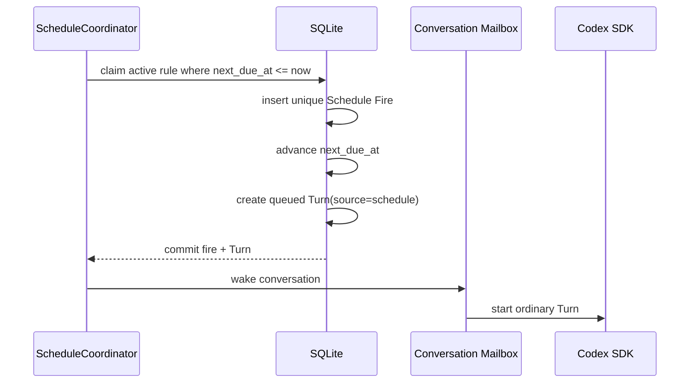

Schedule Coordinator 不直接调用 SDK。`Schedule Fire + 带 immutable queued input snapshot 的 queued Turn + next_due_at`
在事务中提交，`occurrence_key` 防止 daemon 重启、时钟回拨或双 worker 重复触发。
one-shot 规则成功 materialize 时同一 transaction 进入 `completed` 并清空 rule
`prompt_text`；后续执行只使用 Turn snapshot。
不同 Conversation 默认并行；同一 Conversation 仍由 mailbox 保证一个 active
Turn，Schedule Turn 与用户 Turn 使用同一队列且没有独立配额。

#### Misfire 与 DST

daemon downtime 后：

| policy | 行为 |
|---|---|
| `skip` | 跳过所有已错过 occurrence，记录聚合 audit，推进到未来 |
| `latest` | 只为最近一次已错过 occurrence 创建一个 Turn；默认 |
| `all` | 为每个错过的 UTC occurrence 创建 Turn，由 owner 显式承担补跑风险 |

`all` 不在一个内存列表或单个巨大 transaction 中展开。Coordinator 以内部有界
batch 逐段计算、提交 Fire/Turn 并推进 durable cursor，直到追平；batch size 是
防止长事务/OOM 的实现细节，不是拒绝 occurrence 的产品配额。

cron 按 IANA timezone 求值，但 `occurrence_key` 使用 UTC instant。DST spring
forward 中不存在的 wall-clock time 跳过；fall back 重复的 wall-clock time
对应两个不同 UTC occurrence，因此执行两次。UI 必须显示 timezone 和 offset，
不能只显示本地无 offset 时间。

#### 阻塞与失败

- Project root 启动校验失败、Conversation archived/blocked/deleted 或无 active
  Revision：不创建 Codex Thread，fire 与 Schedule 变 `blocked` 并通知 owner；
- provider rate limit 或 Turn 失败：该 Turn 正常失败，不自动重放该 occurrence；
- rule parse/timezone 失效：Schedule blocked，不能静默改用系统 timezone；
- Discord thread auto-archived 且可恢复：outbox 原位 unarchive 后发送；
- Discord thread locked/deleted/无权限：Schedule blocked，不把结果降级发送到
  parent channel；
- ChannelBinding 变化不阻塞 Schedule，也不改变其 Conversation/Project/origin；
- 不设置 Schedule 数量、全局 fire 或 Schedule Turn 队列的固定产品配额。

### 12.7 `/steer`

这是 Codex Python SDK 最值得暴露的专属动作之一，也是 v1 Core：

- 通过 modal 输入 steer text；
- active Turn 必须存在；
- 文字不进入普通 Turn queue；
- 调用 SDK steer；
- UI 在同一 progress card 显示“已追加指导”；
- 审计只保存 hash 和可配置摘要，完整文本按普通 prompt retention 处理。

### 12.8 `/model`

`/model show` 总是可用，显示：

- `Codex.models(include_hidden=False)` 返回的当前 catalog、default 与 image
  modality；不向用户暴露 hidden models；
- configured/current effective model；
- source：global/project/conversation/provider default；
- supported reasoning efforts、personality support、service tiers 与 provider
  upgrade suggestion（若有；只提示，不自动切换）。

`/model set`：

- 只接受当前 `Codex.models()` catalog 中的 model ID；
- active Turn 时拒绝；
- 从下一 Turn 生效，不 recreate client、不丢失 Thread；
- 不接受 Claude/Copilot model alias；
- 不猜 context window 或价格；
- catalog 无法读取是 required capability failure，不用硬编码列表兜底；
- adapter 同时保存 `Model.id` 与 `Model.model`，按受测试的 SDK contract 传选择
  值，不假设两者永远相等；
- 若 response `next_cursor` 非空，由于当前 `Codex.models()` 没有 cursor 参数，
  catalog 标记 incomplete，`/model set` 与 `/model tier set` 暂停，但默认模型
  的普通 Turn 仍可运行；
- 只使用 canonical `service_tiers` 的 `id/name/description`，忽略 deprecated
  `additional_speed_tiers`；upgrade/upgrade_info 只作提示。

`/model tier` 是同一 model command group 下的 Native Optional 子命令，不另造
一个顶层 `/fast`：

- `show` 展示 selected model 的 `service_tiers` 与 `default_service_tier`；
- `set` 只接受 catalog 的 tier ID，从下一 Turn 通过 `service_tier=` 生效；
- `default` 清除 override；
- active/queued Turn 时拒绝；
- model 改变后旧 tier 不受支持时阻止下一 Turn，要求清除或重选；
- 不解释 provider 未声明的速度、价格或配额差异。

### 12.9 `/reasoning`

`/reasoning show` 显示 current model 的
`supportedReasoningEfforts`、`defaultReasoningEffort` 与当前 override。

`/reasoning set`：

- 选项只来自当前 model catalog；
- active/queued Turn 时拒绝，从下一 Turn 生效；
- 切换 model 后若旧 effort 不受支持，阻止下一 Turn 并要求用户选择或清除
  override，不静默替换；
- `default` 表示移除 override，让 provider 使用 model default；
- 这控制公开 reasoning effort，不开放 raw chain-of-thought。

`/reasoning summary` 是 Native Optional，同属 `/reasoning` command group：

- `show|set auto|concise|detailed|none|default`；
- 值来自 public `ReasoningSummary` type，不从 model catalog 猜；
- active/queued Turn 时拒绝，从下一 Turn 通过 `summary=` 生效；
- `none` 是显式要求 provider 不生成 summary；`default` 是清除 override；
- 即使启用 summary，raw reasoning `content/textDelta` 仍在 journal 前丢弃。

### 12.10 `/personality`

Native Optional：

- manifest 支持 Turn `personality=` 时注册 command group；selected model
  `supportsPersonality=false` 时 `set` 明确拒绝，不动态修改 guild command schema；
- `show|set <none|friendly|pragmatic|default>`，从下一 Turn 生效；
- active/queued Turn 时拒绝；
- 值来自 public SDK `Personality` enum（当前
  `none|friendly|pragmatic`），model catalog 只提供 supports bool；
- 不支持时不显示命令，不用 system prompt 模拟。

### 12.11 `/websearch`

Native Optional：

- `show|set off|cached|indexed|live`；
- adapter 映射经过 contract test 的 Codex config，`off` -> disabled；
- capability 可用时默认显式 `cached`，即使 full access 环境可能默认 live，也不
  依赖隐式值；
- `indexed` 只在 search index gate 允许时访问外部结果，不能描述成完全离线；
- `live` 需要 owner 确认，并在 session/progress card 标示外部内容不可信；
- `webSearch` Item 自动显示 query/action/status；
- search tool 失败作为 Item error 呈现，不把整个 Turn 伪装成成功或自动重试；
- Python SDK 无 Turn-level web-search 参数；新 thread/fork/resume 必须通过公开
  `config={"web_search": "<mode>"}` 应用；
- existing Thread 修改 mode 时，仅在无 active/queued Turn 下调用
  `thread_resume()` 重新取得同 ID 的 `AsyncThread` handle；identity mismatch 或
  provider 失败时不提交本地新值；
- 配置映射未通过 manifest 时，不注册命令，`/status` 显示
  `provider_default_uncontrolled`；对必须强制搜索策略的部署，应把该 optional
  capability 提升为本地 startup requirement，而不是把 unknown 冒充 off。

### 12.12 固定执行权限

v1 不注册 `/permissions`。所有 Conversation、Thread Revision、Turn 和 Schedule
都固定使用 `Sandbox.full_access + ApprovalMode.auto_review`。`/status`、session
状态和执行卡片必须醒目标示这一事实；config/migration 中出现其他 profile 时启动或
写入失败，不能静默降级/升级。

### 12.13 `/status`

显示五层健康：

```text
Service       healthy / degraded
Discord       connected / reconnecting
Codex auth    authenticated (type/plan) / required / unknown
Project     runtime ready / starting / unavailable
Conversation  active / blocked / archived
Provider       idle / compacting-or-active / system error
Schedule      active / paused / blocked / next due
Turn           queued / running / terminal
```

避免一个 `online` 布尔值掩盖：

- bot 在线但 SDK 已死；
- SDK 在线但 conversation blocked；
- 本地无 active Turn 但 provider barrier 仍在；
- Turn 完成但 Discord outbox dead letter；
- Discord 断线但 Turn 仍健康。

`Codex auth` 仅在 `account.read` 可用且当前 Project runtime 已加载时调用
`account(refresh_token=False)`；`/status` 不为这项 optional 信息单独启动一个
lazy runtime。可显示 account type 与 provider plan type，但永不显示 ChatGPT
email、token、account ID，也不从 Discord 发起 login/logout。

### 12.14 `/usage`

`thread/tokenUsage/updated` 的 payload 是 `ThreadTokenUsage`，包含
`last`、thread-cumulative `total` 与可选 `model_context_window`；它不是一个
已经证明覆盖全部 subagent 的“current Turn total”。`/usage` 总是可调用，但
没有 observation 时显示 `not reported`。有数据时必须原样标 scope：

```text
Latest provider breakdown (last): input/output/cached/reasoning/total
Thread cumulative (total): input/output/cached/reasoning/total
Model context window: ... (if reported)
Cost: not reported
All-subagent attribution: unknown
```

禁止：

- 把 `last` 改名为完整 Turn usage；
- 将 thread cumulative total 写成当前 Turn usage；
- 将 orchestrator/parent usage 写成全部 Agent usage；
- 推算官方未报告的价格；
- 将本地 wall-clock 当 token usage；
- 混合不同 model/provider 的 usage；
- 用 CLI status 文本 scraping。

### 12.15 `/diff`

v1 使用 typed `turn/diff/updated` 与 completed `fileChange` Item：

- 展示当前/指定 Turn 记录的 Codex file changes；
- 标题必须写“Turn-recorded changes”；
- 不声称等于整个 repository working tree diff；
- oversized patch 作为 `.diff` attachment；
- patch 路径必须经过 project-relative redaction；
- 若当前 Turn 没有 diff，显示 empty；schema 漂移是 adapter contract failure，
  不调用 Codex TUI `/diff`。

未来可新增独立 `/git diff` extension，但不与 Codex-native 能力混名。

### 12.16 `/diagnostics`

默认输出：

- service uptime；
- Discord connection state；
- DB schema/integrity summary；
- Runtime Slot state/generation/version；
- active/queued Turn count；
- active/blocked Schedule count 与 next due；
- pending/dead-letter outbox count；
- recent incident codes；
- attachment cleanup status；
- capability manifest hash。

完整 diagnostic bundle 只能由 allowlist user 生成，默认不包含：

- Discord token；
- Codex auth；
- prompt/assistant 正文；
- command output；
- environment values；
- 完整绝对路径；
- raw reasoning。

`--include-content` 仅为 CLI 向后兼容保留，并写出
`content_persistence=disabled` 标记；它不会查询或导出 transcript/event 正文。

### 12.17 `/capabilities`

按标签显示：

```text
Core
  thread.start       available
  thread.resume      available
  turn.interrupt     available
  turn.steer         available
  turn.image_input   available
  model.catalog      available

Optional
  thread.archive     available
  thread.fork        available
  thread.compact     available
  turn.personality   unavailable for selected model
  turn.reasoning_summary available
  turn.service_tier  available
  usage.notification supported, not observed in current Turn
  web_search.config  available
  collab.item        parser supported

Product-gated
  review             no Python high-level API
  plan_mode          no Python high-level control
  agent_control      no Python high-level control
  account_mutation   local operations only

Discord ingress
  mention_input              available
  conversation_thread_input  available

codexD extension
  schedule           available

Excluded
  workflow           no Codex Python SDK equivalent
```

这是用户理解“为什么没有某个 claudeD/Codex TUI 命令”的权威入口。

### 12.18 明确不提供的命令

| 不提供 | 原因 | 未来正确方向 |
|---|---|---|
| `/workflow` | 无 Codex Python SDK 等价对象 | 本地 turn 用 `/turn` |
| 顶层 `/compact` | 产品动作属于当前 Session | 使用 `/session compact` |
| `/review` | `review/start` 仅 app-server，Python 高层 API 无方法 | 等官方 Python API |
| `/plan` | 可消费 plan Item，但没有公开 plan mode 参数 | 自动 PlanBlock，不伪造 mode |
| `/agent`、`/subagents` | 只有 `collabAgentToolCall` / `subAgentActivity` 可观察，无 roster/control API | 自动内联 TaskCard |
| `/mcp`、`/plugins`、`/skills` 管理 | Python 高层 API 无 list/reload/OAuth/install | 被动使用既有配置/预登记 SkillInput |
| `/worktree` | desktop app surface，无 Python API | 用户自行将 Project 指向现有 worktree |
| `/process`、`/shell` | experimental 且绕开 Thread sandbox | 不提供 |
| `/approve` | Python SDK 无 Discord approval handler | 使用 public ApprovalMode |
| `/permissions` | 产品合同固定 `full_access + auto_review`，不提供可变 profile | 使用隔离 OS identity/VM 改变安全边界 |
| `/raw` | 易泄漏 provider/推理/secret | diagnostics 用受控摘要 |

---

## 13. Discord Renderer

### 13.1 Renderer 原则

1. provider event 不直接变 Discord message；
2. 先在进程内构建 `ContentBlock` AST；
3. 一个 block 只有一个 canonical render；
4. streaming update 与 final render 共用同一 AST；
5. Discord 限制在最后一层处理；
6. 渲染失败降级，不改变 Turn 状态；
7. 原始可复制内容不能只存在图片；
8. renderer 不把正文或 render plan 写入 SQLite；重启前未投递正文允许丢失并显示稳定说明。

### 13.2 ContentBlock

```text
ContentBlock
  ParagraphBlock
  HeadingBlock
  ListBlock
  QuoteBlock
  CodeBlock
  TableBlock
  ToolBlock
  TaskCardBlock
  FileChangeBlock
  PlanBlock
  ErrorBlock
  AttachmentBlock
  DividerBlock
```

每个 block 包含：

- stable `block_id`；
- source item ID；
- revision；
- complete/incomplete；
- plain-text fallback；
- renderer hints；
- source event sequence range。

### 13.3 Render pipeline

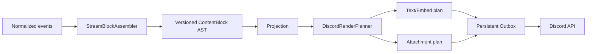

`DiscordRenderPlanner` 是纯函数：

```text
(AST, DiscordCapabilities, RenderLimits) -> RenderPlan
```

它不执行网络调用。相同输入必须产生相同 dedupe/coalesce key。

### 13.4 Streaming assembler

Assembler 为每个 assistant item 持有增量 parser state：

```text
Text
  -> possible table header
  -> table body
  -> closed table
  -> following block
```

关键规则：

- 未闭合 fenced code block 不切分；
- Markdown table header + separator 出现后进入 table candidate；
- 连续 table rows 保留在同一 buffer；
- assistant item completed 时强制 finalize；
- 非 table line 到来时关闭 table；
- escaped `\|`、inline code 中的 pipe 不能误分列；
- quote/list 中嵌套 table 按 Markdown parser 结果处理；
- 不在原始字符串 2000 字符处先切；
- parser 异常时保留原文并回退 plain/code block。

### 13.5 Discord message 策略

每个 Turn 最多维护：

- 一个 status/progress message；
- 若干 final content messages；
- 若干 attachment messages；
- 一个 terminal footer。

默认更新节流：

| 内容 | 最短更新间隔 |
|---|---:|
| assistant text progress | 1000 ms |
| command output summary | 1500 ms |
| plan/tool status | 1000 ms |
| TaskCard progress | 1500 ms |
| terminal/failure | 立即 |

progress coalescing：

- 新 revision supersede 尚未发送的旧 edit；
- terminal final 永不被 progress edit supersede；
- Discord rate-limit response 覆盖本地 interval；
- 进度只显示安全摘要，不刷每个 tool event；
- Turn completed 后不再发送迟到的 running progress。

### 13.5.1 Rich presentation

Discord 展示沿用 claudeD 已验证的模式，但按 Codex 语义映射：

| 内容 | Discord 表现 |
|---|---|
| 最终回答 | 原始 Markdown content，保持可复制与 code fence；单独追加紧凑 terminal footer |
| Turn progress | 同一 Discord message：普通回答走 plain Markdown content，工具/命令状态走稳定 Embed |
| 成功/失败/中断 | 单行状态、last-turn token、耗时和 context 占用；失败/中断包含稳定 terminal code |
| Tool/command/plan | progress Embed 的安全摘要，不逐 delta 刷屏；assistant text 更新不覆盖 Embed |
| 子 Agent/task | 可折叠 Task Embed + 签名按钮，同一消息更新 |
| warning/error/info | 对应颜色的 Notice Embed |
| 普通附件 | Attachment Embed + 文件 |
| 表格 | PNG 置入 Table Embed，附 `.md` source 和 `Copy as text` 按钮 |
| Schedule draft | 结构化字段 Embed + Confirm/Cancel 按钮 |

颜色基线与 claudeD 一致：Codex/表格紫色 `0x7C3AED`，running 黄色
`0xF59E0B`，success 绿色 `0x10B981`，failure 红色 `0xEF4444`，info
蓝色 `0x3B82F6`，muted 灰色 `0x6B7280`。颜色不作为唯一状态语义，title/icon/text
必须同时表达状态。

不可信 assistant Markdown 仍使用 `suppress_embeds=true`，防止任意 URL 生成远端
link preview；codexD 自己构造的显式 Embed 使用独立 message，因此不需要放宽该安全
约束。所有显式 Embed 字段先做 mention suppression 和长度约束。delivery marker
继续留在 message content 中供 crash reconciliation 使用，不依赖 Embed 展示状态。

### 13.5.2 用户请求 reaction 状态

沿用 claudeD 当前实际行为时，emoji 是用户请求消息上的被动状态，不是可点击 Action：

- 只有通过 ACL、routing、attachment preflight 并 durable enqueue 的 Discord 用户消息
  才进入 reaction lifecycle；Bot 输出、progress、TaskCard、Schedule 和 slash command
  不逐条添加 reaction；
- durable accepted/queued 显示 Bot 自己的 `⏳`；
- Turn `completed` 收敛为 `✅`；
- `failed/cancelled/interrupted` 收敛为 `❌`；
- 不注册 reaction listener，不把用户点击 reaction 解释为命令；
- 更新只移除 Bot 自己的 `⏳/✅/❌`，不清理用户添加的同 emoji；
- reaction 更新使用同一 durable outbox 的独立 coalesce key；远端状态检查后只执行缺失的
  add/remove，因此重试与 crash reconciliation 幂等；
- reaction REST 失败只重试/dead-letter 并记录 incident，不改变 Codex Turn 的真实终态。

### 13.6 Markdown 与 Discord 限制

切分优先级：

1. block 边界；
2. paragraph/list item 边界；
3. sentence/newline；
4. grapheme cluster；
5. oversized block 转 attachment。

禁止：

- 切断 code fence；
- 切断 Markdown link；
- 把 surrogate/grapheme 拆开；
- 在 table body 中间生成两个无 header 的表；
- 让用户文本触发 `@everyone`、role/user mention。

所有发送使用 `allowed_mentions=none` 且 reply 默认 `replied_user=false`，除非
codexD 明确引用发起用户；普通
assistant/tool URL 默认 suppress embed，不让不可信输出自动生成远端预览。

### 13.7 Tool 与 command output

ToolBlock 显示：

```text
Tool: command
State: running/completed/failed
Label: sanitized command summary
Duration: ...
Exit: ... (if available)
Output: last bounded lines / attachment
```

规则：

- ANSI/control sequence 移除；
- 单条 progress 不显示完整环境变量；
- output 超过阈值写 `.txt` attachment；
- 命令行按 redaction policy 隐藏 token/password/header；
- 同一 tool 原位更新；
- final output 保留前后片段和 truncation marker；
- renderer 不根据 command text 推断 Turn 成功。

### 13.8 File change

FileChangeBlock：

- project 内路径使用 project-relative display；
- project 外路径不直接显示 absolute path，改为 redacted `OUTSIDE PROJECT`
  notice，并写醒目 warning/audit；project root 只是 cwd，不是 fixed full-access
  policy 的写边界；
- 显示 added/modified/deleted/renamed；
- patch 过长时 `.diff` attachment；
- binary 只显示 metadata；
- 不把 proposed change 当 completed；
- 多次修改同一文件按 item/turn 聚合，但 event history保留。

### 13.9 Codex typed Item 自动展示

以下能力无需额外 slash command：

| SDK Item/notification | ContentBlock | 行为 |
|---|---|---|
| `plan` / plan delta | `PlanBlock` | 同一计划卡原位更新；不冒充 plan mode |
| `mcpToolCall` / progress | `ToolBlock` | server、tool、status、safe result/error |
| `dynamicToolCall` | `ToolBlock` | namespace/tool/status、safe result/error |
| `webSearch` | `ToolBlock` | query/action/status，live mode 标风险 |
| `imageView` | metadata notice | 不按 provider 路径上传本地文件 |
| `imageGeneration` | image attachment/fallback | 先校验 decode、MIME、size 与路径 |
| `sleep` | progress state | 合并，不单独刷屏 |
| `hookPrompt` | audit-only | 不向 Discord 暴露 fragments |
| `enteredReviewMode` / `exitedReviewMode` | mode notice | 被动显示，不注册 `/review` |
| `contextCompaction` / routed `thread/compacted` | compact notice | 只记录 activity，不伪造 command completion |
| token usage | 紧凑 terminal footer 显示 `last`；`/usage` 展示完整 `last` 与 thread `total` |
| `turn/diff/updated` | `FileChangeBlock` | 聚合 diff projection |

`imageGeneration` 的 provider path 必须 `resolve(strict=True)` 到 canonical project
root 或 codexD 专用 generated-output staging dir，且为 regular non-symlink file；
使用 no-follow/descriptor-based open 避免校验到复制之间的 symlink swap，在
size/pixel budget 内完整 decode 后复制到受控 attachment store 再上传。任一
检查失败只显示 metadata + incident，绝不退化为“相信路径并上传”。`imageView`
无论路径落在哪里都不自动上传。

MCP、Skills 或 web search 的配置/管理不由 renderer 推断；renderer 只展示当前
Turn 已收到的正式 typed Item。

### 13.10 子 Agent/task 折叠卡片

`TaskCardBlock` 只来自 SDK 正式 `collabAgentToolCall` 或
`subAgentActivity` Item。它不创建 Discord thread，也不从 assistant 文本、
command label 或未知 event 猜测子 Agent。

默认 collapsed：

```text
⚙️ Codex subagent · agent-1
State: running
[展开]
```

expanded：

```text
⚙️ Codex subagent · agent-1
started · reviewer · Review storage recovery behavior
Agents
• agent-1 · running · reviewer · Review storage recovery behavior
[收起]
```

示例中的 `agent-1` 是首次观察时分配的本地稳定 ordinal；尾部状态文字只能来自
public `CollabAgentState.message`，或 identity-checked child Thread metadata 的
bounded/redacted 结果；缺失或不安全时省略，绝不把完整 prompt 当作 task title。

规则：

- 每个可见 typed task correlation 对应主 Conversation 中一条持久卡片消息；
- `collabAgentToolCall` 可包含多个 `receiverThreadIds` 与 `agentsStates`；卡片
  汇总 operation，expanded view 从 `task_projection_agents` 展示各 agent；
- `subAgentActivity.kind=started|interacted|interrupted` 优先更新能用正式
  agent thread ID 关联的 card；若 provider 没有发送父 `collabAgentToolCall`，则每个
  正式 subagent thread ID 创建一张稳定的 `Codex subagent · agent-N` card，不以
  名称/文本猜关联；
- 首次看到 activity 时可以通过 public `thread/read(include_turns=false)` 读取同 session
  的 child Thread metadata；只有 identity 校验后的 `agentRole` 和 bounded/redacted
  `preview` 进入卡片安全摘要，原始 child thread ID、完整 prompt 和 thread path 不持久化；
- collab tool 精确识别
  `spawnAgent|sendInput|resumeAgent|wait|closeAgent`；`wait` 是内部协作轮询，
  不创建独立 TaskCard，避免连续相同卡片占满消息流；agent terminal state 使用 SDK
  enum，不自行发明“成功”；
- `collabAgentToolCall.prompt` 不进入 event payload、projection 或 Discord；
  只保存 size/hash。SDK 没有独立 task title，UI 不从 prompt 或模型文本伪造；
- `subAgentActivity.agentPath` 同样只保存 size/hash，不持久化或显示原值；
- `started/progress/completed/failed` 原位 edit，同一卡片不重复发送；
- 默认 `collapsed`，单 owner 部署中的展开状态全局持久化；
- Discord 没有原生折叠容器，“展开/收起”按钮通过编辑同一消息实现；
- button custom ID 只包含本地 `task_card_views.id`、revision 与签名/nonce，不含
  provider task/thread ID；
- interaction 必须校验 owner、guild、Conversation、message ID、nonce 和
  revision；重复 interaction 幂等；
- update 使用 `coalesce_key=task-card:{task_projection_id}`，progress 可节流，
  terminal revision 立即发送且不能被旧 progress supersede；
- activity-only 的同一 Agent 后续状态原位 edit 自己的 message；不同 Agent 各自一张
  可折叠卡片；Turn terminal 时把仍未终态的 task/agent 一次性收敛为
  completed/errored/interrupted；
- expanded detail 只显示公开、脱敏、bounded summary；允许 identity-checked public
  Thread preview 的单行脱敏摘要，但不显示完整/raw child prompt、hidden reasoning、
  完整 provider thread ID 或无限 tool transcript；
- parent/child relation 只有 provider 正式字段存在时才展示；
- renderer/daemon 重启从 `task_projections + task_card_views` 重建同一状态；
- 原 Discord message 被删时发送 replacement card 并原子更新 message ID，
  仍不创建新 thread；
- 迟到 event 受 Turn ID、runtime generation 和 event sequence 约束。

若 `collab.item=unsupported`，系统不显示 TaskCard；正式但未实现的新 variant 走
generic fallback 和 compatibility incident，不降级为自然语言推断。

### 13.11 Error

用户可见错误包含：

- stable code；
- 简短中文说明；
- Turn short ID；
- 是否可重试；
- 推荐动作；
- diagnostics incident ID（如有）。

不包含：

- Python traceback；
- raw SDK payload；
- token；
- 完整环境变量；
- 完整绝对路径；
- 隐藏 reasoning。

---

## 14. 表格显示协议

### 14.1 输入来源

`TableBlock` 有两种来源：

1. codexD 内部结构化命令直接产生 columns/rows；
2. Codex 普通 Markdown 回答经 GFM/CommonMark table extension 解析。

不能用简单正则表达式独立解析表格。解析器必须处理：

- alignment separator；
- escaped pipe；
- inline code；
- empty cell；
- leading/trailing pipe；
- CJK；
- emoji；
- multiline fallback；
- malformed table。

### 14.2 TableBlock schema

```text
TableBlock
  block_id
  headers[]
  rows[][]
  alignments[]
  source_markdown
  source_event_range
  parse_warnings[]
  complete
```

不强迫普通 Codex turn 使用 `output_schema`。`output_schema` 适合
codexD 内部明确需要结构化数据的命令；自然语言回答仍以 Markdown parser
为主。

### 14.3 Canonical render decision

每个 TableBlock 只做一次决策：

```text
NATIVE_STRUCTURED
PNG_WITH_SOURCE
CODE_BLOCK_WITH_SOURCE
SOURCE_ATTACHMENT_ONLY
```

Discord v1：

- 正常表格：`PNG_WITH_SOURCE`；
- Pillow/font 不可用：`CODE_BLOCK_WITH_SOURCE`；
- 表格超限：`SOURCE_ATTACHMENT_ONLY`；
- malformed：保持原 Markdown，按普通 text/code render。

Render decision 与原因写入 projection。重放时复用，不再次走不同路径。

### 14.4 PNG 渲染

算法：

1. normalize rows，保留原始 source；
2. 计算每列 grapheme/display width；
3. 选择字体链并做 glyph coverage probe；
4. cell 按可用像素宽度换行；
5. 计算 header/body 高度；
6. 按行分页，每页重复 header；
7. 生成 PNG；
8. 校验 pixel、memory、file size；
9. 生成 Markdown sidecar；
10. 写 attachment metadata 后创建 outbox。

推荐视觉默认：

- 浅/深色固定主题二选一，不依赖用户 Discord theme；
- header 高对比；
- zebra rows 可选；
- 数字右对齐、文本左对齐；
- 不用颜色作为唯一语义；
- 每页显示 `page x/y`；
- 图片 description 包含表格标题、行列数和 source attachment 名称。

### 14.5 字体与 glyph

候选字体：

| 平台 | 文本候选 | CJK 候选 | Emoji 候选 |
|---|---|---|---|
| macOS | SF/Helvetica 系统字体 | PingFang SC/Hiragino Sans GB | Apple Color Emoji |
| Windows | Segoe UI | Microsoft YaHei UI | Segoe UI Emoji |

不能仅检查字体文件是否打开。Glyph probe 至少覆盖：

- ASCII `A0`；
- CJK `中`；
- 常用标点；
- emoji 示例；
- replacement/tofu mask 对比。

如果一个 cell 无可用 glyph：

- 不删除字符；
- 不用空白替代；
- PNG render 失败；
- 回退 code block/source attachment；
- 记录 `table_font_coverage_missing` incident 聚合。

是否随包发布 Noto 字体应在实现阶段单独评估体积与许可证；v1 设计不要求
下载远程字体。

### 14.6 资源限制

建议默认：

| 限制 | 默认 |
|---|---:|
| columns | 20 |
| rows for PNG | 200 |
| cell source chars | 120 |
| total source | 1 MiB |
| page width | 4096 px |
| page height | 4096 px |
| PNG pages | 8 |
| renderer memory budget/table | 128 MiB |
| render wall time | 5 s |

decode/render 不在 Discord event loop 或 daemon 主进程内直接执行。每个 job 进入
supervised MediaWorker process：child env 使用最小 non-secret allowlist，protocol
只传只读 input 与专用 output staging，不传 project path；macOS 使用可用的
rlimit，Windows 使用单独 Job
Object memory/process limits，wall timeout 只终止已记录的具体 worker PID。worker
crash/limit 只产生 renderer fallback，不改变 Turn。这里是 crash/resource
containment，不伪称完整 kernel network sandbox；worker 代码不包含 network client，
也不获得 proxy/credential。没有额外 OS sandbox 时，同用户进程隔离不能被宣传为
抵御 native decoder RCE 的 filesystem security boundary。

超过限制：

- 不截断原始 Markdown attachment；
- PNG 可不生成；
- Discord message 显示行列数、原因和 attachment；
- Markdown source 仍受 attachment size limit；
- 不允许用户通过巨大表格耗尽 daemon 内存。

实际 attachment 上限取：

```text
min(configured_limit, Discord destination upload limit)
```

### 14.7 Markdown sidecar

`.md` sidecar 是 canonical copy source：

- UTF-8；
- 保留原表格文本；
- 文件名安全化；
- 不执行 Markdown；
- 与 TableBlock/source hash 关联；
- bot 重启后仍可下载；
- retention cleanup 前确保 Discord 已持久托管 attachment 或明确过期策略。

### 14.8 Copy-as-text control

表格不生成 CSV。Table Embed 附带一个持久 `Copy as text` 按钮：

- custom ID 使用稳定只读协议 `tb:v1:copy`；
- handler 只读取触发消息自身的 `table-*.md` attachment，不访问本地任意路径；
- 短 source 以 ephemeral fenced Markdown 返回；
- source 超过单条消息限制时以 ephemeral `.md` 文件返回；
- interaction 必须通过 configured guild/user ACL；
- handler 从 Discord message attachment 恢复 source，因此 bot 重启后旧按钮仍可用，
  不新增 message-ID side table。

### 14.9 可访问性

PNG 不是唯一信息载体：

- 同消息附 Markdown source 和复制按钮；
- attachment description 写表格标题和 dimensions；
- 表格前提供一句 plain-text summary；
- color 不承担唯一含义；
- code fallback 保留 header；
- 不删除 emoji/CJK；
- 未来 rich client 可直接使用 TableBlock native table。

### 14.10 表格失败矩阵

| 失败 | 行为 |
|---|---|
| Markdown parse 失败 | 原文作为普通 block |
| font load 失败 | code block + source |
| glyph coverage 失败 | code block + source |
| Pillow exception | incident + code block |
| PNG 超 Discord size | source attachment only |
| 表格过大 | summary + source |
| upload 429/5xx | outbox retry |
| upload permission/size permanent failure | code/text fallback + dead letter incident |
| renderer crash | Turn 不变，从 projection 重建 |

### 14.11 防重复

dedupe key：

```text
table:{turn_id}:{block_id}:{content_revision}:{render_kind}
```

一旦 `render_kind=PNG_WITH_SOURCE` commit：

- 不再创建同 revision 的 code-fence outbox；
- retry 复用相同 attachment；
- final projection 改变才产生新 revision；
- source attachment 与 PNG 使用同一 render group；
- superseded streaming preview 不在 final 后发送。

这里的“防重复”指本地 render plan 和 outbox logical operation。Discord
delivery 仍是 at-least-once；ack crash window 中允许同一文件重复上传，并
通过 delivery marker reconciliation 识别。

---

## 15. 输入附件

### 15.1 v1 保证

v1 同时保证文本、图片与 ordinary file 输入；file-only 消息合法，混合附件按同一
Discord ordinal 合并到一个 Turn。`turn.image_input` 是 required capability：
受支持 SDK 组合若无法通过 release/installation image-input contract test，
daemon `startup_failed`，Discord client 不登录。用户未登录或网络暂不可达按
operational degraded 状态处理，不改写 capability 结论。

认证后还按 §7.5 要求 complete/known catalog 中至少存在一个
`inputModalities` 含 `image` 的可用 model；catalog incomplete 与“完整 catalog
明确没有 image model”使用不同错误码。当前 Conversation 选择的 model 不支持
image 时，图片 ingress 在
provider 调用前拒绝并提示 `/model set`；绝不静默丢图或自动切换 model。

普通文件使用独立的 `mention.input` capability；能力缺失时在 provider start 前以
`file_input_unsupported` fail closed，不得静默丢弃文件。

### 15.2 图片输入

1. 检查 Discord attachment metadata，只接受 Discord library 提供的 attachment
   object，不解析 assistant/user 文本中的 URL；reported size/MIME/filename 均是
   不可信提示，reported size 参与 ingress manifest，但不能证明 CDN representation；
2. 按附件数量和本地 decoder memory budget 预检；下载 URL 必须是 HTTPS、official
   Discord CDN host、无 userinfo，redirect 后仍满足同一 policy；
3. 以 connect/read timeout、实际 streaming byte cap 下载到随机命名的 data-dir
   quarantine；只接受完整 HTTP 200，拒绝 206/`Content-Range`/空 body，存在
   `Content-Length` 时必须等于 stream 实际字节数。Discord reported size 与实际
   完整响应不一致时继续处理，并只记录不含 filename/URL/path/content 的结构化计数；
4. 检查 magic bytes 与完整 decode，不信任扩展名/MIME；
5. 不按扩展名或 MIME 限定格式；接受隔离 decoder 能完整解码的 raster image，
   动画图片取首帧，无法解码的内容和可执行内容拒绝；
6. decode 前后都执行 pixel/memory budget；先应用 EXIF orientation，再移除
   EXIF/GPS/profile 等 metadata，规范化色彩模式并编码为 SDK 接受的 raster
   format；
7. 记录原始 hash、规范化文件 hash、dimensions、media type 和用户顺序；
8. 通过 public `LocalImageInput(path=...)` 或
   `ImageInput(url="data:image/...;base64,...")` 交给同一 Turn，具体模式由
   contract-tested manifest 固定；
9. normalized attachment 与 metadata 原子提交后立即删除原始 quarantine
   文件，只保留 `source_sha256`；retention 到期后清理规范化副本。

步骤 4-6 必须复用 §14.6 MediaWorker isolation；decoder crash/timeout 将 ingress
标记 `rejected/image_decode_failed`，不能带崩 daemon 或退化为直接传原文件。

图片下载失败不会开始 Turn；不能先启动 Codex 再发现 attachment 无法读取。
图片-only Turn 允许；codexD 不擅自补一段“请分析图片”的 prompt。重复 Discord
delivery 复用同一 ingress/attachment/Turn，不重复下载或创建第二个 Turn。
HTTP/HTTPS image URL 已 deprecated，不直接交给 SDK。

retention cleanup 不得删除 queued/starting/running Turn 仍引用的图片。图片规范化
或 SDK 映射失败时，ingress 转 `rejected`，返回稳定错误码，不创建 provider
Turn。

### 15.3 普通文件 durable contract

普通文件是 opaque bytes；codexD 不解析、解压、执行、OCR，也不把内容、URL 或
路径字符串拼入 prompt。最终文件只写入 `attachments/input/` 的随机名称，安全
`display_name` 仅作为 `MentionInput.name` metadata，绝不决定目录或文件名。

`TurnFile` 是 immutable snapshot，包含 attachment ID、原 ordinal、canonical
path、安全 display name、nullable reported media type、SHA-256、实际大小和
retention deadline。enqueue transaction 只保存 data-dir-relative path；opaque
file 的 `source_sha256 == normalized_sha256 == TurnFile.sha256`。

enqueue 和每次 provider start 前都执行同一 fail-closed 校验：

1. DB path 必须是无 `.`/`..`/absolute syntax 的 data-dir-relative path，且固定在
   `attachments/input/`；
2. data dir 到目标的所有父目录都必须为 daemon-owned 非 symlink directory；POSIX
   mode 为 0700；
3. leaf 必须是 daemon-owned、0600、不可执行 regular file，且不能是 symlink；
4. 通过 no-follow descriptor 重算实际大小与 SHA-256，并与 snapshot 比较；读文件
   期间发生 inode/size/path replacement 也视为失败；
5. 任一文件失败则 provider 不启动；错误与 diagnostics 只含稳定 code/内部
   attachment ID，不含 display name、绝对路径、CDN URL 或文件内容。

capability/catalog await 完成后、构造 SDK `MentionInput` 前执行最后一次校验，并在
POSIX 上持有 shared descriptor lock 到 provider terminal 或 confirmed runtime
termination；非 terminal stream 异常、取消或意外结束不会释放。retention 删除前使用
non-blocking exclusive lock。Windows 使用受保护的 service-user owner-only DACL、
no-reparse handle 和 provider-lifetime no-write/delete-sharing lease；任一原生安全
能力初始化或验证失败时不报告 `mention.input=true`。

该边界明确把 same-service-UID 进程视为 trusted：descriptor lease 防御其他
principal、retention cleanup 与遵守 lease 协议的协作 mutation；它不声称能防御已经
控制 full-access service account 的进程。后者可直接控制 daemon、文件与 app-server，
不属于 ordinary-file lease 的安全保证。

文件 retention 与图片同为 7 天。terminal deadline 到期后删除；任何
queued/starting/running/cancelling Turn 引用期间均保留。orphan sweep 同时覆盖
input_image/input_file，并对 symlink/path escape fail closed。

公开的附件失败码固定为 `too_many_attachments`、`attachment_size_limit`、
`attachment_total_size_limit`、`attachment_download_failed`、
`attachment_download_timeout`、`attachment_integrity_failed`、
`image_decode_failed` 和 `file_input_unsupported`。除图片 decode 失败外，用户文案
统一称 attachment/file，不把普通文件误称为 image；Discord status/error、普通日志
和 diagnostics 都不得包含 CDN URL、绝对本地路径或文件内容。

### 15.4 预登记 SkillInput

若 `skill.input=true`，owner 可在本机配置中预登记：

```text
skill name -> canonical trusted path
```

用户 prompt 显式包含 `$skill-name` 时，adapter 可同时传 public
`SkillInput(name, path)`，避免模型再次查找路径。约束：

- Discord 不能提供任意 skill path；
- path 在 daemon 启动时 resolve、校验并记录 hash；
- 不自行扫描并暴露 `$CODEX_HOME` 中全部 skills；
- 不提供 `/skills install|delete|reload`；
- skill 不存在或 manifest 不支持时明确提示未注入，不能假装已执行；
- Codex 自己按描述隐式发现 skill 属于 provider 行为，codexD 不从自然语言
  结果反推“skill 已使用”。

---

## 16. 配置与安全

### 16.1 配置来源

优先级从高到低：

1. local operations CLI 的一次性非 secret override；
2. 环境变量中的开发/部署 override；
3. `config.toml`；
4. 内置安全默认。

Discord 消息和 slash command 不能设置任意 config key。
用于配置 codexD daemon 的环境变量不是 Codex command-process environment；
启动 SDK child 前必须按 §7.6 重建 allowlist env。

建议 `config.toml`：

```toml
[discord]
guild_id = "..."
owner_user_id = "..."
allowed_user_ids = ["..."]
command_scope = "guild"
max_attachment_count = 10
file_max_bytes = 26214400
message_max_bytes = 52428800

[runtime]
sdk_version_policy = "compatible_range"
codex_bin = "/absolute/path/to/codex" # optional; defaults to the SDK-pinned runtime
nonsecret_env_allowlist = ["JAVA_HOME", "DEVELOPER_DIR"]
codex_log_filter = "warn,codex_http_client::transport=error"

[codex]
web_search_mode = "cached"

[schedule]
default_timezone = "UTC"
default_misfire_policy = "latest"

[security]
default_sandbox_profile = "full_access"

[rendering]
stream_update_ms = 1000
table_max_columns = 20
table_max_rows_png = 200
table_memory_mib = 128

[retention]
events_days = 14
input_attachments_days = 7
render_attachments_days = 30
logs_days = 7
tool_output_hours = 24
outbox_content_days = 7
codex_logs_days = 7
codex_trace_hours = 24
```

Windows path 使用合法 TOML string，不允许以字符串拼接生成。

### 16.2 Secret

Secret 包括：

- Discord bot token；
- Codex auth material；
- codexD projection-HMAC/component-signing keys；
- future webhook/telemetry credential。

要求：

- 不写入 git；
- 不写入 `config.toml`；
- 不作为 command-line argument；
- 不写入 LaunchAgent plist；
- 不写入 Scheduled Task XML；
- 不写入 diagnostic bundle；
- 不通过 Discord command 回显。

推荐：

- `codexd auth discord set` 将 token 写入 macOS Keychain 或 Windows
  Credential Manager；
- install 首次生成独立的 durable projection-HMAC key 与 component-signing key
  并存入同一 OS secret store；HMAC key 丢失/更换必须走显式 projection migration，
  不能静默导致旧 TaskCard correlation 失效；
- Codex auth 继续由官方 Codex `$CODEX_HOME` 管理；
- 开发环境可用 `CODEXD_DISCORD_TOKEN`，但必须在任何 SDK client 创建前读入内存；
  随后按 §7.6 清空 process environment 并只恢复 non-secret allowlist。不能只给
  `CodexConfig.env` 传 allowlist，因为当前 SDK 会先复制整个 parent environment；
  启动日志只记录来源，不记录值，SDK/app-server child env 永不包含该 key；
- 无 secret 时 startup fail closed。

### 16.3 Discord 身份与 ACL

每个 interaction/message 都重新验证：

```text
user_id in allowed_user_ids
AND guild_id == configured guild
AND (
  message is an explicit bot mention in a supported text channel
  OR discord_thread_id maps to an active Conversation with the same persisted origin
)
```

只有第一条路径会创建主会话 thread 与 Conversation。Parent channel 下任意
未映射 thread 的普通消息不会自动注册，也不存在额外的 thread bind 操作。

不能只在 bot 启动时缓存 guild member role。v1 使用 immutable Discord user
ID allowlist，不依赖昵称、显示名或 role name。

命令权限：

| 动作 | 权限 |
|---|---|
| 普通 Turn | allowed user |
| Turn cancel/steer | allowed user，且同 Conversation |
| schedule create/update/pause/resume/delete/run-now | owner user，且同 Conversation |
| project bind/unbind | owner user |
| model/reasoning/personality/websearch change | owner user |
| session new/resume/fork/archive/rename/compact/clear | owner user |
| diagnostics export | owner user |
| service install/uninstall | 只能本机 CLI |
| Codex login/logout | 只能本机 CLI，且须取得 maintenance lock |

即使当前仅一个用户，也必须显式配置稳定的 `owner_user_id`，且该 ID 必须同时
出现在 `allowed_user_ids` 中。不得从最小 Discord ID 或列表顺序推导 owner，
防止 allowlist 变更后管理权限静默漂移。

### 16.4 Project path policy

Path validation：

1. 拒绝空值、NUL、非法 Windows device path；
2. expand user；
3. 相对路径以 operator canonical `$HOME` 为基准；
4. `resolve(strict=True)`；
5. 目录；
6. service user 可读取；
7. Windows 比较使用 normalized/casefold path；
8. UNC/network drive 默认拒绝；
9. 保存 canonical path 与 display path。

每次 Runtime Slot 启动重新验证，而不是只在 bind 时验证。若 canonical root
不可用或不再满足 policy，runtime 保持 unavailable 并记录稳定 incident；不能修改
Project root，也不能把既有 Conversation 静默迁移到另一 cwd。

路由规则：

- 未绑定 configured-guild text channel 必须 fallback 到 operator canonical `$HOME`；
- `$HOME` 是固定 trusted default；
- 显式 `/project bind` 可指向 service user 能读取的任意现存目录；
- bind/unbind 只影响未来 Conversation；

明确禁止：

- fallback 到 daemon working directory；
- attachment filename 决定本地路径；
- codexD-owned status/control/error metadata 在非 ephemeral Discord 消息显示完整路径；
- Codex event 中越界 path 直接渲染。

### 16.5 Prompt 与命令注入边界

用户 prompt 本来就会交给 Codex，因此不能把 prompt injection 与系统命令
注入混为一谈。必须阻断的是：

- 将 slash command option 拼进 shell；
- 将 project path 拼进未转义 command；
- 将 Codex 文本输出当 codexD control message；
- 将 Markdown link 自动下载/执行；
- 将 tool output 重新解析为 slash command；
- 将 attachment filename 当执行参数；
- 将 provider raw event 当 Discord component custom ID。

所有 OS 操作使用参数数组或平台 API，不使用 shell string。

### 16.6 Sandbox

固定 `full_access`：

- 每个新 Conversation 使用 SDK 的 `Sandbox.full_access`（provider 映射为
  dangerFullAccess）；后续 `/session new|fork|resume`、每个 Turn 和 Schedule
  也显式使用同一固定值；
- 默认 approval mode 是 SDK public `ApprovalMode.auto_review`；
- binding 的 project root 只决定 cwd，不限制文件读写范围；
- session/status/progress card 必须显示 `FULL ACCESS`，不能只藏在配置页；
- 不存在 Discord/config profile mutation；
- 仍只接受 allowlist owner user；
- 不把 full access 写成“用户已审批某一次工具”，它是会话执行策略。

这也意味着 `full_access` **不是 credential isolation boundary**。Codex command
process 与 daemon 默认属于同一 OS user；即使 §7.6 已移除 secret environment，
它仍可能按平台权限读取用户文件、credential helper/Keychain/Credential Manager，
或尝试观察同用户进程。把 token 放入 OS secret store 防止静态配置泄漏，不等于
能抵御同用户 full-access Agent。UI/安装文档必须明确此 residual risk；处理不可信
仓库、图片或 live web 内容时应在独立 VM/OS identity 中部署整套 codexD。把
Discord gateway secret 与 runtime 做成跨 OS-identity broker 属于独立
security proposal，不在 v1 内伪称已实现。

SDK 虽公开 `workspace_write` 和 `read_only` preset，codexD v1 不暴露它们，也不通过
`config_overrides` 私自注入 writable roots。Web search mode 与 agent command
进程的网络访问仍是两个不同边界；不能用 `/websearch off` 冒充网络 sandbox。

### 16.7 app-server 暴露

v1：

- SDK 管理本地 app-server；
- 不绑定 non-loopback socket；
- 不把 WebSocket 暴露给 Discord/browser；
- 不建立反向代理；
- 不让用户提交 JSON-RPC；
- 不依赖 experimental daemon protocol。

若未来需要 raw app-server，必须单独做：

- protocol compatibility range 与 handshake；
- authentication；
- local transport；
- approval request state machine；
- schema generation；
- threat model；
- migration proposal。

### 16.8 数据库与文件权限

建议：

- macOS data dir `0700`，DB/secret export `0600`；
- Windows ACL 只授予当前用户和必要系统主体；
- attachment 不可执行；
- diagnostic bundle 使用新随机目录；
- SQLite URI 不接受用户输入；
- migration 文件随包只读；
- database backup 权限不宽于原 DB；
- instance lock 防止第二 daemon 同时写。

v1 不宣称 SQLite application-level encryption：Schedule prompt 作为用户显式创建的
durable automation 配置仍是本地敏感内容；Discord prompt、assistant transcript、
render plan 与 tool output 正文均不写 SQLite。部署文档仍要求启用
FileVault/BitLocker；真正 credential/signing key 继续只放 OS secret store，
不能因为磁盘已加密就写入 DB。

### 16.9 Redaction

Redaction pipeline 在写 log/raw event/incident 前执行：

- Discord token pattern；
- API key/bearer/auth header；
- URL query secret；
- environment value allowlist 外内容；
- home directory -> `~`；
- project root -> `<project>`；
- provider thread ID 日志只保留 suffix/hash；
- Discord user/channel ID 可 hash；
- command 中 `--password`、`--token` 等参数；
- `.env` 内容。

Redaction 失败不能以“为了诊断”绕过。超出 schema 的 payload 默认只保存
hash/size/type。

### 16.10 Supply chain

- 构建和 CI 环境可以使用 lock file/hash 保证产物可复现，但发布 metadata
  对 `openai-codex` 声明兼容范围；
- `openai-codex` 维护 minimum/recommended/latest-supported 测试矩阵；
- SDK 管理配套 Codex runtime 依赖，codexD 记录实际版本并校验 handshake；
- 不自动下载任意 latest CLI；
- Pillow/Markdown parser 也使用经过测试的兼容范围；
- release 包生成 SBOM；
- upgrade 前运行 migration dry-run 和 contract tests；
- 不从 Discord 安装 plugin/MCP/package。

---

## 17. Service 与平台常驻

### 17.1 本地 operations CLI

建议提供：

```text
codexd daemon
codexd doctor
codexd auth discord set|status|clear
codexd auth codex status
codexd auth codex login-api-key
codexd auth codex login-chatgpt
codexd auth codex login-device-code
codexd auth codex logout
codexd service install
codexd service start
codexd service stop
codexd service restart
codexd service status
codexd service logs
codexd service uninstall
codexd db check
codexd db backup
codexd db compact --yes
codexd db trim-codex-logs --yes
codexd diagnostics export
```

这些是 codexD 运维命令，不是 Codex CLI 命令。`auth codex` 只包装 public
`account()`、`login_api_key()`、`login_chatgpt()`、
`login_chatgpt_device_code()` 与 `logout()`：

- mutation 命令必须取得与 daemon 相同的 exclusive maintenance lock；daemon
  正在运行时拒绝，避免另一 app-server 修改共享 `$CODEX_HOME` 而现有 runtime
  看不到 global account notification；
- local auth/status CLI 在构造同步 `Codex` 前同样执行 §7.6 child-environment
  scrub；它不能因为是短命运维进程就把当前 shell 的 cloud/token 环境全部传给
  app-server；
- API key 只从 no-echo TTY 或明确 secure stdin 读取，禁止 argv、环境变量、log
  和 shell history；
- SDK `login_api_key()` 没有 completion handle；命令只能报告 SDK 已接收/本地
  `account()` 类型，不声称 key 已通过远端请求，也不偷偷发计费 Turn 验证；
- `login-chatgpt` 只在本机显示 handle 的 `auth_url` 后等待 matching completion；
  `login-device-code` 只显示 `verification_url` 与 `user_code` 后等待 matching
  completion；Ctrl-C 必须先调用 handle `cancel()`；
- credentials 由 Codex SDK/runtime 自己管理，codexD 不复制到 SQLite/Keychain/
  Credential Manager；
- logout 要求交互确认；完成后 operator 再启动 service；
- daemon 运行时，`status` 只读其带 `observed_at` 的 redacted account projection；
  daemon 停止时，取得 maintenance lock 后使用 `account(refresh_token=False)`；
  两条路径都不显示 email/token/account ID，也不为了 status 启第二个共享 runtime。

`service status` 必须同时检查：

- OS manager 中的 service/task；
- PID/start token；
- heartbeat freshness；
- database instance lease；
- daemon boot ID。

仅看到 PID 不等于 healthy。

### 17.2 单实例

启动顺序：

1. 创建/打开 platform lock；
2. 验证没有活跃且 start token 匹配的实例；
3. 打开 DB；
4. transaction 取得 instance lease；
5. 生成 boot ID；
6. 开始 recovery。

macOS 使用 advisory file lock；Windows 使用 named mutex + DB lease。不能只用
PID 文件，因为 PID 可复用。

### 17.3 Heartbeat

daemon 每 10 秒原子替换 `health.json`：

```json
{
  "schema_version": 1,
  "boot_id": "...",
  "pid": 1234,
  "process_start_token": "...",
  "started_at": 0,
  "heartbeat_at": 0,
  "service": "healthy",
  "discord": "connected",
  "database": "healthy",
  "codex_auth": {
    "state": "authenticated",
    "observed_at": 0
  },
  "runtime_slots": {
    "topology": "project_scoped",
    "ready": 1,
    "starting": 0,
    "unhealthy": 0
  },
  "turns": {
    "queued": 0,
    "active": 1
  },
  "provider_barriers": 0,
  "outbox": {
    "pending": 0,
    "dead_letter": 0
  },
  "sdk_version": "X.Y.Z",
  "runtime_version": "X.Y.Z"
}
```

Heartbeat 不含 path、prompt、thread ID、token。`codex_auth.state` 只允许
`authenticated|required|unknown`，不写 account type、plan、email 或 ID。

默认判断：

- 20 秒内：fresh；
- 20-60 秒：degraded；
- 超过 60 秒：stale；
- heartbeat stale 只是诊断信号，OS manager 是否重启仍依据进程退出；
- 不因为一个长 Turn 没有 event 就判 daemon stale。

### 17.4 macOS LaunchAgent

目标是当前登录用户的私有 Agent，不是 system daemon。

建议 label：

```text
com.codexd.daemon
```

正式安装/升级默认安装并启用 LaunchAgent；`RunAtLoad` 与失败重启保活是固定安装
语义，不要求用户每次登录后手工运行 daemon。开发者直接执行 `codexd daemon` 不会
静默修改 OS manager；显式 `service uninstall` 才移除自动启动。

核心 plist 语义：

| Key | 设计 |
|---|---|
| `ProgramArguments` | 绝对 executable + `daemon` |
| `RunAtLoad` | true |
| `KeepAlive.SuccessfulExit` | false |
| `ThrottleInterval` | 10 |
| `WorkingDirectory` | codexD data dir，不是 project root |
| `StandardOutPath` | codexD log path |
| `StandardErrorPath` | codexD log path |
| `ProcessType` | **不设置** |

不把 Discord token 放在 `EnvironmentVariables`。
`service install` 必须把当前已 scrub 的 non-secret runtime environment、data/log
path 与 Discord 的 guild/owner/allowlist ID 固化到 data dir 下 `0600` 的受保护
environment snapshot；plist 只传该 snapshot 的绝对路径。这样通过环境变量提供的
非秘密配置不会在 launchd 重启后丢失，也不会把 token 写入 plist。

安装：

1. render plist 到临时文件；
2. `plutil` 校验；
3. 原子移动到 `~/Library/LaunchAgents`；
4. `launchctl bootout` 旧实例（不存在可忽略明确错误）；
5. `launchctl bootstrap gui/$UID`；
6. `launchctl kickstart`；
7. `launchctl print` 验证 manager 中的实际配置；
8. 等待 fresh heartbeat。

磁盘 plist 更新不代表 launchd 已加载新配置，必须以 `launchctl print` 为
准。

### 17.5 Windows Task Scheduler

v1 针对单用户部署选择 Task Scheduler，而不是系统级 Windows Service。正式
安装/升级默认注册并启用 task，登录自动启动且失败按 policy 重启；开发者直接运行
daemon 不会静默注册 task：

这里的 Windows Task Scheduler 只负责启动/保活 codexD daemon。产品
`/schedule` rule 全部由 SQLite + `ScheduleCoordinator` 管理，绝不为每条规则
创建一个 Windows Scheduled Task。

| 属性 | 设计 |
|---|---|
| Trigger | 当前用户登录 |
| Turn level | Least privilege |
| Multiple instances | Ignore new |
| Start when available | true |
| Restart on failure | enabled，受控次数/间隔 |
| Execution time limit | disabled |
| Stop on battery | false |
| Working directory | `%LOCALAPPDATA%\codexD` |
| Action | 绝对 `codexd.exe daemon` 或受控 Python launcher |

设计边界：

- 默认需要用户登录；
- 不承诺登出后继续；
- OS 重启后用户登录自动启动；
- 不存储用户密码以实现“未登录运行”；
- 不使用 `cmd.exe /c` 拼接 command；
- token 从 Credential Manager 读取；
- 安装时使用与 macOS 相同的受保护 non-secret environment snapshot，Task XML
  只包含 snapshot 路径，不包含 token 或 credential；
- Task XML 更新后必须查询实际 registered task；
- `LastTaskResult=0` 不等于 daemon 当前 healthy，仍检查 heartbeat。

如果未来要求未登录运行，应另设计 Windows Service、service account、
Codex auth profile 和 ACL，不在 v1 偷换 Task Scheduler 语义。

### 17.6 Child process ownership

SDK 管理 app-server child。当前高层 API 不公开 child PID，因此 codexD 记录：

- parent PID/start token；
- runtime generation；
- graceful close status；
- close timeout；
- suspected leak incident。

不得通过 `_client._proc`、进程名扫描或模糊 PID 猜 child。Windows 实施必须在任何
SDK client 创建前建立 kill-on-close Job Object，并让 daemon 后代继承；macOS
依赖 SDK stdio transport 在 parent hard-exit 后收到 EOF 并退出，这一行为属于
Phase 0/平台 contract gate。任一平台 gate 不通过时先增加可验证的 process
containment 设计，不能声称 Task Scheduler/launchd 会自动清理任意进程树。

停止顺序：

1. Discord 停止接受新 Turn；
2. queued Discord Turn -> `interrupted_before_start`；尚未进入 provider 且有完整
   immutable snapshot 的 queued Schedule Turn 保持 queued，供下次启动恢复；
3. active Turn 请求 interrupt；
4. 最多等待 configurable drain（默认 30 秒）；
5. flush event/outbox transaction；
6. close SDK clients；
7. close Discord；
8. WAL checkpoint；
9. heartbeat 写 stopping/stopped；
10. release instance lock。

close 超时：

- 不无限等待 anyio/task deadlock；
- 记录 suspected child leak；
- Windows 由 Job Object containment 收口；macOS 由已通过的 stdio-EOF contract
  收口；
- 不按名称 kill 系统中其他 Codex 进程；
- 下次启动不把旧 Turn 当 active。

Windows `service stop/restart` 先写入带当前 `boot_id` 的受保护 shutdown request，
由 daemon 执行上述有界清理；只有 daemon 在 deadline 内无响应时才显式记录警告并
回退到 Task Scheduler `/End`。旧 boot 的 request 不得停止新实例。

### 17.7 Transport watchdog

Discord gateway watchdog 只负责：

- 记录 latency/last event；
- 请求 Discord library reconnect；
- 重建 Discord client；
- 更新 health。
- 在 ready/RESUMED 后触发 durable inbound reconciliation；

禁止：

- 因 gateway idle 重启整个 daemon；
- close SDK runtime；
- interrupt Turn；
- 将 Discord offline 写成 Turn failed；
- 以 provider event 频率判断 gateway health。

### 17.8 Runtime watchdog

Runtime health 信号：

- child process exit；
- SDK client transport closed；
- explicit SDK health API（若公开）；
- stream unexpected close；
- repeated adapter failures。

不使用：

- 最近 assistant token 时间；
- pending tool count；
- Discord progress update；
- conversation last message time。

### 17.9 Upgrade

升级步骤：

1. `/status` 或 local CLI 检查无 active Turn；
2. service stop；
3. SQLite backup；
4. 安装目标 codexD 版本，让包管理器按声明范围解析兼容 SDK/runtime，并记录
   实际版本；
5. migration dry-run；
6. 启动；
7. capability/contract smoke；
8. heartbeat ready；
9. Discord `/capabilities` 校验。

禁止 active Turn 中热替换 SDK/bundled CLI。

Migration 失败：

- 保留 backup；
- daemon 不登录 Discord；
- 不自动用旧 binary 打开新 schema；
- 给出本机恢复步骤。

---

## 18. 可观测性与故障处理

### 18.1 Structured logging

每条 log 至少包含：

```text
timestamp
level
event
boot_id
project_id?
conversation_id?
turn_id?
runtime_generation?
event_sequence?
stable_code?
duration_ms?
```

日志不把自然语言 prompt 作为默认字段。需要关联时使用 hash/short ID。
SDK/app-server stdout 是 JSON-RPC transport，禁止 tee 到应用日志；child stderr
也不原样转发。`TransportClosedError` 等异常可能携带 SDK 收集的 stderr tail，
必须先走与 command output 相同的 secret/path/control-character redaction，再
写 bounded error summary。

### 18.2 指标

即使 v1 不开放 HTTP metrics endpoint，也应在内存/health/diagnostics 维护：

- daemon uptime；
- Discord reconnect count；
- runtime start/crash/restart count；
- Turn queued/running/terminal count；
- Turn duration；
- interrupted Turn count by reason；
- Schedule active/paused/blocked、due lag、misfire 和 fire count；
- event ingress depth/write latency；
- outbox pending/retry/dead-letter；
- Discord API latency/rate limit；
- table parse/render/fallback count；
- DB busy/integrity/migration status；
- unknown provider event count；
- resume mismatch count。

### 18.3 Incident severity

| Severity | 示例 |
|---|---|
| `info` | optional capability unavailable |
| `warning` | table font fallback、Discord retry、Schedule blocked |
| `error` | runtime crash、outbox dead letter、unknown provider event、duplicate Schedule invariant |
| `critical` | thread identity mismatch、DB commit failure after provider start、schema corruption |

相同 code/context 可聚合，避免每个 event 建一条 incident。

### 18.4 Diagnostic bundle

Bundle 内容：

```text
manifest.json
health.json
versions.json
capabilities.json
config.redacted.toml
database-schema.txt
database-integrity.txt
incidents.json
logs.tail.jsonl
service-status.txt
```

默认不含 message/event payload。用户可在本机 CLI 显式选择
`--include-content`，并收到敏感数据警告；Discord 入口不提供该开关。

### 18.5 Error 分类

| 类别 | Turn 结果 | 自动动作 |
|---|---|---|
| User validation | 不创建/failed before start | 返回明确错误 |
| Security/policy | rejected | audit |
| Authentication | failed | runtime disabled，提示本机登录 |
| Runtime startup | queued -> interrupted/failed | backoff restart |
| Provider rejection | failed | 不自动重试 |
| Provider rate limit | failed | 显示 retry-after，用户显式重试 |
| Stream unexpected close | interrupted | restart runtime |
| DB write | interrupted/critical | fail closed |
| Renderer | Turn 不变 | fallback |
| Discord transient | Turn 不变 | outbox retry |
| Discord permanent | Turn 不变 | dead letter incident |
| Service shutdown | interrupted | graceful drain |
| Schedule parse/timezone | 不创建 Turn | rule blocked，通知 owner |
| Schedule target unavailable | 不创建 Turn | fire blocked，不创建新 Thread |

### 18.6 Retry 原则

自动重试：

- Discord REST transient/rate-limit；
- attachment upload transient；
- runtime process start；
- health/diagnostic write；
- DB busy 在严格短窗口内；
- idempotent read。
- 未 materialize 的 Schedule due scan 与相同 occurrence 的 DB transaction。

不自动重试：

- 用户 Codex turn；
- thread start/resume/fork；
- file-changing provider action；
- permission/model change；
- project bind；
- provider unknown-outcome operation。
- 已 materialize 或 provider 已开始的 Schedule Turn。

原因：provider 可能已执行文件修改但 response 丢失。自动重放可能重复副作用。

### 18.7 Timeout 默认

| 操作 | 默认 |
|---|---:|
| Discord interaction defer | 3 秒内 |
| Runtime startup | 30 秒 |
| DB busy wait | 5 秒 |
| SDK close/drain | 30 秒 |
| Discord request | library/default + retry-after |
| Attachment download | 30 秒 |
| Table render | 5 秒 |
| Outbox lease | 30 秒 |
| Event quiet timeout | **无** |
| Turn hard ceiling | **关闭** |
| Runtime idle eviction | **关闭** |

所有 timeout 产生 stable code，不能静默 cancel task。

### 18.8 Disk full

DB/attachment 写入出现 disk full：

- 停止接受新 Turn；
- active EventPump 尝试 interrupt；
- 不继续仅内存消费；
- health -> critical；
- Discord 若还能发送，提示存储故障；
- 不删除最近 event 来“自救”；
- operator 清理/扩容后执行 DB integrity check。
- Schedule Coordinator 停止 materialize 新 Turn，恢复后从持久 `next_due_at`
  按 misfire policy 处理。

### 18.9 Clock change

- 持久时间使用 UTC wall-clock；
- duration 同进程内用 monotonic clock；
- OS 时钟回拨不改变 event sequence；
- outbox `next_attempt_at` 以 UTC 存储，worker 对大幅跳变告警；
- Schedule Coordinator 不用固定 sleep 累加时间，而是每次从持久
  `next_due_at` 与当前 UTC 重新计算 wakeup；
- 时钟向前跳按 misfire policy 处理，向后跳依赖唯一 UTC occurrence key
  防重复；
- timezone database 版本变化后重算未来 occurrence，但不得改写已存在的
  Schedule Fire。

---

## 19. 测试契约

### 19.1 测试层次

| 层 | 目标 |
|---|---|
| Unit | domain state machine、parser、redaction、path policy |
| Adapter contract | Python SDK 支持矩阵、API 和 event variants |
| Integration | fake Discord + real SQLite + fake/real Codex adapter |
| Recovery | crash/restart/outbox replay |
| Rendering golden | Markdown/表格/字体/image |
| Platform | LaunchAgent/Task Scheduler install/status/uninstall |
| Security | ACL/path/secret/mention/attachment |
| Chaos | runtime crash、gateway disconnect、disk/db failure |

### 19.2 Fake Codex adapter

必须有 deterministic fake：

- configurable thread ID；
- start/resume mismatch；
- streamed text；
- command/file-change/tool events；
- terminal success/failure/interrupted status；
- stream quiet gap；
- stream unexpected close；
- delayed interrupt；
- provider completed status `interrupted`；
- approval/sandbox provider rejection；
- steer accept/reject；
- unknown event；
- usage `last`/thread `total`/context-window scope；
- runtime generation crash。

多数 CI 不调用真实 Codex 服务。Fake 不能只模拟 happy path。

### 19.3 官方 SDK contract tests

至少对 minimum、recommended、latest-supported 三个 SDK 组合验证：

1. SDK 声明的 runtime 依赖可解析且 handshake 成功；
2. client 以 `experimental_api=False` start/close，未调用私有/实验 surface；
3. thread start 显式 `ephemeral=False` 并返回 ID 与 `session_id`；关闭 client、
   启动新 runtime 后该 ID 仍可读；
4. resume 使用显式 effective config，并返回相同 thread/session identity；
5. fork 显式 `ephemeral=False`、使用 effective config 并返回不同于 source 的新
   thread ID；`forked_from_id` 必须精确指向 source，`session_id` 必须非空。
   这两个 lineage 条件共同定义 same-tree contract；不同 Thread 的
   `session_id` 不要求相等；
6. daemon 只使用 `turn()` + `stream()`，stream 只读一次；立即完成 Turn 的早到
   event 在 handle 返回后仍可完整读取；
7. `turn/completed` 同时覆盖 completed/failed/interrupted，随后 stream 结束，
   不等待 provider drain；
8. `run()` failed-Turn 异常行为只作为 SDK contract 记录，不进入 daemon path；
9. interrupt；
10. thread read、archive/unarchive（后两者若 optional capability enabled）；
    unarchive returned handle 必须可直接 start 下一 Turn、不要求再发一次 resume，
    并保留已设置的 Thread-only web-search config；
11. set_name；compact 不等待不可绑定的 internal Turn，但必须验证 start response
    与 provider serialization contract：response 已同步回到 idle，或
    `Thread.read(include_turns=False)` 在 activity 期间 non-idle、结束后 idle；
12. steer 接受 SDK `RunInput`，同时验证 codexD 产品层仅开放 text；
13. text + data URL/local image、多图顺序与 image-only；image-only 必须跑真实
    runtime contract，不能只靠静态 type；
14. `Codex.models()` 的 model ID/model、modalities、reasoning efforts、
    personality support、service tiers、upgrade metadata；
15. model catalog `next_cursor` 非空时 `complete=false`，禁止 mutation；
16. model/effort/service-tier override、reasoning summary，personality（若 model 支持）；
17. output schema + codexD 本地 JSON validation（若 enabled）；
18. 全部公开 `ThreadItem` fixture 的 tagged-union normalization 与未知 variant
    safe fallback；
19. `AgentMessage.phase=final_answer` 优先，commentary 不被误作最终回答；
20. file-change delta/patch notification 可兼容，但 completed Item/diff 为
    canonical final state；
21. usage fixture 精确保留 `last`、thread `total` 与 context window；不宣称
    Turn-only 或 all-subagent total；
22. web search 的 disabled/cached/indexed/live 映射；existing Thread 通过
    resume 同 ID 更新 config；
23. `collabAgentToolCall` 多 receiver/agent-state 与 `subAgentActivity`
    correlation；
24. `Sandbox` 三档与固定 `ApprovalMode.auto_review` 的精确 wire mapping；
    `deny_all` 只做 non-gating compatibility 记录，不进入产品 profile；
25. 高层默认 approval handler 对 command/file request 的 response，以及无法
    注入 Discord approval handler 的边界；其他 server request 的空 response 与
    `Thread.status.activeFlags` waiting projection 不得被误作可回答能力；
26. account read；login/logout 仅本机 manual test，不创建 Discord command；
27. unknown notification safe fallback；unknown `turn/completed` 主动结束 adapter
    迭代并进入 protocol-incompatible interruption，不永久挂住；
28. child crash 时 exception/stream 行为；
29. client close 后 child 退出；另以 harness hard-kill parent，验证 stdio EOF/平台
    process containment 不留下 app-server orphan；高层无 child PID 时禁止按进程名
    扫描或 kill；
30. public error hierarchy/`is_retryable_error()` classification；同步
    `retry_on_overload()` 不进入 daemon event loop，副作用 API 不自动重试；
31. 两个 project/cwd 的 SDK clients 共享同一临时 `CODEX_HOME` 并行运行，验证
    state DB/rollout 无损且 notification 不串 Turn；
32. daemon bootstrap 在 parent environment 放入随机 secret sentinel 后执行 scrub；
    创建 SDK client 时断言 effective child environment 只含 allowlist 且 sentinel/
    Discord/signing secret 均不存在。该 gate 必须覆盖 SDK `env` 的 additive 语义，
    不能只测试 codexD 生成的 mapping。

需要 auth/计费的 tests 标记为 manual/nightly，不在每个 PR 默认运行。
import/signature、enum mapping、generated fixture 与 fake-runtime tests 仍在每个 PR
执行；不能因线上 test 昂贵而完全跳过 SDK compatibility gate。

### 19.4 State machine tests

Conversation：

- new/resume/fork/archive/clear；
- active Turn 时 mutation 被拒；
- provider barrier 时 mutation 被拒、普通消息只入 durable queue；
- compact effect crash 后不重发，active status 保持 barrier，idle read 幂等清除；
- 本地无 active Turn 但 provider status=active 时不得调用 `Thread.turn()`；
- resume mismatch blocked；
- rollout missing blocked；
- clear 保留 revision。

Turn：

- queued cancel；
- starting cancel 在 handle 返回后 deferred interrupt；
- normal completion；
- provider failure；
- cancel/completion race；
- provider interrupted + user intent -> cancelled；
- provider interrupted without intent -> interrupted；
- stream close without terminal -> interrupted；
- runtime generation stale event ignored；
- quiet gap 不结束；
- duplicate terminal event idempotent。

Outbox：

- retry；
- rate limit；
- edit coalescing；
- final supersedes progress；
- crash while sending；
- dead letter；
- duplicate worker。

Command intent：

- same interaction/same payload 返回既有结果；
- same interaction/different payload 拒绝；
- `effect_in_flight` 重启后只 read-back reconcile，不重发 SDK mutation；
- 无 stable correlation 的 crash window -> unknown + incident。

### 19.5 Recovery/chaos tests

| 场景 | 预期 |
|---|---|
| Discord gateway disconnect during 30-minute Turn | Turn 继续，重连补发 |
| Discord REST 500 | outbox retry，不重跑 |
| Discord send 成功、ack transaction 前 kill | reconciliation 或可识别的 at-least-once duplicate |
| prompt `⏳` add 成功、ack 前 kill | retry 检查 Bot 自己的 reaction，保持单个 `⏳` |
| terminal reaction 更新中途 kill | retry 收敛为唯一 `✅` 或 `❌`，不删除用户 reaction |
| reaction permission denied | reaction outbox dead-letter + incident；Turn 继续并保留真实终态 |
| Discord thread create 成功、mapping commit 前 kill | 用 starter message reconcile 唯一 thread；不重复 Conversation |
| main Discord thread auto-archived during quiet Turn | unarchive dependency sent 后再投递 final |
| codexD kill -9 during Turn | restart 后 Turn interrupted，thread retained |
| app-server child kill | affected Turn interrupted，runtime generation +1 |
| DB locked 6 秒 | fail closed/incident，不无界积压 |
| disk full on event append | interrupt/critical |
| renderer raises | Turn terminal 不变，fallback |
| duplicate Discord message delivery | 同一 Turn |
| stale SDK event from old generation | incident，不更新 projection |
| resume returns different ID | Conversation blocked |
| service config file updated but manager not reloaded | status 检出 drift |
| Windows PID reuse | start token 防误判 |

### 19.6 表格测试

Golden fixtures：

- 简单 ASCII；
- CJK header/body；
- emoji；
- alignment；
- escaped pipe；
- inline code pipe；
- leading/trailing empty cell；
- code fence 相邻；
- blockquote/list 相邻；
- stream 在 header/body 任意字符切片；
- exactly/over Discord text limit；
- 20 列/200 行边界；
- oversized source；
- missing font；
- tofu glyph；
- PNG oversize；
- Copy-as-text 的短/长 Markdown source；
- renderer crash；
- MediaWorker wall-time/memory limit；
- duplicate replay。

断言：

- 一个 table revision 只有一个 canonical render；
- Markdown source hash 与原文一致；
- 不生成 CSV attachment；
- 无字符静默删除；
- CJK 不以 tofu 通过；
- fallback 可复制；
- Turn state 不受 render 失败影响。

### 19.7 claudeD Issue 回归测试

| 来源 | codexD test |
|---|---|
| #301 | first thread ID 在任何后续 event 前 commit |
| #277 | config change 后 resume identity 不变 |
| #285 | fake process death 覆盖内存 active flag |
| #323 | active quiet Turn 不被 idle cleanup |
| #324 | terminal event 前所有 provider event 被读取；terminal 后只 drain 本地 projection/outbox |
| PR #339 | gateway reconnect 不影响 runtime |
| PR #352 | quiet gap 不结束 EventPump |
| PR #353 | 81+ 分钟 synthetic stream 无 reader cap |
| #321 | unknown task/item 不静默丢弃 |
| #322 | usage 显示 scope |
| #205 | PNG/code fallback 不重复 |
| #219 | glyph probe 检出 CJK tofu |
| #274 | split 保持 block 完整 |
| #308 | streaming table 在 finalize 时仍完整 |
| #232 | generated plist 不含 ProcessType Background |
| #320 | Windows Schedule 使用打包 `tzdata`，不依赖系统 IANA database |

### 19.8 Security tests

- unauthorized user；
- wrong guild/channel；
- Gateway 只请求 `GUILDS/GUILD_MESSAGES/MESSAGE_CONTENT`；4014 时不进入 ready、
  不无限 reconnect，doctor 给出 Developer Portal 修复提示；
- bind 后权限被撤销时，thread create/send/upload 进入正确 blocked/dead-letter
  状态，不丢 Turn terminal projection；
- symlink escape；
- Windows casefold path collision；
- UNC path；
- attachment `../` filename；
- SVG masquerading as PNG；
- Discord mention injection；
- secret redaction；
- token 不出现在 plist/Task XML；
- SDK/app-server/command child 的 effective env 不含 Discord/codexD secrets；
- projection HMAC/signing key 缺失时 fail closed，篡改 TaskCard custom ID 被拒绝；
- 新 Conversation 默认 full access 且有醒目标识；
- 只有 owner 可通过 Discord 修改 profile；
- Discord/config 不能注入额外 writable root；UI 明示 public SDK 不报告 effective roots；
- diagnostic bundle 默认无 content；
- raw unknown event 只保留受控 metadata。
- WebP/GIF/PNG/JPEG 等可解码图片、图片-only 和多图顺序正确映射到一个 Turn；
- non-Discord/off-policy redirect attachment URL 被拒绝，stream byte cap 不信任
  `Content-Length`；
- MIME/扩展名不一致仍按真实内容分类；损坏或声明为图片但无法 decode 的内容拒绝，
  明确的普通文件作为 opaque input 接受；
- MediaWorker OOM/timeout/crash 不影响 daemon，effective env 无 secret，worker
  protocol 不接收 project path；
- 图片下载或规范化失败时不创建 provider Turn；
- `.txt`、`.json`、PDF 和未知 binary 的 file-only/text+files/mixed ingress 都只创建
  一个 Turn，并按原 Discord ordinal 与图片合并；
- attachment count/单文件/总量/download timeout/integrity 失败使用稳定错误码，整条
  ingress 回滚并清理该消息的新 artifact；durable enqueue 后 artifact ownership
  转交 retention，不由 transport error path 删除；
- 普通文件 enqueue/provider-start 前的 path/symlink/type/mode/size/hash 复验失败时
  不启动 provider Turn，错误、日志和 diagnostics 不暴露路径、URL 或内容；
- `mention.input` 缺失时 file Turn 以 `file_input_unsupported` fail closed，文字/图片
  Turn 与既有 image modality gate 不受影响；
- normalized commit 后原始 EXIF/GPS quarantine 被删除；
- `imageGeneration` symlink/path-swap/越界文件不上传；
- queued/active Turn 引用的图片不被 retention cleanup 删除；
- Codex API key 不出现在 argv、环境变量、log、diagnostics 或 SQLite；
- Codex auth mutation 在 daemon 持有 instance/maintenance lock 时拒绝；
- browser URL/device code 只出现在本机 terminal，Discord 无 login/logout 命令；
- `account()` projection 不显示 email、token 或 account ID。

### 19.9 Platform tests

macOS：

- install/bootstrap/print；
- duplicate install；
- restart on crash；
- clean stop；
- plist drift；
- no `ProcessType=Background`；
- heartbeat；
- login restart；
- harness hard-kill daemon 后 app-server 因 stdio EOF 退出，无 process-name cleanup。

Windows：

- task register/query/delete；
- IgnoreNew；
- LeastPrivilege；
- no execution time limit；
- restart on failure；
- no token in XML；
- logon startup；
- stale heartbeat detection；
- named mutex；
- kill-on-close Job Object 对 SDK child 生效；
- long path/Unicode data dir。

### 19.10 Schedule tests

- once 与 5-field cron parse/canonicalization；
- IANA timezone、Windows `tzdata` 缺失时 fail closed；
- DST spring-forward skip 与 fall-back 两个 UTC occurrence；
- `skip/latest/all` 三种 daemon-downtime misfire；
- 同一 occurrence 重复 scan、双 worker、时钟回拨只产生一个 Schedule Fire；
- fire/Turn transaction 前后 kill 的 crash recovery；
- 未进入 provider 的 queued Schedule Turn 可恢复，starting/running Turn 不重放；
- `/schedule run-now` interaction ID 幂等且不移动 `next_due_at`；
- pause/resume/update optimistic version；
- `/project unbind` 不取消、不迁移也不阻止 active Schedule；既有 Schedule 继续使用
  创建时固化的 Conversation/Project/Discord origin；
- auto-archived/unlocked Discord thread 原位 unarchive；locked/deleted/无权限时
  Schedule blocked，不创建新 Thread；
- Schedule Turn 与用户 Turn 在同一 mailbox 串行；
- provider error 不自动重跑 occurrence；
- 无固定 Schedule/Fire/queue 产品配额。

### 19.11 TaskCard tests

- 只有正式 `collabAgentToolCall` / `subAgentActivity` Item 创建或更新 TaskCard；
- `spawnAgent/sendInput/resumeAgent/closeAgent` operation mapping；重复 `wait` 不创建卡片；
- 一个 collab Item 的多个 receiver/agent-state 各自持久化并聚合显示；
- activity-only 的每个正式 subagent thread-ID 各自创建一张卡，重复 activity 只 edit
  该 Agent 原卡；
- 展开卡片显示 identity-checked child Thread 的 bounded/redacted role + preview；
- Turn terminal 收敛未终态 task/agent，不留下永久 running card；
- assistant 文本、command label、unknown Item 不触发 task 推断；
- 初始 card collapsed，展开/收起只 edit 同一 Discord message；
- duplicate progress/event/interaction 幂等；
- terminal revision 不被迟到 progress 覆盖；
- owner/guild/Conversation/message/nonce/revision 校验；
- daemon restart 保留 display state 并恢复原位更新；
- card message 被删除时只重建卡片，不创建 Discord thread；
- parent/child relation 缺失时不猜测；
- expanded 内容无 raw prompt、hidden reasoning、完整 provider thread ID；
- SDK adapter 不支持正式 collab Item 时 `/capabilities` 明示 unsupported；
  parser supported 但当前 Turn 未出现时显示 supported/not observed，不误报 unavailable。

---

## 20. 实施阶段

> 以下是设计通过 review 后的建议实施顺序。当前阶段不执行。

### 20.1 Phase 0：SDK 技术原型

目标：

- 建立 minimum/recommended/latest-supported 兼容范围矩阵；
- 验证 required/optional capability；
- 捕获真实 public event fixtures；
- 验证 start/resume identity；
- 验证 interrupt/steer/fork/archive；
- 验证 text/image-only input、model catalog/`next_cursor` 截断处理、reasoning effort、
  service tier、usage/diff/plan 与全 `ThreadItem` union；
- 验证 SDK close 与 child lifecycle；
- 确认 approval/sandbox public API、默认 approval handler；
- 确认 `experimental_api=False` 且 daemon 不调用收集式 `run()`；
- 确认 compact start-only API 及 provider busy/idle serialization、file delta
  compatibility、AgentMessage phase；
- 确认多 client 共享 `$CODEX_HOME` 是否安全，据此固定 project-scoped/shared
  topology；
- 确认 `CodexConfig.env` additive 行为与 child environment secret scrub。

退出门禁：

- required capability 全通过；
- capability manifest 固定；
- RuntimeLease scope schema 与部署 topology 固定；
- required primitive 与 optional event parser/not-observed 分级固定；
- 无需私有 app-server RPC；
- thread 与 Turn 边界得到真实验证；
- 不满足则回到设计 review，而不是 shell-out 补洞。

### 20.2 Phase 1：Domain 与 Storage

实现：

- config、ID、clock；
- Conversation/Revision/RuntimeLease/Turn state machine；
- SQLite migrations；
- event journal；
- projector；
- outbox；
- recovery；
- fake adapter。

退出门禁：

- state/unit tests；
- crash recovery tests；
- duplicate input idempotency、outbox logical dedupe 与 remote reconciliation；
- DB backup/migration。

### 20.3 Phase 2：Codex Runtime

实现：

- official SDK adapter；
- capability manifest；
- Runtime Supervisor；
- mailbox；
- EventPump；
- normalization；
- core start/resume/read/turn-stream/interrupt/steer；
- text/image input、model catalog、reasoning 与 terminal lifecycle；
- 全 `ThreadItem` union、turn-scoped notification 与 unknown fallback；
- optional archive/unarchive/fork/compact/personality/service tier/web search、
  usage/diff/plan、SkillInput/MCP/dynamic-tool/collab Item parser；
- optional account read/login/logout adapter。

退出门禁：

- contract tests；
- runtime crash generation test；
- no second stream consumer；
- no automatic Turn replay。

### 20.4 Phase 3：Discord Core

实现：

- auth/ACL；
- project binding；
- Conversation routing；
- ordinary message -> Turn；
- session/turn/model/reasoning/usage/diff/status/diagnostics/capabilities；
- `/status` account read-only 摘要；auth mutation 仍为本机运维；
- outbox worker；
- reconnect。

退出门禁：

- unauthorized paths/users rejected；
- gateway disconnect does not interrupt Turn；
- Discord duplicate delivery idempotent；
- command mutation locks。

### 20.5 Phase 4：Persistent Schedule

实现：

- Schedule/Schedule Fire schema 与 migration；
- IANA timezone/cron parser；
- Schedule Coordinator 与 startup misfire reconciliation；
- `/schedule` CRUD、pause/resume/run-now；
- queued Schedule Turn 安全恢复；
- schedule status card、audit、health 和 incident。

退出门禁：

- fake-clock/DST/misfire tests；
- occurrence/Turn idempotency；
- kill-before/after-materialize chaos；
- 与 Conversation mailbox、project unbind、session lifecycle 集成测试。

### 20.6 Phase 5：Rich Rendering

实现：

- ContentBlock AST；
- streaming assembler；
- Markdown parser；
- progress coalescing；
- tool/file/error blocks；
- PlanBlock 与 `collabAgentToolCall` / `subAgentActivity` TaskCardBlock；
- TableBlock；
- PNG/source/copy fallback；
- attachment retention。

退出门禁：

- golden tests；
- CJK/emoji/font fallback；
- oversized table；
- no duplicate render；
- Discord limit/rate tests。

### 20.7 Phase 6：Service 与稳定性

实现：

- health/logs/incidents；
- diagnostics；
- macOS LaunchAgent；
- Windows Task Scheduler；
- secret store；
- local `codexd auth discord ...` 与 `codexd auth codex ...`；
- single instance；
- graceful shutdown；
- upgrade/backup instructions。

退出门禁：

- platform integration tests；
- kill/restart chaos；
- service config drift；
- no secret in manager config；
- long Turn 无 idle timeout。

### 20.8 Phase 7：Optional Codex-native 能力

每项独立 proposal：

- output schema；
- fork/rename；
- compact；
- personality；
- reasoning summary；
- service tier；
- web search；
- pre-registered SkillInput；
- passive MCP cards；
- dynamic tool/image-generation cards；
- ordinary file `MentionInput` 已按 §15 的受控 attachment contract 启用；任意本机
  resource picker/路径引用仍需独立 proposal。

`review`、plan mode、agent control、background terminals 和 plugin management
仍留在 Gated；没有 Python 高层 API 时不能通过 implementation phase 绕过。

---

## 21. 已固定默认

| 项目 | 默认 |
|---|---|
| Python | 3.12+ |
| 用户模型 | 单 owner user |
| Discord | configured guild only |
| 未绑定 channel | authorized mention 路由到 canonical `$HOME` Project |
| Project binding | optional future-Conversation cwd override |
| Sandbox | fixed full_access；无 `/permissions` 或 config mutation |
| ApprovalMode | auto_review；不提供 Discord `/approve` |
| Full access | 所有 Conversation/Revision/Turn/Schedule 固定启用 |
| Model | 来自 `Codex.models()` catalog，不硬编码 |
| Reasoning effort | selected model default，可用 `/reasoning` 覆盖 |
| Reasoning summary | provider default；可用 `/reasoning summary` 覆盖 |
| Service tier | selected model/provider default；不硬编码 |
| Web search | capability 可用时 cached；否则 provider_default_uncontrolled；indexed/live 显式选择，live 需确认 |
| Provider | official Python Codex SDK only |
| SDK/runtime version | tested compatible range + runtime handshake |
| Experimental API | off；`CodexConfig.experimental_api=False` |
| Account mutation | 本机运维 only；Discord `/status` 只读 |
| Runtime topology | preferred one slot per project；共享 `$CODEX_HOME` contract 不通过则 one shared runtime |
| Runtime idle eviction | off |
| Concurrent Turns | 不设全局上限，1 active Turn per Conversation |
| Schedule | local persistent，默认 timezone UTC、misfire latest |
| Turn hard timeout | off |
| Quiet timeout | none |
| Active Turn restart | interrupted，不 replay；仅未进入 provider 的 queued Schedule Turn 可恢复 |
| Conversation restart | resume thread |
| Database | SQLite WAL |
| Event ordering | monotonic DB sequence |
| Discord delivery | persistent outbox，at-least-once |
| Streaming edit | 1000 ms min |
| Table | PNG + MD + Copy-as-text，code fallback；无 CSV |
| Input | text、所有可安全解码的 raster image、多图与 image-only |
| Table PNG | 20 columns、200 rows、128 MiB budget |
| macOS | 正式安装默认启用 LaunchAgent；RunAtLoad + failure keepalive；无 ProcessType |
| Windows | 正式安装默认启用 Task Scheduler；at logon + restart on failure |
| Workflow | excluded；`/schedule` 是 local codexD extension |
| app-server raw/WebSocket | excluded |

---

## 22. 系统不变量

实现必须以 assertion/constraint/test 维护：

1. 一个 Conversation 同时最多一个 active Turn。
2. 一个 active Turn 同时最多一个 EventPump。
3. 一个 provider stream 只消费一次。
4. active revision requested/actual thread ID 必须一致。
5. provider event 先写 journal，后进入 Discord。
6. Discord retry 不创建新 Turn。
7. runtime generation 不匹配的 event 不更新 projection。
8. 只有 provider terminal success 能完成 Turn。
9. stream unexpected close 不能成功。
10. daemon restart 不 replay provider-started Turn；只恢复从未进入 provider 的
    queued Schedule Turn。
11. Conversation 可恢复不代表 Turn 可恢复。
12. active Turn 时不 idle-evict Runtime Slot。
13. Discord gateway reconnect 不关闭 Runtime Slot。
14. renderer failure 不改变 Turn terminal state。
15. 一个 TableBlock revision 只有一个逻辑 canonical render；远端 delivery
    仍是 at-least-once。
16. PNG 不是表格唯一信息载体。
17. 未知 provider event 不静默丢弃。
18. hidden reasoning 不持久化/展示。
19. 显式 binding 的 project root resolve 后必须是 service user 可读取的现存目录。
20. operator canonical `$HOME` 是内置 trusted root；未绑定频道必须路由到唯一 HOME
    Project，不能创建隐式 ChannelBinding。
21. Project canonical root 和 Conversation 的 Project/Discord origin 创建后不可变；
    bind/unbind 只影响未来 Conversation。
22. 所有 Conversation/Revision/Turn/Schedule 固定 full access + auto_review，且 UI
    必须醒目标示。
23. secret 不进入 manager config、log、incident、diagnostics。
24. optional capability 缺失不能用 CLI/private RPC fallback。
25. 所有输入附件完成单次下载、分类、验证和持久化后才能创建 provider Turn；普通
    文件还必须在 provider start 前再次通过 durable snapshot 完整性复验。
26. 每个 Schedule UTC occurrence 最多一个 Schedule Fire，每个 Fire 最多关联
    一个 Turn。
27. Schedule 只 materialize 普通 Turn，不直接调用 SDK，也不自动重放
    provider-started Turn。
28. `AgentMessage.phase=final_answer` 是 canonical final 首选；completed commentary
    必须保留在 terminal visible transcript，但不得冒充 canonical final。progress
    preview 删除或截断不能造成持久 transcript 丢失。
29. Optional Item/notification 未被观察到不等于 capability unsupported。
30. `/session compact` 只确认 start；provider barrier 在 thread idle 前阻止下一
    Turn，但 idle 不被冒充成不可绑定 internal Turn 的完成状态。

---

## 23. 主要风险

### 23.1 Python SDK 仍在演进

风险：

- API/event schema 变化；
- beta/stable 表述不一致；
- SDK 与 bundled CLI 强耦合。

缓解：

- 声明受支持版本范围和 breaking upper bound；
- minimum/recommended/latest-supported compatibility matrix；
- adapter isolation；
- capability manifest；
- contract fixtures；
- upgrade gate；
- unknown event incident。

### 23.2 本地 active Turn 不 durable

风险：

- daemon/app-server/OS 重启后任务中断；
- shell 子进程可能泄漏；
- 用户误以为 session resume 等于任务 resume。

缓解：

- UI 明确区分 Conversation 和 Turn；
- restart 标记 interrupted；
- 不自动 replay；
- service 保活；
- graceful shutdown。

### 23.3 Discord 不是可靠事件总线

风险：

- gateway disconnect；
- REST rate limit；
- edit/upload failure；
- message limits。

缓解：

- SQLite outbox；
- projection replay；
- coalescing；
- attachments；
- Discord 与 runtime 解耦。

### 23.4 表格跨平台

风险：

- CJK tofu；
- emoji 渲染差异；
- Pillow/font 版本；
- 图片过大；
- PNG 无障碍差。

缓解：

- glyph probe；
- source sidecar；
- resource limit；
- deterministic fallback；
- golden tests。

### 23.5 单用户仍有高权限

风险：

- Discord account compromise；
- project 内容中的 prompt 导致危险操作；
- full access；
- attachment/path traversal。

缓解：

- user/channel allowlist；
- project roots 决定 cwd/binding，但不伪装成 full-access sandbox；
- full access 默认值在每个新会话醒目标示；
- owner-only Discord ACL；
- audit；
- secret store；
- no public app-server。

### 23.6 Windows 常驻语义

风险：

- Task Scheduler 默认依赖用户登录；
- Credential Manager/profile；
- task 显示成功但 daemon heartbeat stale；
- path case/long path。

缓解：

- 文档诚实声明；
- manager + heartbeat 双检查；
- named mutex；
- path normalization；
- 若需未登录运行，另设计 Windows Service。

### 23.7 Event journal 体积

风险：

- text/tool delta 过多；
- command output 大；
- attachment 累积。

缓解：

- bounded/batched delta；
- retention；
- terminal 后做 storage compaction；
- source attachment；
- size metrics；
- disk-full fail closed。

### 23.8 Schedule 的无人值守权限

风险：

- owner 离线时仍可能以 full access 修改文件；
- daemon downtime 后补跑；
- Project/Conversation 状态变化导致输出无目标。

缓解：

- 仅 owner 创建/修改，创建时显示未来 occurrence 与醒目权限确认；
- 默认 `misfire=latest`，`all` 必须显式选择；
- 每次触发读取当前 permission/model，而不是长期快照旧权限；
- ChannelBinding unbind 只改变未来 Conversation 路由；既有 active Schedule 继续使用
  固化的 Conversation/Project/Discord origin；
- target 不可用时 blocked，不创建新 Thread、不换 channel；
- provider-started Turn 绝不自动重放。

---

## 24. Review 重点

本轮 review 建议重点确认：

1. 是否接受“thread durable，active Turn best-effort”的明确产品口径；
2. 是否接受 v1 只走 Python SDK，不用 raw app-server/CLI fallback；
3. `/turn` 直接表示 Codex Turn、无第二层 execution wrapper 是否清晰；
4. `/schedule` 的 local rule -> ordinary Turn、misfire 与 DST 语义是否符合预期；
5. model/reasoning/service-tier/image/steer 与完整 typed Item union 是否覆盖
   Codex v1 差异化能力；
6. archive/fork/rename/compact/personality/web search/usage/diff/SkillInput/MCP/
   dynamic tool/collab Item 与本机 Codex auth 作为 Native Optional 是否合理；
7. review、plan/multi-agent mode、agent control 与任意本机 resource mention UX
   留在 Gated 是否合理；
8. 新 Conversation 默认 `Sandbox.full_access + ApprovalMode.auto_review`
   是否符合预期；
9. 子 Agent/task 默认折叠、原位更新且不创建 Discord thread 是否符合预期；
10. Windows Task Scheduler 登录依赖与 Python `tzdata` 是否可接受；
11. 图片输入与 table PNG + Markdown copy fallback 是否符合 Discord 体验；
12. SQLite event journal/outbox/Schedule Fire/command-intent 的复杂度是否接受。

---

## 25. 官方依据

### 25.1 OpenAI Codex

- [Codex SDK](https://learn.chatgpt.com/docs/codex-sdk)
- [Python Codex SDK README](https://github.com/openai/codex/blob/ed2f985a26eee9a59cde0fdefd20f69b45bc25f5/sdk/python/README.md)
- [Python Codex SDK API reference](https://github.com/openai/codex/blob/ed2f985a26eee9a59cde0fdefd20f69b45bc25f5/sdk/python/docs/api-reference.md)
- [Python public API source](https://github.com/openai/codex/blob/ed2f985a26eee9a59cde0fdefd20f69b45bc25f5/sdk/python/src/openai_codex/api.py)
- [Python runtime client and `CodexConfig`](https://github.com/openai/codex/blob/ed2f985a26eee9a59cde0fdefd20f69b45bc25f5/sdk/python/src/openai_codex/client.py)
- [Python message router](https://github.com/openai/codex/blob/ed2f985a26eee9a59cde0fdefd20f69b45bc25f5/sdk/python/src/openai_codex/_message_router.py)
- [Python input source](https://github.com/openai/codex/blob/ed2f985a26eee9a59cde0fdefd20f69b45bc25f5/sdk/python/src/openai_codex/_inputs.py)
- [Python result collector](https://github.com/openai/codex/blob/ed2f985a26eee9a59cde0fdefd20f69b45bc25f5/sdk/python/src/openai_codex/_run.py)
- [Python retry helper](https://github.com/openai/codex/blob/ed2f985a26eee9a59cde0fdefd20f69b45bc25f5/sdk/python/src/openai_codex/retry.py)
- [Python Sandbox mapping](https://github.com/openai/codex/blob/ed2f985a26eee9a59cde0fdefd20f69b45bc25f5/sdk/python/src/openai_codex/_sandbox.py)
- [Python ApprovalMode mapping](https://github.com/openai/codex/blob/ed2f985a26eee9a59cde0fdefd20f69b45bc25f5/sdk/python/src/openai_codex/_approval_mode.py)
- [Python notification models](https://github.com/openai/codex/blob/ed2f985a26eee9a59cde0fdefd20f69b45bc25f5/sdk/python/src/openai_codex/models.py)
- [Generated notification registry](https://github.com/openai/codex/blob/ed2f985a26eee9a59cde0fdefd20f69b45bc25f5/sdk/python/src/openai_codex/generated/notification_registry.py)
- [Generated v2 public types](https://github.com/openai/codex/blob/ed2f985a26eee9a59cde0fdefd20f69b45bc25f5/sdk/python/src/openai_codex/generated/v2_all.py)
- [Python Codex SDK package metadata](https://github.com/openai/codex/blob/ed2f985a26eee9a59cde0fdefd20f69b45bc25f5/sdk/python/pyproject.toml)
- [PyPI openai-codex](https://pypi.org/project/openai-codex/)
- [Codex app-server](https://learn.chatgpt.com/docs/app-server)
- [Codex thread store](https://github.com/openai/codex/tree/main/codex-rs/thread-store)
- [Codex non-interactive mode](https://learn.chatgpt.com/docs/non-interactive-mode)
- [Codex web search](https://learn.chatgpt.com/docs/web-search)
- [Codex Skills](https://learn.chatgpt.com/docs/build-skills)
- [Codex MCP](https://learn.chatgpt.com/docs/extend/mcp?surface=cli)
- [Codex subagents](https://learn.chatgpt.com/docs/agent-configuration/subagents)
- [Codex sandbox and approvals](https://learn.chatgpt.com/docs/agent-approvals-security)
- [Codex developer commands](https://learn.chatgpt.com/docs/developer-commands.md?surface=cli)
- [Codex TUI slash commands](https://github.com/openai/codex/blob/main/codex-rs/tui/src/slash_command.rs)

### 25.2 claudeD

- [HXYerror/claudeD](https://github.com/HXYerror/claudeD)
- [Issue #301](https://github.com/HXYerror/claudeD/issues/301)
- [Issue #277](https://github.com/HXYerror/claudeD/issues/277)
- [Issue #285](https://github.com/HXYerror/claudeD/issues/285)
- [Issue #323](https://github.com/HXYerror/claudeD/issues/323)
- [Issue #324](https://github.com/HXYerror/claudeD/issues/324)
- [PR #339](https://github.com/HXYerror/claudeD/pull/339)
- [PR #350](https://github.com/HXYerror/claudeD/pull/350)
- [PR #352](https://github.com/HXYerror/claudeD/pull/352)
- [PR #353](https://github.com/HXYerror/claudeD/pull/353)
- [Issue #321](https://github.com/HXYerror/claudeD/issues/321)
- [Issue #322](https://github.com/HXYerror/claudeD/issues/322)
- [Issue #205](https://github.com/HXYerror/claudeD/issues/205)
- [Issue #219](https://github.com/HXYerror/claudeD/issues/219)
- [Issue #274](https://github.com/HXYerror/claudeD/issues/274)
- [Issue #308](https://github.com/HXYerror/claudeD/issues/308)
- [Issue #232](https://github.com/HXYerror/claudeD/issues/232)
- [Issue #320](https://github.com/HXYerror/claudeD/issues/320)

### 25.3 本地参考

- `/Users/xu/dev/ai/copilot-worktrees/copilotD/xuzhang4-microsoft-literate-fishstick/docs/copilotD-detailed-design.md`

本文只复用其通用架构经验，不继承 Copilot CLI 命令、事件名、权限模式或
计费语义。

### 25.4 Discord

- [Start Thread from Message](https://discord.com/developers/docs/resources/channel#start-thread-from-message)
